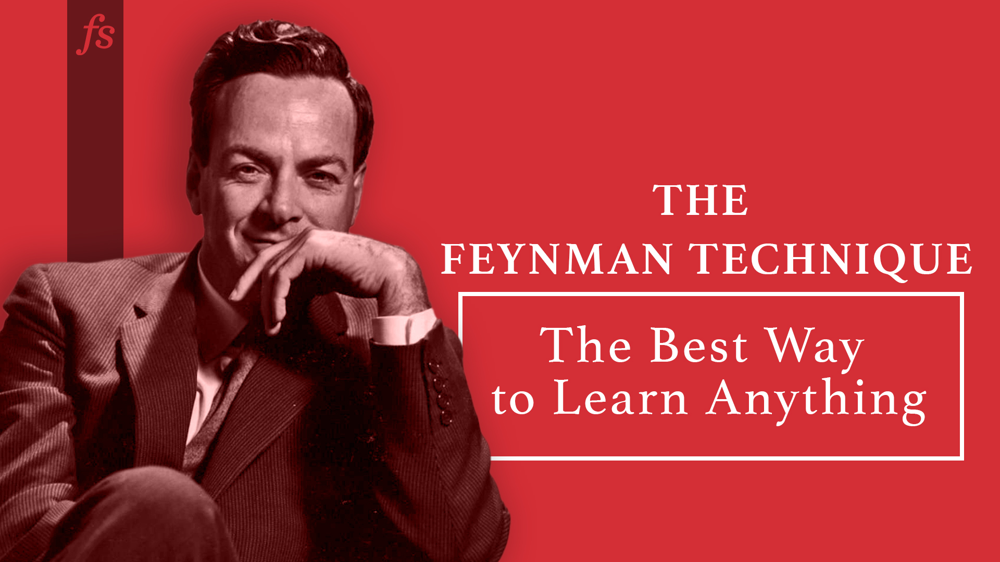

# 📚ClassNotebook

  <div align='center'>
      
      
      
 </div>

> Feynman’s learning technique comprises four key steps:
>
> 1. Select a concept and map your knowledge
> 2. Teach it to a 12-year-old
> 3. Review and Refine
> 4. Test and Archive


bilibili videos:https://space.bilibili.com/7258779


* CS、数学相关的个人笔记以及B站视频文档出处，参考[文档内容编排](#文档内容编排)
  * CS以及bilibili视频网站文档一般为markdown格式
  * 公式推导相关材料一般为pdf格式
* 学习、教程规划链接，请访问[这里](https://xiaoniaoyouhuajiang.github.io/ClassNotebook/)
* demos代码（规划中）




## 文档内容编排

```
- 编程生产力之元工具
  - 元工具.md 跟软件开发人员工作密切相关的工具的原理讲解及workflow优化，如debugger,profiler,repl,shell等
- 编译原理
  - PL.md 跟编译原理/计算机语言设计/LLVM技术栈/程序分析相关的技术内容
  - rust.md 学习和记录rust学习中的细节
- 并行思维与编程
  - 并行思维与编程.md 并行计算的笔记
  - 集群超算系统架构.md 学习、工作中了解到和超算集群相关的知识
- 存储系统
  - 关于存储的点点滴滴.md 存储介质，操作系统和存储的配合，如何评测存储产品
- 深度学习落地的道与术
  - 深度学习落地的道与术.md 机器学习系统相关的技术
  - candle源码学习.md Rust深度学习框架Candle的源码阅读与学习计划
  - candle-tensor的设计.md 记录阅读tensor源码的一些结论与经验
- 深度学习应用与理论
  - 深度学习应用与理论.md 使用深度学习相关的算法的场景以及原理
- 算法puzzles
  - container.md 高性能数据结构的研究和探讨
- 网络与通信原理
  - 基于实践的网络知识探索.md 使用各种网络工具探索计算机网络原理
- C++的强大
  - 跟随系列
    - 编译与链接.md 介绍静态库/动态库，编译与链接过程的文档
  - CMake学习系列.md 
  - C++ for python programmer.md python，C++混合编程技术
  - 负载的性能模型.md 
- index.html github pages相关
- onetab 网页资源的浏览器标签
- scheduler.drawio github pages相关
```


## 实验代码

### exp


### code_src

**code_src目录已经比较久没有更新，其中记录的内容和代码已许久没更新过了**

* bayesnet-贝叶斯网
  * utils.py(贝叶斯网的实现)

* dataAnalysis-数据分析框架
  * JuliaV(Julia实现版本)
  * PythonV
* dataStore-数据库相关知识
  * postgresql相关
  * redis相关
* distributed_system-分布式系统
* Dynamic_Programming-动态规划相关
* fluent_python-流畅Python相关笔记
* FP-函数式编程相关
* go-go语言相关
* interview-面试常见问题
  * Python-interview
  * Python的内存管理机制
* os-操作系统相关
* paradigm-编程范式相关学习
* web_api_design-webapi设计原则
