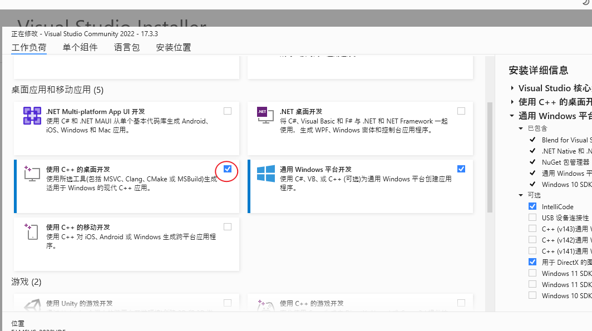
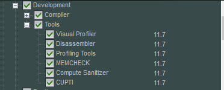
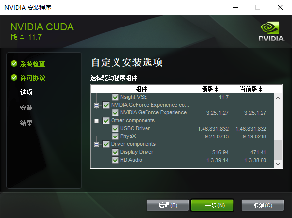
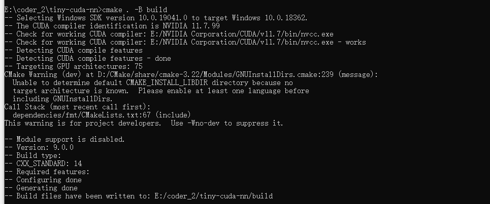
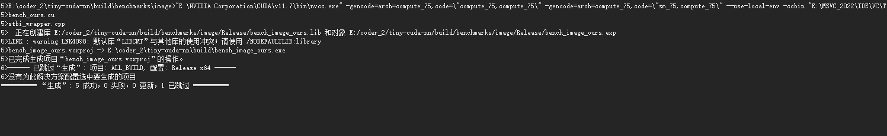

# Python程序员如何学习C++

## 动机，思路，资源

### 学习C++语言的动机：

工具角度：

* 硬件亲和性高，更细粒度的控制硬件（CUDF）
* **零开销抽象，性能标杆，给脚本语言提供高性能的core（pytorch；opencv；tvm...）**
* 更细粒度地与操作系统交互，很好地控制系统调用，如使用perf工具写性能分析工具，使用ptrace写debugger(pdb)
* Native语言，不依赖VM，更小的启动开销
* 强大的类型系统与现代特性，抽象能力与表达能力的标杆（但协作开发更难就是了。。）
* 数一数二的生态。科学计算领域/AI/仿真/数据库/编译器/渲染引擎，几乎没有啥它不能开发的


工具角度其实是非常重要的，至少在我看来，我学习CS相关的很多知识，都是为了让我**能把工具好好地用起来**，正所谓“君子生非异也，善假于物也”，小到提升个人竞争力，大到工匠精神或者体验强大工具带来的便利感与可能性。对我来说，这些是我的原始动力


扩充视野角度：

* **逼你学习内存管理，对效率/开销的考量粒度更细；**
* 使你更进一步地认识自己已知的语言，如函数语义
* 逼你学习主流操作系统下，可执行文件/静态库/动态库，编译链接等知识，清扫软件学习的障碍
* 扩充对软件的认识，GUI/OS/DBMS（LevelDB,MongoDB,Qt...），窥探底层，带来一双透视眼
* code generation/模板元编程等骚操作。。


当然，也要反过来想想，自己已知的高级语言相比于CPP的优势


### 我的思路

大体流程上：

* 了解，通过一些talk，如cppcons，大佬的指引了解这门语言，有个overview，并且有个大概方向；
* 入门，主要是**看书**和**折腾**，在**读书，捣鼓工具链，抄代码**三个过程中反复横跳
  * 入门-看书：这时候主要是参考百科全书类读物，顺着读带有实践内容的好的书
  * 捣鼓工具链：不仅是搞IDE，要了解**全流程以及相关的工具链**，编译器，链接器，调试器，甚至是repl，了解它们将为你扫清很多障碍（当然不能特别特别深入，一般判断准则是你与好友交流，你能把整个流程讲清楚，每个工具的大致作用描述出来，就不错了），
  * 抄代码：会抄代码你才会写代码，一边抄一边思考（咋思考这个估计教不了了。。），项目选择的准则是：
    * 虽小，五脏俱全
    * 和学习动机强相关


入门阶段，应该是比较久的，毕竟CPP出了名的复杂，记得不管哪个过程都要一直动手，dirty your hands。如何控制这三个过程的投入比例？要记住现在的主要目的是为后面的实践铺路,所以关键是你得**掌握基础知识**，所以看书并跑通代码绝对是你的主战场。


* 开发，并继续学习。在**看书且抄代码，写算法题，回顾**三个过程中反复横跳


### 学习资源

* 了解
  * 博客:
  * talks/videos:
* 入门
  * 书籍：
    * Accelerated CPP
    * c++ primer
    * 微软现代CPP编程指南
    * learncpp.com
  * 工具链：
    * CMake
    * GDB
  * 语言基础
    * [codegrepper](https://www.codegrepper.com/code-examples/cpp)
    * [learncpp](learncpp.com)
    * [ods](https://github.com/patmorin/ods)
  * 入门项目
    * MingDebugger
    * minigdb
    * CoCoVM
    * [ELL](https://github.com/microsoft/ELL)
    * [windows_ai](https://docs.microsoft.com/en-us/windows/ai/windows-ml/)
    * [NumCpp](https://github.com/dpilger26/NumCpp)
    * Dlib
* 领域相关项目
  * [机器学习](https://hackernoon.com/top-cc-machine-learning-libraries-for-data-science-nl183wo1)
  * MetaNN


## 语言基础

### (环境篇)MSVC使用指南

#### x86-hosted VS x64-hosted

https://www.cnblogs.com/flyinggod/p/10838214.html


#### 环境变量设置

* tools,include files,library files,SDKs
* 具体使用到的环境变量为`PATH`,`TMP`,`INCLUDE`,`LIB`,`LIBTH`

* [不推荐手动配置环境变量，，但咱们可以自己去看](https://docs.microsoft.com/zh-cn/cpp/build/building-on-the-command-line?view=msvc-170)


* 前提：一个巨坑，系统变量——VSINSTALLDIR(https://developercommunity.visualstudio.com/t/vcvars32bat-fails-after-upgrade-to-vs-2017-version/375841)
* 记住配置自己的命令行脚本，比如init.bat


#### 命令行指南

* 如果只想要编译器，链接器，标准库，以及其他C++开发的基础工具，则使用installer安装时只需要勾选：



* 类似gcc xxx.cpp，直接生成可执行文件

```powershell
cl /EHsc xxx.cpp
```

`可能是我还没习惯，但windows下的环境搭建，，真的好难`

工具集：

* CL
* Link


项目管理工具

* MSBUILD
* CMake


#### 集成CUDA

CUDA所包含的：






推荐使用CMake来构建项目，因为：

* 相对来说，跨平台能力最强


使用CMake来构建项目，常见问题：

* cmake No CUDA toolset found
  * 注意CMake版本：保证[CMake](https://cmake.org/) v3.21 or higher
  * 注意两个环境变量，下面是示例：
    * CMAKE_CUDA_COMPILER = C:\Program Files\NVIDIA GPU Computing Toolkit\CUDA\v11.6\bin\nvcc.exe
    * CUDA_PATH = C:\Program Files\NVIDIA GPU Computing Toolkit\CUDA\v11.6
    * CUDA_PATH_V11_6 = C:\Program Files\NVIDIA GPU Computing Toolkit\CUDA\v11.6
  * CUDA集成问题：copied the files in C:\Program Files\NVIDIA GPU Computing Toolkit\CUDA\v11.6\extras\visual_studio_integration\MSBuildExtensions to here C:\Program Files (x86)\Microsoft Visual Studio\2019\Community\MSBuild\Microsoft\VC\v160\BuildCustomizations，具体见[stackoverflow](https://stackoverflow.com/questions/56636714/cuda-compile-problems-on-windows-cmake-error-no-cuda-toolset-found)
  * set(CMAKE_CUDA_COMPILER "D:/nvidia/bin/nvcc.exe")
* CUDA_ARCHITECTURES NOT FOUND
  * set(CMAKE_CUDA_ARCHITECTURES  {你的兼容性版本})
* MS版本过新：unsupported Microsoft Visual Studio version!
  * 这个我帮你试过了（走了亿些弯路），总而言之，在windows下，你只能**重装/再安装一个适配的CUDA版本**


在windows下编译成功的这种快乐，你也值得拥有






构建Neoml

```powershell
E:\coder_2\neoml>E:\MSVC_2022\IDE\VC\Auxiliary\Build\vcvarsall.bat amd64
**********************************************************************
** Visual Studio 2022 Developer Command Prompt v17.3.3
** Copyright (c) 2022 Microsoft Corporation
**********************************************************************
[vcvarsall.bat] Environment initialized for: 'x64'

E:\coder_2\neoml>cmake -G "Visual Studio 17 2022" -A x64 .\NeoML -DCMAKE_INSTALL_PREFIX=.
-- Selecting Windows SDK version 10.0.19041.0 to target Windows 10.0.18362.
-- The CXX compiler identification is MSVC 19.33.31629.0
-- Detecting CXX compiler ABI info
-- Detecting CXX compiler ABI info - done
-- Check for working CXX compiler: E:/MSVC_2022/IDE/VC/Tools/MSVC/14.33.31629/bin/Hostx64/x64/cl.exe - skipped
-- Detecting CXX compile features
-- Detecting CXX compile features - done
-- The C compiler identification is MSVC 19.33.31629.0
-- Detecting C compiler ABI info
-- Detecting C compiler ABI info - done
-- Check for working C compiler: E:/MSVC_2022/IDE/VC/Tools/MSVC/14.33.31629/bin/Hostx64/x64/cl.exe - skipped
-- Detecting C compile features
-- Detecting C compile features - done
-- Found OpenMP_C: -openmp (found version "2.0")
-- Found OpenMP_CXX: -openmp (found version "2.0")
-- Found OpenMP: TRUE (found version "2.0")
-- Looking for a CUDA compiler
-- Looking for a CUDA compiler - E:/NVIDIA Corporation/CUDA/v11.7/bin/nvcc.exe
-- The CUDA compiler identification is NVIDIA 11.7.99
-- Detecting CUDA compiler ABI info
-- Detecting CUDA compiler ABI info - done
-- Check for working CUDA compiler: E:/NVIDIA Corporation/CUDA/v11.7/bin/nvcc.exe - skipped
-- Detecting CUDA compile features
-- Detecting CUDA compile features - done
-- Found Vulkan: FALSE
-- Found OpenMP: TRUE (found version "2.0")
-- Could NOT find MKL (missing: MKL_INCLUDE_DIR MKL_CORE_LIB MKL_SEQUENTIAL_LIB MKL_INTEL_LIB)
--
-- 3.11.4.0
-- Looking for pthread.h
-- Looking for pthread.h - not found
-- Found Threads: TRUE
CMake Deprecation Warning at E:/coder_2/neoml/_deps/googletest-src/CMakeLists.txt:4 (cmake_minimum_required):
  Compatibility with CMake < 2.8.12 will be removed from a future version of
  CMake.

  Update the VERSION argument <min> value or use a ...<max> suffix to tell
  CMake that the project does not need compatibility with older versions.


CMake Deprecation Warning at E:/coder_2/neoml/_deps/googletest-src/googletest/CMakeLists.txt:56 (cmake_minimum_required):
  Compatibility with CMake < 2.8.12 will be removed from a future version of
  CMake.

  Update the VERSION argument <min> value or use a ...<max> suffix to tell
  CMake that the project does not need compatibility with older versions.


-- Found PythonInterp: D:/Anaconda3/python.exe (found version "3.8.3")
-- Configuring done
CMake Warning (dev) in E:/coder_2/neoml/NeoMathEngine/src/CMakeLists.txt:
  Policy CMP0104 is not set: CMAKE_CUDA_ARCHITECTURES now detected for NVCC,
  empty CUDA_ARCHITECTURES not allowed.  Run "cmake --help-policy CMP0104"
  for policy details.  Use the cmake_policy command to set the policy and
  suppress this warning.

  CUDA_ARCHITECTURES is empty for target "NeoMathEngine".
This warning is for project developers.  Use -Wno-dev to suppress it.

CMake Warning (dev) in E:/coder_2/neoml/NeoMathEngine/src/CMakeLists.txt:
  Policy CMP0104 is not set: CMAKE_CUDA_ARCHITECTURES now detected for NVCC,
  empty CUDA_ARCHITECTURES not allowed.  Run "cmake --help-policy CMP0104"
  for policy details.  Use the cmake_policy command to set the policy and
  suppress this warning.

  CUDA_ARCHITECTURES is empty for target "NeoMathEngine".
This warning is for project developers.  Use -Wno-dev to suppress it.

CMake Warning (dev) in E:/coder_2/neoml/NeoMathEngine/src/CMakeLists.txt:
  Policy CMP0104 is not set: CMAKE_CUDA_ARCHITECTURES now detected for NVCC,
  empty CUDA_ARCHITECTURES not allowed.  Run "cmake --help-policy CMP0104"
  for policy details.  Use the cmake_policy command to set the policy and
  suppress this warning.

  CUDA_ARCHITECTURES is empty for target "NeoMathEngine".
This warning is for project developers.  Use -Wno-dev to suppress it.

CMake Warning (dev) in E:/coder_2/neoml/NeoMathEngine/src/CMakeLists.txt:
  Policy CMP0104 is not set: CMAKE_CUDA_ARCHITECTURES now detected for NVCC,
  empty CUDA_ARCHITECTURES not allowed.  Run "cmake --help-policy CMP0104"
  for policy details.  Use the cmake_policy command to set the policy and
  suppress this warning.

  CUDA_ARCHITECTURES is empty for target "NeoMathEngine".
This warning is for project developers.  Use -Wno-dev to suppress it.

-- Generating done
-- Build files have been written to: E:/coder_2/neoml
```


#### 学习MSVC项目的build system

本文以一个工业级项目NeoML来讲解如何形成自己的Windows下的MSVC-CMAKE workflow。

visual studio版本-2022，CUDA-11.7（这两个是最新的发布版本，用它们其实我有点虚。。，但很多DL相关的项目都是在较高的版本上测试过的，so..）

首先要对一些文件类型有个大致的概念：其中黑体字的会重点介绍

| 文件名                   | 目录位置 | 解决方案资源管理器位置       | 说明                                                         |
| :----------------------- | :------- | :--------------------------- | :----------------------------------------------------------- |
| Solname.sln              | Projname | 在解决方案资源管理器中不显示 | 解决方案文件。 它将一个或多个项目的所有元素组织到一个解决方案中。 |
| Projname.suo             | Projname | 在解决方案资源管理器中不显示 | 解决方案选项文件。 它存储解决方案的自定义项，以便每次打开解决方案中的项目或文件时，都具有所需的外观和行为。 |
| **Projname.vcxproj**     | Projname | 在解决方案资源管理器中不显示 | 项目文件。 它存储特定于每个项目的信息。 （在早期版本中，此文件被命名为 Projname.vcproj 或 Projname.dsp。）有关 C++ 项目文件 (.vcxproj) 的示例，请参阅[项目文件](https://learn.microsoft.com/zh-cn/cpp/build/reference/project-files?view=msvc-170)。 |
| Projname.sdf             | Projname | 在解决方案资源管理器中不显示 | 浏览数据库文件。 它支持浏览和导航功能，如“转到定义”、“查找所有引用”和“类视图”。 它是通过分析头文件生成的。 |
| Projname.vcxproj.filters | Projname | 在解决方案资源管理器中不显示 | 筛选器文件。 它指定在何处放置添加到解决方案的文件。 例如，.h 文件置于“头文件”节点中。 |
| Projname.vcxproj.user    | Projname | 在解决方案资源管理器中不显示 | 迁移用户文件。 从 Visual Studio 2008 迁移项目之后，此文件包含从任何 .vsprops 文件转换的信息。 |
| Projname.idl             | Projname | 源                           | （特定于项目）包含控件类型库的接口描述语言 (IDL) 源代码。 此文件由 Visual C++ 用于生成类型库。 生成的库会向其他自动化客户端公开控件的接口。 有关详细信息，请参阅 Windows SDK 中的[接口定义 (IDL) 文件](https://learn.microsoft.com/zh-cn/windows/win32/Rpc/the-interface-definition-language-idl-file)。 |
| Readme.txt               | Projname | Project                      | 自述文件。 它由应用程序向导生成，描述项目中的文件。          |


MSBUILD是WINDOWS下默认的项目系统，当你新建一个windows项目，项目的属性（可以理解为对项目信息的一种描述）被存储在一种扩展名为vcxproj的XML文件下。MS推荐使用者在IDE中创建以及修改vcxproj文件，避免手动修改带来的问题。

如果要修改编译相关的属性，去这里https://learn.microsoft.com/zh-cn/cpp/build/working-with-project-properties?view=msvc-170

在vcxproj文件中，要注意两种重要内容：**Build.props**和**Build.targets**

##### 编译器选项以及编译属性


#### VS调试pybind应用


#### 调试其他库代码work-flow

##### NeoML的FineObjLite


##### 调试NeoML.dll


##### tiny-cuda-nn


### (基础篇)如何利用learn-cpp和MS的modern cpp tutors


### 类型与数据

* 隐式转换

```c++
// 字面量的隐式转换：略
// 变量的隐式转换
#include <iostream>

void print(double x) // print takes an double parameter
{
	std::cout << x;
}

int main()
{
	int y { 5 };
	print(y); // y is of type int

	return 0;
}

// unsafe conversions：如信息丢失
int main()
{
    double d { 5 }; // okay: int to double is safe
    int x { 5.5 }; // error: double to int not safe

    return 0;
}
```

* 每次类型转换，都产生了新的值
* 隐式类型转换是个丰富的课题


* 显式类型转换**static_cast**

```c++
#include <iostream>

void print(int x)
{
	std::cout << x;
}

int main()
{
	print( static_cast<int>(5.5) ); // explicitly convert double value 5.5 to an int

	return 0;
}
```


### memory view

* 内存位置

```c++
#include<iostream>
using namespace std;

int main(){
    int array[5], i;
    cout << "Size of integer in this compiler is "
        << sizeof(int) << "\n";

    for (i=0; i < 5; i++){
        cout << "Address array[" << i << "] is " << &array[i] << "\n";
    }
    return 0;
}
```


### 动态内存分配

CPP支持三种类型的动态内存分配：

* 静态内存分配：给静态变量以及全局变量分配内存。


### Templates

> Templates enable you to define the operations of a class or function, and let the user specify what concrete types those operations should work on.

```c++
// 之前有使用过julia进行编程，会觉得这块很容易理解
template <typename T>
T minimum(const T& lhs, const T& rhs)
{
    return lhs < rhs ? lhs : rhs;
}
```


> The primary restriction when using templates is that a type argument must support any operations that are applied to the type parameters.


## 开发重点

### benchmark/algorithms

* [cppitertools](https://github.com/ryanhaining/cppitertools)
* cuda-exe
* 


### memory manager

* [cnmem](https://github.com/NVIDIA/cnmem/blob/master/src/cnmem.cpp)
* https://github.com/rapidsai/rmm
* [RMM](https://github.com/rapidsai/rmm)


### 高效数据结构/存储形式/data manipulation

参考项目：

* [pfr](https://github.com/boostorg/pfr)
* [pdsa](https://github.com/gakhov/pdsa)
* [ods](https://github.com/patmorin/ods)
* [Dlib_Linear_Algebra](http://dlib.net/linear_algebra.html)
* [ray/modin ](https://github.com/modin-project/modin)
  * [How Modin uses Ray](https://docs.ray.io/en/latest/data/modin/index.html)
* [aGrUM](https://agrum.gitlab.io/pages/agrum.html)
* neoml/FineObjLite


### 执行优化/执行工厂

参考项目：

* tensor compiler
  * [TACO](https://github.com/tensor-compiler/taco)
  * TVM
  * ONNX
  * loopy
  * [TASO](https://github.com/jiazhihao/TASO)

* ml optimizer

  * hummingbird
  * edgeml
  * [tiny-cuda-nn](https://github.com/NVlabs/tiny-cuda-nn)

* ml-system

  * [Enzyme](https://github.com/EnzymeAD/Enzyme)
  * [Neoml](https://github.com/neoml-lib/neoml#getting-started)
  * 

  


### better python

* austin
* [no-gil](https://github.com/colesbury/nogil)
* pybind
* tourchdynamo
* cinder


### system tools


### CV


## learning from code


### tiny-cuda-nn


### neoml

abbyy大家都知道吧~

neoml非常适合我们学习，因为它**文档非常非常详细**

甚至，提供了[API设计原则](https://github.com/neoml-lib/neoml#basic-principles):

* 平台无关：前端接口与数学计算的底层引擎完全解耦：只要选择引擎，剩下的ML code都是一样的
* 独立绑定的数学引擎：构造出来的网络都只与一个数学引擎绑定，比如选了GPU引擎，那么所有相关的计算都会在GPU上执行，这么做是为了避免不必要的数据交换
* 数学引擎是线程安全的：同一个实例可以在不同的线程中被访问；然而，神经网络的实现是非线程安全的
* 支持ONNX格式（支持，但只支持一点）：所以其他框架所生成的模型同样能够被转化为框架支持的网络形式，，然而反过来是不支持的
* 独立的序列化格式：使用独有的二进制格式（通过CArchive,CArchiveFile实现）来保存和载入预训练模型
* ABBYY框架原语：NeoML库起源于ABBYY内部基础结构。出于各种原因，ABBYY使用了一个名为FineObj的跨平台框架。因此，开放库版本使用了一些框架原语。常用类描述:
  * 基础类
    * CArray
    * CString
    * Reference couting
  * Exceptions
    * CException
    * ...
    * CMemoryException
  * Serialization
    * ...
* NeoML包含两类C++接口：
  * 算法库：
    * 神经网络
    * 分类以及回归算法
    * 聚类算法
    * 辅助类算法
  * 数学引擎：用户一般不需要使用到这些


### aGrUM


### chainer


## 通用工具与workflow

我的观点是，阅读代码是在学习一门新语言时最常见的活动。

当你想要learn from project时，一些好的工具很重要。


### call graph


### repl


### bridge

* pybind


