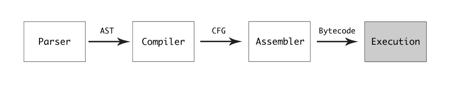
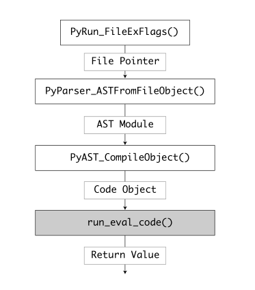

# Python语言源码分析

## 编译与基础


获得python源码：git clone

从源代码编译参考：Python3.7源码剖析 ------- 手把手教你windows编译Python - 艾欧尼亚的文章 - 知乎
https://zhuanlan.zhihu.com/p/351541371

C,GO,C++直接将源码编译为特定平台上的可执行二进制文件，而JAVA和.NET CLR则编译为虚拟机专用的语言，轻松实现代码跨平台。Cpython runtime在第一次执行代码的时候，也有编译的过程，编译后的结果是字节码，它们将被存储在.pyc文件中并作为执行的缓存。Cpython中的compiler是纯C语言实现的。

compiler可被分为两种类型：

* self-hosted:以bootstrapping技术作为支撑，编译器自身是编译语言实现的，比如GO语言。
* source-to-source:靠另一个已经有编译器的语言实现

当一个新的语言被实现时，需要一个软件来编译实现好的编译器，所以一般都是依赖于一个成熟的编程语言。GO语言一开始的编译器由C来实现，接着用GO语言自身重写了GO语言的编译器（自举），经过编译后，GO语言便拥有了由自身实现的编译器。

而对Python而言，Python保留了C的编译器实现，同时一些标准库：sockets,ssl,os,wxpython沿用了C的API，也有一个Python自己解释自己的实现：Pypy

### 手动编译安装
```shell
# 安装必要的包：
apt-get install build-essential

# 可以去修改编译选项：
vim ./Modules/Setup
# 去掉zlib的注释

# 注意，安装必要包的内容需要包含：dpkg-dev
./configure
make -j
```


## grammar

Python的词法解析，类型系统/数据模型以及执行模型，依赖系统（the import system）的内容，可以在docs.python.org/3/reference中找到，这就是Python的官方文档。这部分的内容也可以在Cpython的doc > reference中找到。

#### 一个例子

> doc/reference/compound_stmts.rst

比如说，这个文档就定义了python中statement的定义，以"with"的定义为例（讲解参考之一：https://dbader.org/blog/python-context-managers-and-with-statement），with的作用是声明一个上下文管理器。

上面提供的文档都是**人类可读的内容**

而提供给机器的定义可以在grammar/grammar中找到，这部分的内容暂时略过，会涉及到语法结构的记录方法，但不是我目前关注的重点。


## C语言的简单讲解

C语言和python的一个巨大区别是C preprocessor。

### C的预处理器(C Preprocessor)

C预处理器对源码处理后生成的文件会被编译器拿去处理，预处理器的主要目的是在源码文件中做文本替换,在遇到#if之后会做一些基本的条件判断。

#### 让我们首先看看#include

#include是用来将一个文件的源码载入到当前源文件中的语句，举个例子，看下Cpython的/_multiprocessing/semaphore.c文件，最顶部

```c
#include "multiprocessing.h"
```

这个语句会让预处理器拉取`multiprocessing.h`文件内容并放到这个文件中的输出文件中。其中，包含文件是否有<>决定了预处理器的处理次序，有<>则会优先搜索系统包含的文件。


## 配置与输入

让我们回顾一下如何执行Python代码：

* Python -c "`<what you want to execute(python code)>`"
* python -m  `<module>`
* python `<file contain python code>`
* cat `<file>` | file
* 开启repl并输入指令
* 调用C API


对于Python解释器而言，执行代码需要用到：

* 一个可以执行的python模块
* 状态：比如环境变量
* 配置：可选的或可用的

python code在被执行前，会先建立一个Cpython runtime

runtime的配置被定义为三种数据结构

* PyPreConfig 用于初始化配置-PyPreConfig
* PyConfig 用于runtime的配置-PyConfig
* Cpython解释器的编译完成的配置

这三种数据结构都被定义在Include/cpython/initconfig.h中。

#### Pre-Initialization Configuration

PyPreConfig的三个主要函数：

* 设置Python内存分配器
* 设置LC_CTYPE分配数
* 设置UTF-8模式

PyPreConfig类型包含的字段都是整形，与PyPreConfig相关的文件有两个：

> Python/initconfig.c
> 该文件在系统环境下将配置load进系统环境中并与字符命令合并
> Include/cpython/initconfig.h
> 该文件则定义了初始化配置的数据结构

#### 运行时配置的数据结构

前面也提到运行时配置的数据结构被设置在pyConfig结构体中，其中包括：

* runtime flags：包括debug/optimized等
* 运行模式：包括script file, stdin, module
* 扩展选项，用-X `<option>`来进行指定
* 运行时的环境变量

#### 使用命令行方法来设置运行时

具体有哪些办法可以参考链接（docs.python.org/3/using/cmdline.html）

举个例子，python有一种运行模式称作verbose模式，主要被用于Debug

```python
# 打印被载入运行时的模块
./python -v -c "print('hello world')"
```

运行上面的命令，你会看到几百行的输出，包括使用到的第三方模块以及任何系统环境中的东西

运行时的配置加载逻辑被封装在initconfig.c文件中的config_parse_cmdline()中


## Python的通用对象设计

Python分支，版本：

https://github.com/python/cpython/tree/v3.9.0b1


该主题（CPython源码分析）的主要意义：

* 引导
* 方法
* 重点


这一章节，我们主要需要cover的主题：

* PyObject
* 理解 _PyObject_HEAD_EXTRA
* 引用计数
* PyVarObject
* PyTypeObject
* Type对象的子结构
* PyNumberMethods子结构
* PySequenceMethods子结构
* PyMappingMethods子结构
* type对象
* Allocator, deallocator, initialization 函数
* 迭代器函数（Iterator）
* 方法与属性


### PyObject

**Include/object.h Line no 104**

```c
typedef struct _object {
_PyObject_HEAD_EXTRA
Py_ssize_t ob_refcnt;
struct _typeobject *ob_type;
} PyObject;
```

包含了三个元素：

* 一个宏，在调试模式下展开以跟踪Python堆中的所有对象
* 对象的引用计数器
* 一个指向类型对象的指针


### 理解 _PyObject_HEAD_EXTRA

_PyObject_HEAD_EXTRA给每个对象添加了正向和反向指针，共同组成了一个双向链表，用于在runtime中追踪堆中的Python对象

当编译前配置flag的时候:

../configure CFLAGS='-DPy_DEBUG -DPy_TRACE_REFS' --with-pydebug

这个宏就会展开。


具体看**Include/object.h Line no 68**

```c
#ifdef Py_TRACE_REFS -> 1
/* Define pointers to support a doubly-linked list of all live heap
objects. */
#define _PyObject_HEAD_EXTRA \
struct _object *_ob_next; -> 2 \
struct _object *_ob_prev; -> 3
#define _PyObject_EXTRA_INIT 0, 0,
#else

#define _PyObject_HEAD_EXTRA
#define _PyObject_EXTRA_INIT
#endif

```


### Referebce couting

计数器就是我们刚看到的**ob_refcnt**

引用计数也是Python垃圾回收（GC）的机制，每当一个对象被引用，比如放到list中，计数值会增加。用完后，计数值会减少，清零时被deallocator清除

通过**sys.getrefcount(a)**我们可以获取对象的当前引用计数值。

```python
import sys
tem = 0
sys.getrefcount(a)
```


sys.refcount调用本身也会增加被引用对象的计数值

```python
# ...
a = 2000000
sys.getrefcount(a)
def f(a):
	print(sys.getrefcount(a))
	
sys.getrefcount(a)
```


### PyVarObject

PyVarObject是container对象的抽象（包括lists, types, dicts, sets）

```c
typedef struct {
PyObject ob_base;
Py_ssize_t ob_size; /* Number of items in variable part */
} PyVarObject;
```

上述见object.h的115行

可以看到该对象包含一个PyObject对象，用来做数据存储，而ob_size则代表container的对象个数


### PyTypeObject

这块源码之后介绍，现在只需要知道，类型对象包含了可以施加在相应实例上的操作


### 通用类型函数原型

标题什么意思？

看下Inlcude/object.h的163行


typedef PyObject * (*unaryfunc)(PyObject *);

ex: unaryfunc nb_negative;

*(int, float...)*


typedef PyObject * (*binaryfunc)(PyObject *, PyObject *,);

ex:binaryfunc nb_add;

*(int, float, string...)*


再来看看其他的原型

```c
typedef PyObject * (*ternaryfunc)(PyObject *, PyObject *, PyObject *);

typedef int (*inquiry)(PyObject *);

typedef Py_ssize_t (*lenfunc)(PyObject *)

typedef PyObject *(*ssizeargfunc)(PyObject *, Py_ssize_t);
```


list_repeat函数就属于**ssizeargfunc**，位于Objects/listobject.c的2788行


```c
static PySequenceMethods list_as_sequence = {
    (lenfunc)list_length,                       /* sq_length */
    (binaryfunc)list_concat,                    /* sq_concat */
    (ssizeargfunc)list_repeat,                  /* sq_repeat */
    (ssizeargfunc)list_item,                    /* sq_item */
    0,                                          /* sq_slice */
    (ssizeobjargproc)list_ass_item,             /* sq_ass_item */
    0,                                          /* sq_ass_slice */
    (objobjproc)list_contains,                  /* sq_contains */
    (binaryfunc)list_inplace_concat,            /* sq_inplace_concat */
    (ssizeargfunc)list_inplace_repeat,          /* sq_inplace_repeat */
};
```

还有一些原型就不一一介绍了。


### 特定的类型函数原型

object.h的175行；

```c
typedef int (*visitproc)(PyObject *, void *);
typedef int (*traverseproc)(PyObject *, visitproc, void *);
```


以traverseproc为例，Objects/listobject.c的2607行；

```c
static int
list_traverse(PyListObject *o, visitproc visit, void *arg)
{
    Py_ssize_t i;

    for (i = Py_SIZE(o); --i >= 0; )
        Py_VISIT(o->ob_item[i]);
    return 0;
}

```


### 介入：创造我们自己的Python对象

#### 生命周期

#### 内存管理

#### 类型


## 函数和生成器

涉及内容：

* 理解Evaluation Loop

* PyFunctionObject的创建
* LOAD_CONST opcode
* MAKR_FUNCTION opcode
* 函数调用
* 函数帧的结构（function frame）
* CALL_FUNCTION opcode
* 生成器
* 创建一个生成器
* 创建一个生成器实例
* 生成器对象的结构
* 一个生成器的执行


### 理解执行流程



上述是Python运行的一般流水线。




### PyFunctionObject的创建

首先得明白一点，Python的VM可以理解为一个栈机器(stack machine)，而栈帧的每次创建都代表着一个函数受到了调用；然而PyFunctionObject对象只会被创建一次，下面做个实验：


```python
def mul(a, b):
    return a * b

# python -m dis test_function.py生成并打印python字节码
```


<!-- image missing: image-20220903214357610 (Typora local cache) -->


第四条opcode**MAKR_FUNCTION**创建了可重用的PyFunctionObject对象，来看看该对象的结构


```C
// funcobject.h的21行

typedef struct {
    PyObject_HEAD
    PyObject *func_code;        /* A code object, the __code__ attribute */
    PyObject *func_globals;     /* A dictionary (other mappings won't do) */
    PyObject *func_defaults;    /* NULL or a tuple */
    PyObject *func_kwdefaults;  /* NULL or a dict */
    PyObject *func_closure;     /* NULL or a tuple of cell objects */
    PyObject *func_doc;         /* The __doc__ attribute, can be anything */
    PyObject *func_name;        /* The __name__ attribute, a string object */
    PyObject *func_dict;        /* The __dict__ attribute, a dict or NULL */
    PyObject *func_weakreflist; /* List of weak references */
    PyObject *func_module;      /* The __module__ attribute, can be anything */
    PyObject *func_annotations; /* Annotations, a dict or NULL */
    PyObject *func_qualname;    /* The qualified name */
    vectorcallfunc vectorcall;

    /* Invariant:
     *     func_closure contains the bindings for func_code->co_freevars, so
     *     PyTuple_Size(func_closure) == PyCode_GetNumFree(func_code)
     *     (func_closure may be NULL if PyCode_GetNumFree(func_code) == 0).
     */
} PyFunctionObject;
```


* 首先是**func_code**，是指向code对象的指针，包含了要被解释器执行的字节码。

* globals指针包含了一个字典，存储着可能会被函数用到的全局变量
* func_defaults指针包含了一个元组，存储着默认参数
* kw则是关键字参数
* vectorcall函数则是用来执行函数的栈的


### LOAD_CONST字节码

load_const字节码用来把值推向数据栈的头部，数据栈中的值在后期执行函数时会被用到，比如我们定义的函数"a * b"，具体执行让我们来看Python/ceval.c的1487行:

```c
case TARGET(LOAD_CONST): {
    PREDICTED(LOAD_CONST);
    PyObject *value = GETITEM(consts, oparg);
    Py_INCREF(value);
    PUSH(value);
    FAST_DISPATCH();
}
```


### MAKE_FUNCTION字节码

```c
// ceval.c 3592行
case TARGET(MAKE_FUNCTION): {
PyObject *qualname = POP();
PyObject *codeobj = POP();
PyFunctionObject *func = (PyFunctionObject *)
PyFunction_NewWithQualName(codeobj, f->f_globals, qualname);

Py_DECREF(codeobj);
Py_DECREF(qualname);
if (func == NULL) {
goto error;
}

if (oparg & 0x08) {
assert(PyTuple_CheckExact(TOP()));
func ->func_closure = POP();
}
if (oparg & 0x04) {
assert(PyDict_CheckExact(TOP()));
func->func_annotations = POP();
}
if (oparg & 0x02) {
assert(PyDict_CheckExact(TOP()));
func->func_kwdefaults = POP();
}
if (oparg & 0x01) {
assert(PyTuple_CheckExact(TOP()));
func->func_defaults = POP();
}

PUSH((PyObject *)func);
DISPATCH();
}
```


可以看到，函数对象的生成依靠的是对**PyFunction_NewWithQualName**的调用，其中需要给到该函数散个参数：

* code object
* 全局变量
* 函数名


再去看Objects/funcobject.c的11行，构造的具体实现：

```c
PyFunctionObject *op;
// ...
op = PyObject_GC_New(PyFunctionObject, &PyFunction_Type);
```

PyObject_GC_New调用将该对象在堆上实例化了。


### 函数调用过程

函数对象一旦被创建，就能多次调用。每次被调用，都会在调用的栈上创建一个新的栈帧，推到栈的头部（当前线程）。一旦执行完成，栈帧就被销毁，出栈。


### 函数栈帧的结构

栈帧的结构可以在Include/cpython/frameobject.c文件中找到(不同版本的Cpython位置是不固定的)。

```c
struct _frame {
    PyObject_VAR_HEAD
    struct _frame *f_back;      /* previous frame, or NULL */
    PyCodeObject *f_code;       /* code segment */
    PyObject *f_builtins;       /* builtin symbol table (PyDictObject) */
    PyObject *f_globals;        /* global symbol table (PyDictObject) */
    PyObject *f_locals;         /* local symbol table (any mapping) */
    PyObject **f_valuestack;    /* points after the last local */
    /* Next free slot in f_valuestack.  Frame creation sets to f_valuestack.
       Frame evaluation usually NULLs it, but a frame that yields sets it
       to the current stack top. */
    PyObject **f_stacktop;
    PyObject *f_trace;          /* Trace function */
    char f_trace_lines;         /* Emit per-line trace events? */
    char f_trace_opcodes;       /* Emit per-opcode trace events? */

    /* Borrowed reference to a generator, or NULL */
    PyObject *f_gen;

    int f_lasti;                /* Last instruction if called */
    /* Call PyFrame_GetLineNumber() instead of reading this field
       directly.  As of 2.3 f_lineno is only valid when tracing is
       active (i.e. when f_trace is set).  At other times we use
       PyCode_Addr2Line to calculate the line from the current
       bytecode index. */
    int f_lineno;               /* Current line number */
    int f_iblock;               /* index in f_blockstack */
    char f_executing;           /* whether the frame is still executing */
    PyTryBlock f_blockstack[CO_MAXBLOCKS]; /* for try and loop blocks */
    PyObject *f_localsplus[1];  /* locals+stack, dynamically sized */
};
```

略


### CALL_FUNCTION字节码

我们在前面定义函数的代码后新增调用代码的语句。

```python
def mul(a, b):
    return a * b


result = mul(10, 20)

```


<!-- image missing: image-20220904001147251 (Typora local cache) -->


再来对比一下当前生成的字节码，可以看到:

待续


## 内存管理

这一部分，我们会cover以下内容

* overview
* Arenas
* 基于Arenas的内存管理
* Arena内存分配
* 内存销毁过程
* 内存池
* 内存池的结构
* 对象的内存分配
* 池表（Pool table）
* SMALL_REQUEST_THRESHOLD


### overview

使用完内存后不释放会导致内存泄漏。Python语言替编程者承担了管理内存的责任，其创造了一种内部内存映射，称之为**arenas**，我们可称之为竞技场。

竞技场是预分配的内存块，块大小可以被配置。

进入Objects/obmalloc.c文件（910行）

```c
#define ARENA_SIZE              (256 << 10)     /* 256KB */
...
    
#define POOL_SIZE               SYSTEM_PAGE_SIZE        /* must be 2^N */
```

从这可以看到默认的竞技场size是256kb，而POOL的size大小则和系统的页大小一致（一般为4kb）


<!-- image missing: image-20220904024854571 (Typora local cache) -->

但显然如果都是4kb就能被称之为**pool**，多少是有些奇怪的。


实际上Pool根据其大小能被分为几类：

* class 1: 1-8 bytes
* class 2: 8-16 bytes
* ...
* class 64: 504-512 bytes

而请求内存大小一旦超过512bytes，就会转为通过系统调用来获取


### Arenas

一个arena对象是指向大块内存位置的指针

Objects/obmalloc.c文件中，可以看到arena的设计

```c
struct arena_object {
    /* The address of the arena, as returned by malloc.  Note that 0
     * will never be returned by a successful malloc, and is used
     * here to mark an arena_object that doesn't correspond to an
     * allocated arena.
     */
    uintptr_t address;

    /* Pool-aligned pointer to the next pool to be carved off. */
    block* pool_address;

    /* The number of available pools in the arena:  free pools + never-
     * allocated pools.
     */
    uint nfreepools;

    /* The total number of pools in the arena, whether or not available. */
    uint ntotalpools;

    /* Singly-linked list of available pools. */
    struct pool_header* freepools;

    /* Whenever this arena_object is not associated with an allocated
     * arena, the nextarena member is used to link all unassociated
     * arena_objects in the singly-linked `unused_arena_objects` list.
     * The prevarena member is unused in this case.
     *
     * When this arena_object is associated with an allocated arena
     * with at least one available pool, both members are used in the
     * doubly-linked `usable_arenas` list, which is maintained in
     * increasing order of `nfreepools` values.
     *
     * Else this arena_object is associated with an allocated arena
     * all of whose pools are in use.  `nextarena` and `prevarena`
     * are both meaningless in this case.
     */
    struct arena_object* nextarena;
    struct arena_object* prevarena;
};
```


### Arena内存管理

UNIX-based的系统，Python会使用mmap系统调用来请求内存。


## GIL的设计


