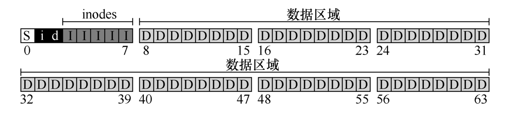
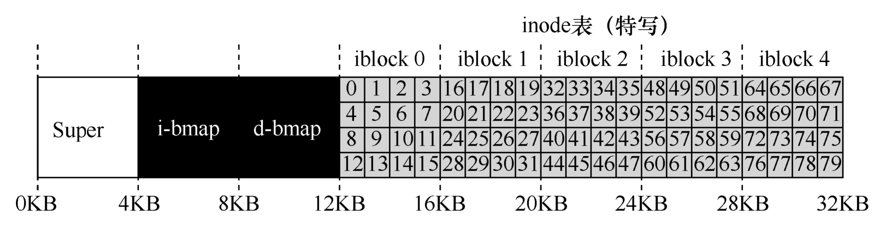
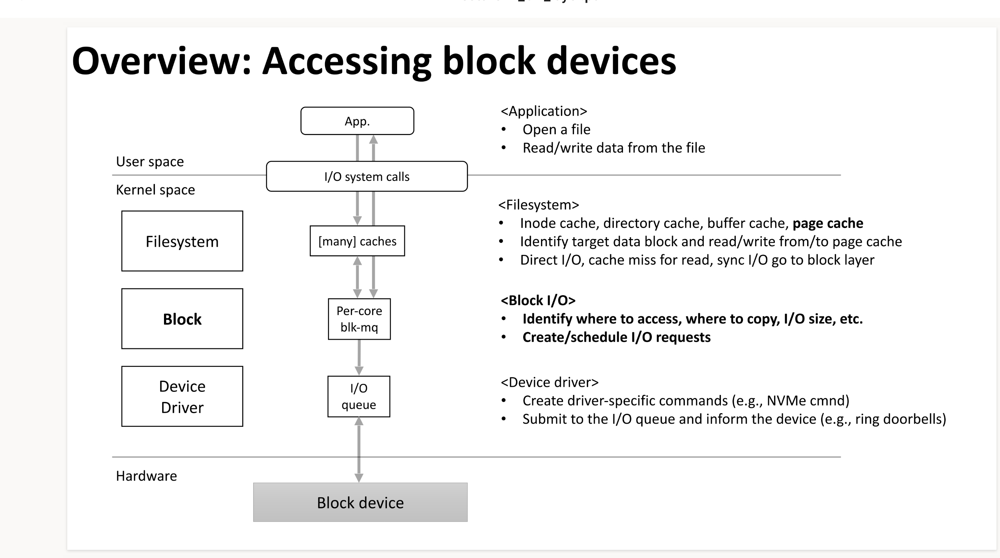
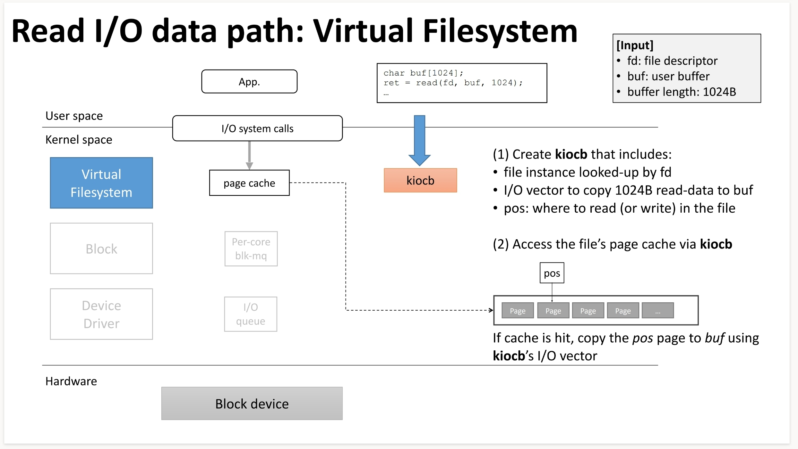
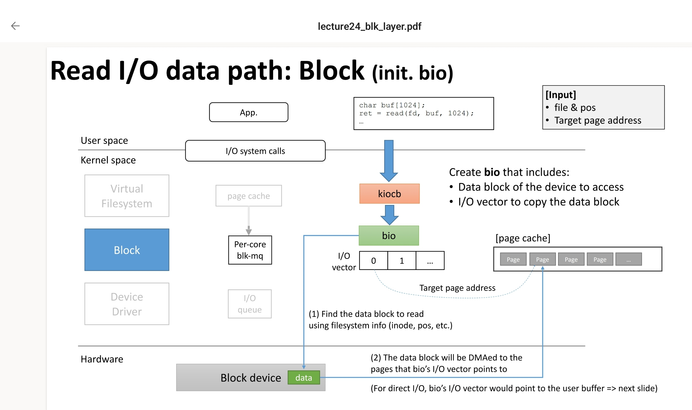
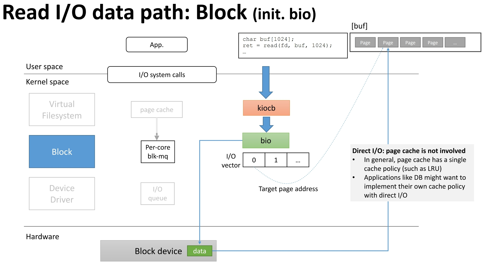
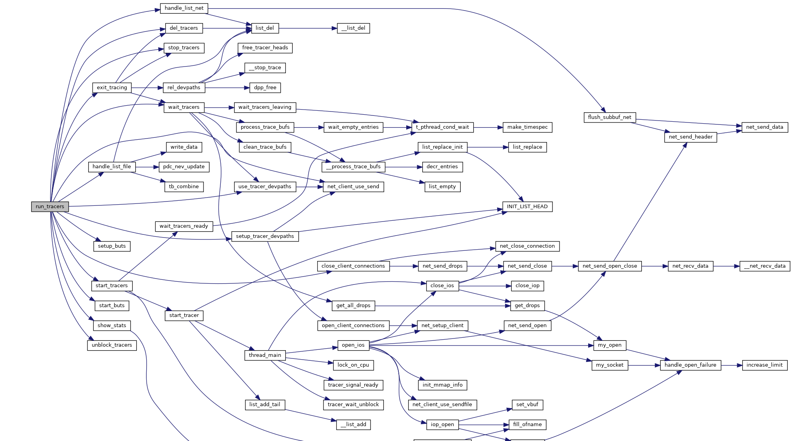

# 我的存储笔记
## 存储介质，产品

### 块设备
比如HDD，SSD，它们：
* 允许访问固定块的数据
* 固定块的数据被称为`blocks`：Block是由文件系统定义的最小的可寻址单元（大多数为4kb），见后文VFS部分

### 分布式存储
分布式存储主要包括文件、对象存储。典型的使用场景下，分布式存储组网由客户端，分布式文件/对象存储、万兆交换机、千兆交换机组成。客户端和存储产品通过万兆交换机连接（也可能是IB）。


## 存储理论
我们将从一次linux IO按照从前端到后端的顺序进行分解来看一下一个iO完成所需要经过的完整链路，按照如下顺序：
* syscall -> vfs(重点讲block-based fs)
* 

### 很有意思的问题：
＊ [why don't windows/Linux use relational Databases(RDBMS)](softwareengineering.stackexchange.com/questions/285677)
* 

### 文件系统的实现
首先理论方面的学习，主要是先抽象出一个极简的文件系统,再看看现实中的案例。

#### 数据结构
文件系统在磁盘上使用什么类型的结构来组织数据和元数据
简单的文件系统可以是这样：


上图为一小块磁盘区域的数据内容，其中：
* 磁盘被分为64个小块(block)，每块大小为4KB
* "D"代表数据，为用户数据的代表
* "I"代表inode，为存放文件元数据的结构
* "d"代表数据位图和inode位图，是一种用于管理空闲块的数据结构
* "i"代表inode位图，用于管理inode块的数据结构
* "S"代表超级块，用于存储文件系统本身的信息

放大0-7数据块(管理结构)的内容：

假设说，我现在希望获取inode32的数据，通过计算得知我需要获得第20KB位（inode大小为256字节）的数据 -> 文件系统要索引这个字节位的数据。但是磁盘是由可寻址扇区组成的(固态硬盘使用闪存芯片存储数据，闪存芯片被分为多个可寻址的扇区，每个扇区都有唯一地址)，通常扇区是512字节，从而文件系统需要向40发出一个读取请求。

除了纯粹数据外的用户数据统称为元数据，设计inode时，最重要的决定之一是它如何引用数据块的位置，一个简单的方法是，将磁盘地址直接写入到inode中，使用这种方法有一个局限性是，对于很大的文件，将没有足够的空间来纳入这些地址。为了解决这类问题，人们想到了**多级索引**

分配一个块专门存其他块的地址，INODE设置12个（举例）直接指针和一个间接指针，一个块可以存1024个指针，则文件上限上涨至4144KB。想要继续扩容，则继续套娃。许多文件系统使用套娃（多级索引）的方法来满足文件大小上限的需求，比如ext2,ext3。

### 块I/O层
linux kernel有一个块IO层是块设备上层的“块抽象”，它像一层夹心饼干，在设备驱动和文件系统之间，文件系统对块设备的访问落到block layer就会变成一次'requests'。
大体上长这样：


我们看到块IO层其中一个作用是**找到哪里去访问以及拷贝，并确定IOSIZE**，我们得提一下page cache这个概念，即页缓存，首先声明一点：页缓存最重要的作用便是提高文件系统的性能，当应用程序读取文件（或者说使用read系统调用）时，正常的调用链，OS会去查看页缓存中是否存在page cache中了，如果有就直接从当中读取了，所以理所应当地，page cache会存在比磁盘访问性能更高的内存中，下面给出一些命令来让你更深切地感受到page cache的存在。

```shell
# 该命令可以查看到当前linux系统中，页缓存的size
cat /proc/meminfo | grep "Cached:"
```

关于块IO过程中的细节，可以看下文的`一次IO的代价`，这里我们讨论下，下发到驱动前，BIO对象中的"request"所包含的内容，我们先提出一些重要的问题：
* 我们知道文件层的io相关的信息：inode相关信息，按照request这个词本身的意义，我们想知道request会落到哪个设备
* 对于每个设备，一定会有多个`queue`，我们如何知道request落到哪个queue
* 细致考虑到执行过程，我们会想知道：这个req应该是由哪个cpu逻辑核来执行

带着这些问题，我们利用一些现成的工具来帮助我们回溯这个过程：即blktrace

#### 块I/O层的功能
* 给VFS提供一个对不同介质磁盘统一的接口
* 文件系统构造BIO，将BIO传递给mapping layer，它将物理设备映射为逻辑设备，mapping layer使用到的技术是linux内核中的device mapper framework，这项技术依赖卷管理，多路径（multipathing），自动精简配置（thin provisioning），加密以及RAID，其中最著名的是LVM（logical voume management）
* blk-mq，将IO请求分配给每个CPU核，BIO请求会被分配到多个调度队列
* 处理IO请求的多个调度器
* 异常处理以及为IO请求进行统计的模块

#### 如何定义块设备
Linux内核和外部进行数据交换的方式有两种，一种是同一时间只和外部设备交换一个字符，键盘和串口设备都是这种"Character device"，能够这样处理的设备一般都是交换的数据量不大的设备。

在交换数据量很大的场景下，内核以固定的块作为单位来在设备上寻址，除了磁盘，CD-ROMs和闪存驱动都用这种方法来进行访问。

一个块设备，每次和内核交换N bytes，这个N取决于：
* 应用程序：来自用户空间的请求大小？
* 页缓存：4KB
* 基于磁盘的文件系统：介于512B~4KB之间
* 物理设备：在物理设备上，最小的可寻址单元被称为sector，通常是512字节

注意文件系统的block和block layer的"block"并不一致，后者的基础单元是"sector"，内核中定义了"sector_t"类型，用于表示偏移量或者是大小，每一个单元是512的倍数。sector_t的类型是"unsigned integer"，它们足够大因此满足寻址时的需求。

Linux系统中的几乎所有内容都可以从"文件表示"中找到，这包括了存储设备的硬件。`/dev/sd*`代表的就是最常见的磁盘驱动，*一般是代表磁盘发现顺序的字母，另一方面，加入该字母后跟随着数字，则该数字代表分区号，linux下将块设备打印出来的方法是`lsblk`命令。使用lsblk得到的标准输出中有一列是"MAJ:MIN",代表块设备的major号和minor号，前者用来标识一个磁盘驱动，而一个驱动可以和多个设备交互，后者就是用来区分多个设备的。

#### "块设备"的决定性特征
* 随机访问能力：设备能够从一个地址转移到另外一个地址来进行获取数据
* 能够通过固定大小的块的数量来寻址以及改写数据
* 可堆叠性：块设备可以通过device mapper framework进行堆叠，这个特性扩展了物理设备的功能性并且允许了逻辑卷的扩展
* buffered IO:块设备会使用缓冲区IO，即数据会在被写入设备之前被写进缓冲区，块设备上的读和写操作充分利用了页缓存，读和写操作在遇到块设备之前都会先到内存中
* 文件系统/分区：块设备能够被划分为更小的逻辑单元，从而在这些逻辑单元上构建文件系统
* 请求队列：块设备一般实现了提交到具体设备的块请求队列

#### 内核中关于块的关键数据结构
内核中块的关键数据结构包括下列部分：
* register_blkdev
* block_device
* gendisk
* buffer_head
* bio
* bio_vec
* request
* request_queue

* register_blkdev函数
块设备需要被使用，它首先必须被内核先注册，该函数就是注册函数，被定义在`include/linux/blkdev.h`中：

```c
int __register_blkdev(unsigned int major, const char *name, void (*probe)(dev_t devt))
```
该函数从内核的动态主设备分配池中获取主设备号，一旦主设备号被成功获取，函数会创建一个`block_struct`结构体，代表着块设备的驱动，该结构体保安了主设备号，驱动名称以及指向驱动操作的函数指针。
---

* block_device结构体
该结构体被定义在`include/linux/blk_types.h`中

```c
struct block_device {
    sector_t bd_start_sect;
    sector_t bd_nr_sectors;
    struct disk_stats __percpu *bd_stats;
    unsigned long bd_stamp;
    bool bd_read_only;
    dev_t bd_dev;
    atomc_t bd_openers;
    struct inode * bd_inode;
    ...
}
```
该结构体的实例会在设备文件被打开时创建，一个块设备可以是一整块磁盘或者是一个单独的磁盘分区。除了上述内容，该结构体还包含对gendisk的指针以及一个存储请求队列的数组
---

* gendisk结构体

block_device中一个重要的字段是bd_disk指针，指向的就是gendisk的结构体。其含义是物理磁盘，他被用于注册块设备以及关联IO操作。

```c
struct gendisk {
    int major;
    int first_minor;
    int minors;
    char disk_name[DISK_NAME_LEN];
    unsigned short events;
    unsigned short event_flags;
    ...
}
```
从上文我们可以得知：块设备有整块磁盘，也有分区，它们都有bd_disk这个字段。gendisk是被块设备驱动实例化以及控制的，一经注册，块设备驱动就可以通过该结构体来实现设备级别的IO操作，其中一些极其重要的字段如下：

* minors：代表该设备的minors数量
* fops:该字段指向的是文件操作，这些操作被内核调用，用来处理读写等操作
* private_data:存储和驱动绑定的一些信息
* queue: 该字段指向的是一个管理IO请求的队列（提交给设备的IO），从而，每个块设备都会有一个队列，内核可以独立地处理多个块设备的IO，从而避免遇到IO瓶颈
---


* buffer_head结构体
块设备广泛应用了页缓存，从而块设备上的读和写操作会表现在cache当中。当应用第一次读取某个位置的内容时，该块的内容会被获取并被写入到内存中。同样的，当程序想要往硬盘中写入数据时，写入操作首先是在cache当中进行的，每一次进行交换的数据被存在buffer中，该结构体便是由buffer_head来代表的。

```c
struct buffer_head {
    unsigned long b_state;
    struct buffer_head *b_this_page
    struct page *b_page
    sector_t b_blocknr;
    size_t b_size;
    ...
}
```

* b_data: 该字段指向了data_buffer中的起始位置
* b_size：该字段表示了这段buffer的大小
* b_page:块存储对应到内存中的页
* b_blocknr:buffer的逻辑块号，
* b_state:一个位字段，用于表示缓冲区状态，比如**BH_UPDATE**代表buffer包含最新的数据。
* b_count:该字段记录了buffer_head的使用者数量
* b_page:指向页缓存中包含当前数据的页的指针
* b_bdev:指向的对应块设备的指针

buffer_head用作表示页缓存和其磁盘上地址的一个映射，在内核版本2.6之前，该结构除了映射作用外，还会作为每个IO的容器，但是该设计存在一个问题是内核势必会使用大量的内存空间来处理IO请求。
---

* bio结构体
受限于buffer_head结构体的局限性，bio结构体被创建来代表正要进行的块IO操作，文件系统将请求转换为一个或多个BIO，然后被送去block layer，bio的重要组成部件：
* bi_next:指向下一个bio结构体的指针。用于将一个IO操作表示为多个链接在一起的bio实例
* bi_vcnt:该字段指定了IO操作所需要的data buffers的数量，每一个data buffer被表示成一个bio_vec结构体，其包含了对内存对象的指针以及该buffer的长度
* bi_end_io：函数指针，指向了当IO完成需要执行的操作。用于释放该IO所引用的资源，并唤醒等待操作执行完的进程
* bi_opf：位掩码，用于指定IO操作相关的选项，比如强制同步I/O或者禁用写缓存等
---

* bio_vec结构体
bio_vec定义了上文所描述的IO具体内容
```c
struct bio_vec {
    struct page *bv_page;
    unsigned int bv_len;
    unsigned int bv_offset;
}
```
* bv_page: 该字段指向了包含需要进行传输的数据所在的page的引用的位置
* bv_offset:page的偏移量（数据从何开始）
* bv_len:包含了要传输数据的长度

---

* request和request_queue结构体
这两个结构体被定义在include/linux/blk-mq.h以及include/linux/blkdev.h文件中，
后文会对这部分做具体介绍

#### blk-mq
原本Linux内核的IO请求队列是单队列，随着：
* 块设备随机读写能力的增强（SSD/NVME技术的发展）
* 众核架构的普及

原本的实现会带来一些问题：
* 频繁地核切换/中断降低了IO的性能

blkmq架构由两层队列构成：
* software staging queues:每个逻辑核绑定一条队列，从而不会被CPU争抢，每个IO请求会在其中进行重拍/合并，每个队列会绑定一个IO SCHEDULER
* hardware dispatch queues:对应设备驱动的数量

关于其中的关键数据结构：
* blk_mq_register_dev：该容器包含所有向BLOCK LAYER注册一个块设备的信息。提供了一些驱动能力的字段
* blk_mq_ops：该结构是一个引用对象，为块设备暴露了驱动的例程操作（OPS）
* blk_mq_ctx:每个CPU都会绑定的一个结构体，代表着一个每个CPU核心
* 

#### device-mapper
一些存储的需求：
* thin provision
* snapshots
* volume management
* encryption

这些功能都会被linux的device mapper framework所cover，这一层级用于将物理块设备映射到高层级的虚拟块设备。用户态的API是dmsetup，它依赖的库是libdevmapper.so,该文件通过'ioctl'系统调用和内核交互，主要是将用户数据传输给/dev/mapper/control这个特殊的文件，而内核中的device mapper主要能被划分为三个模块：
* Mapped device
* Mapping table
* Target device

##### mapped device
一个块设备，可能是一整个磁盘，或者是独立的分区，可以被映射到其他设备上。被映射到的是一个逻辑设备，它们通常可以在'/dev/mapper'路径下看到，LVM中的逻辑卷就是被映射设备中的典型例子。值得注意的是，mapper设备本身使用的驱动就是mapper device driver

##### mapping table
注意一个mapping table保存的信息是对于一个映射本身而言的，它描述的是逻辑块地址是被如何映射出来的。

```shell
# 可以通过命令查看
dmsetup table /dev/mapper/myvg-mylv
```

##### target device
不同的映射类型包括：‘linear‘, ’mirror’, 'snapshot', ...
* linear: 连续的块地址映射
* raid: 实现软件层面的raid映射
* crypt: 为块设备上的数据进行加密
* stripe:
* multipath:主机到存储涉笔有多条路径
* thin:创建大于物理设备的空间

通过device mapper,企业可以使用
* dm-cache
* dm-writecache
等target来制作存储系统的多层级缓存系统，比如用慢设备作为冷数据的储存点，快速设备作为热数据的储存点或者是缓存，机制包括：
* Write-back
* Write-through
* Write-around
* Pass-through
（后续补充相关的实践）

#### block-layer的IO处理策略和调度器
IO调度器一般会有几种技术来优化磁盘性能：
* sorting（排序行程顺序IO）
* merging（向前合并，向后合并）
* coalescing（中间插IO请求）
* plugging（等一等，看等下有没有需要合并的）

非常容易理解，初衷就是减少寻道时间，把一些bio（被包在request中）直接按照连续性拼接在一起

多队列的IO调度器算法包括：
* MQ-deadline
* Budget Fair Queuing(BFQ)
* Kyber
* None

##### MQ-deadline
时延敏感性的调度策略，包含两种队列：
* 使用按照扇区编号进行排序的队列
* FIFO队列，按照它们的deadline进行排序，


### IO的应用层面分析

#### 一次IO的代价
首先我们看下linux下一次IO需要经过的路径：


我们分析一次read操作的执行序列：


而对于bio对象，则是这样,bio会携带vfs带来的关于IO块的信息，用于落到驱动去查询对应的数据，查到数据后会将数据放到page cache中（非direct iO的情况下）：


而对于Direct IO过程，请看图示：


可以看到在Block层有`blk-mq`，这一层的具体机制可以去看linux kernel文档：docs.kernel.org/block/blk-mq.html

##### blk-mq
多队列块IO排队机制依赖于现代存储设备的并行能力，


#### 通信层面-json和msgpack
json数据可能是用于数据交换任务中最常见的交换格式，我认为json的流行主要源于其`表达能力强`以及`人类可读性强`，在不伤害上面两个关键特性的前提下，我们考虑优化json数据交换的效率，其中一个非常有代表性的工作就是`msgpack`。

在msgpack官网就可以看到对于这种序列化方法的描述：本身实际是一种二进制交换格式。其中一些著名的软件如`redis`就使用了这一种数据交换格式。使用官方的demo你可以尝试将json数据变成msgpack（十六进制数）,并且能看到压缩比。所以事实上msgpack是一种序列化标准，它有两个组成部分：`类型系统`以及`格式`，序列化的过程试讲应用对象转换为msgpack格式，反之亦然。

首先，msgpack类型包括integer,nil,boolean,float,raw(包括string和binary,前者为utf8字符串，后者为字节阵列)，array代表一种对象的序列，map亦然，还有Extension类型。
Extension类型非常关键


#### 访问方法

#### 存储特征和存储应用设计


## 存储软件&分解&测试

### 存储追踪工具：blktrace
`blktrace`是块IO层级的追踪工具，当你要了解每个下发到块设备的IO操作时，blktrace是最合适的工具，该工具还服务于IO领域内的内核开发者
对比一下,blktrace和iostat：iostat提供了获取向目标设备的请求队列获取信息的能力，但并不覆盖每一个IO

blktrace是很多工具的基础：ioprof, seekwatcher, iowatcher，首先分析一下，一个IO请求，从应用层到块设备，路径如下：


blktrace重点分析的过程是block layer中的过程，因此对于block-io过程想要挖掘细节也可以参考这一部分。
我们考虑一个IO进入到block layer，会经历的过程：
* remap：io被device mapper（DM）或者multiple device（MD）映射到其他设备
* split：IO请求可能会因为扇区边界未对齐，size太大而被拆分成多个物理IO
* merge：可能会因为与其他IO请求的物理位置相邻而合并成一个IO
* 被IO Scheduler依照调度策略发送给driver
* 被driver提交给硬件，经过HBA，电缆，交换机（SAN），最后到达块设备，完成IO请求，将结果返回

blktrace可以将内核态的IO过程记录下来，来看一条典型的trace命令
```shell
blktrace -d /dev/sda -o - | blkparse -i -
```
将上述过程分解后表示则：
```
 Q------->G------------>I--------->M------------------->D----------------------------->C
 |-Q time-|-Insert time-|
 |--------- merge time ------------|-merge with other IO|
 |----------------scheduler time time-------------------|---driver,adapter,storagetime--|
 
 |----------------------- await time in iostat output ----------------------------------|
```
关于这些大写字母所代表的事件，我们在下面补充。

我们来分析blktrace的输出：


* 第一个字段：8,0 这个字段是设备号 major device ID和minor device ID。
* 第二个字段：3 表示CPU
* 第三个字段：11 序列号
* 第四个字段：0.009507758 Time Stamp是时间偏移
* 第五个字段：PID 本次IO对应的进程ID
* 第六个字段：Event，这个字段非常重要，反映了IO进行到了那一步
* 第七个字段：R表示 Read， W是Write，D表示block，B表示Barrier Operation
* 第八个字段：223490+56，表示的是起始block number 和 number of blocks，即我们常说的Offset 和 Size
* 第九个字段： 进程名

关于第六个字段的值，其可能的范围主要是这一些：
```
       A      IO was remapped to a different device
       B      IO bounced
       C      IO completion
       D      IO issued to driver
       F      IO front merged with request on queue
       G      Get request
       I      IO inserted onto request queue
       M      IO back merged with request on queue
       P      Plug request
       Q      IO handled by request queue code
       S      Sleep request
       T      Unplug due to timeout
       U      Unplug request
       X      Split
```
我们根据上面信息，来重新看下几个阶段的数据表征。

Q2G:生成IO请求所消耗的时间，包括remap和split;
G2I:IO进入IO Scheduler所消耗的时间，包括merge的时间；
I2D:IO在IO Scheduler中等待的时间；
D2C:IO在driver和硬件上所消耗的时间；
Q2C:整个IO请求所消耗的时间


#### 使用案例
我们可以根据自己的需求创建一种标准化的IO测试流程来更好地获取被测系统以及测试任务的特征，假设我们的目标程序可以通过shell方式唤醒，我们采用`事后分析`的方法，使用blktrace配合blkparse，btt等结果分析工具来协助分析。

首先，blktrace的目标是具体的块设备，默认输出文件名是`<device>`.blktrace.`<cpu>`，如果想要分析某个进程的执行结果怎么办呢，目前能想到的方法仍然是尽可能的让目标系统处于IDLE状态（控制其他服务，将非必须启用的服务都暂停），然后使用shell同时启动目标软件和blktrace

```shell
# 使用blktrace监控sda持续性20秒，解析结果存在/data目录下
blktrace -d /dev/sda -o /data -w 20

# 将per cpu结果合并为一个二进制结果
blkparse -i <device> -d <device>.blktrace.bin

# 使用btt进行阶段分析
btt -i <bin> -l <output>

# live模式分析
btrace /dev/sda
```

实际上用作分析最重要的软件是`btt`，btt工具能够提炼出的最具概括性的信息是在trace阶段获得的IO的上述各阶段的时间开销（最小值，平均值，最大值），其中有两个特别重要的阶段，即`D2C`和`Q2C`，前者表征了块设备本身的处理能力，如果D2C的MAX越大，代表设备的tail latency越高。后者代表的是一个IO请求在块层的全部时间，Q2C - D2C代表了内核软件栈的延迟。


#### 实现原理分析
这一小节记录的信息来源于网络上各路分析博客，作为下一小节-实现分析的预备部分。

首先看blktrace的实现，我们先参考其User Guide: allstar.jhuapl.edu/repo/p1/amd64/blktrace/doc/blktrace.pdf


btt分析的数据都是对于单一事件的记录，btt是如何做聚合的呢？


#### Doxygen-代码分析
首先讲下在doxygen wizard的界面上的配置改进，在`Mode`下`Select the desired extraction mode`中选择`All Entities`，同时勾中Include cross-referenced source code in the output，编程语言的优化则根据项目的语言配置来选择（如C/C++）。

输出主题下，HTML选择with navigation panel并勾选With search function；不必选择Latex（消耗生成时间，但是产物意义不大）

Diagrams下为了有更丰富的图例，选择GraphViz来生成目标，勾选所有Dot graphs

Project是BUILTIN—STL—SUPPORT，主要为CPP服务。BUILD中要讲`EXTRACT STATIC`和讲`EXTRACT PRIVATE`选中

BUILD下将`SHOW_GROUPED_MEMB_INC`勾选

Source Browser需要勾选REFERENCED_BY_RELATION,以及REFERENCES_RELATION

Dot是`DOT_GRAPH_MAX_NODES`修改为100，`UML_LOOK`需要勾选,`UML_LIMIT_NUM_FIELDS`修改为0。`TEMPLATE_RELATIONS`=yes

关于C++项目的配置优化，可以参考codeyarns.com/tech/2014-06-18-how-to-configure-doxygen-for-c-code.html。


我们按照上面的配置，来生成blktrace的doxygen文档。

可以看到main函数中关键的执行流就在于run_tracers，我们点击查看其调用关系：




blktrace.c文件的依赖中`blktrace_api.h`定义了关键的几个操作：
* BLKTRACESETUP
* BLKTRACESTART
* BLKTRACESTOP
* BLKTRACETEARDOWN

这些宏展开后是ioctl.h中系统调用的接口，用于设备驱动程序和用户空间程序间的通信。在启动blktrace的时候使用strace可以看到调用了ioctl的两个命令，即`BLKTRACESETUP`和`BLKTRACESTART`，


### 有哪些衡量指标
我们结合IO理论部分考虑这些可能的指标：
* 性能
    * 大IO带宽极限
    * 小IO带宽极限
    * IO延迟
* 能耗

### 测试基准＆测试
我们先从日常使用、企业级场景、压测这几个维度出发，去考虑三个场景下对于IO任务的一些需求，我们很难将所有场景覆盖完整，因为这个领域（数据存储）所覆盖的内容实在是过于庞大，因此我们从最常见的场景出发来考虑。

#### data deduplication（重删压缩）


#### 个人用户的日常使用
* windows场景、linux场景都需要考虑
* 移动设备的测试需求
* 


#### 个人测试工具
* fio

#### 企业使用的存储设备
企业市场一定是相对个人来说更加高端的场景（虽然像废话），我们考虑下对于企业来说，数据存储可能需要具备的特点：
* 高容错
* 容灾
* 超低时延
* 高容忍

#### 企业测试工具
* COSBench 0.4.2.c4
* Vdbench50406
* S3 Browser

##### 容量检测
步骤：
* 查看SUT文件/对象存储剩余裸容量A
* 使用vdbench向分布式文件/对象存储写入数据量为B的文件/对象数据，再查看剩余容量C
* 则评估有效容量： A*B / (A-C)

一般企业级的有效容量不低于1PB

##### 接口测试
测试NFS的文件接口是否正常工作，包括：
* 创建NFS协议挂在的共享目录
* 目录创建，重命名，删除；
* 文件创建，修改，移动，重命名，删除；
* 卸载共享目录/重新挂载

其他协议还有ftp（目录创建，重命名，文件上传，下载，删除）
Windows的CIFS（和NFS的测试类似）

测试S3接口，完成配置后，启动S3服务，通过S3 browser完成：
* 创建桶，上传对象，查看桶内对象；
* 下载上传的对象，查看对象是否一致；
* 删除桶对象，批量删除桶对象；
* 查看桶内对象是否被成功删除
* 删除桶

IPV4，IPV6网络测试

##### 功能测试
* 图形化管理
* 冗余策略配置
* 系统资源监控：CPU占用率，总空间，已用空间，读写带宽，读写IOPS
* 节点间的负载均衡：在客户端运行vdbench/cosbench，在5~10个目录下创建150~300个256~512MB的文件；1个桶内创建15000~30000个512MB的对象顺序写入。数据创建过程中查看各节点情况，单个节点需在该类节点均值的20%上下限内。
* 目录配额，为目录创建快照，WORM期特性
* 节点并发数设置

### 
