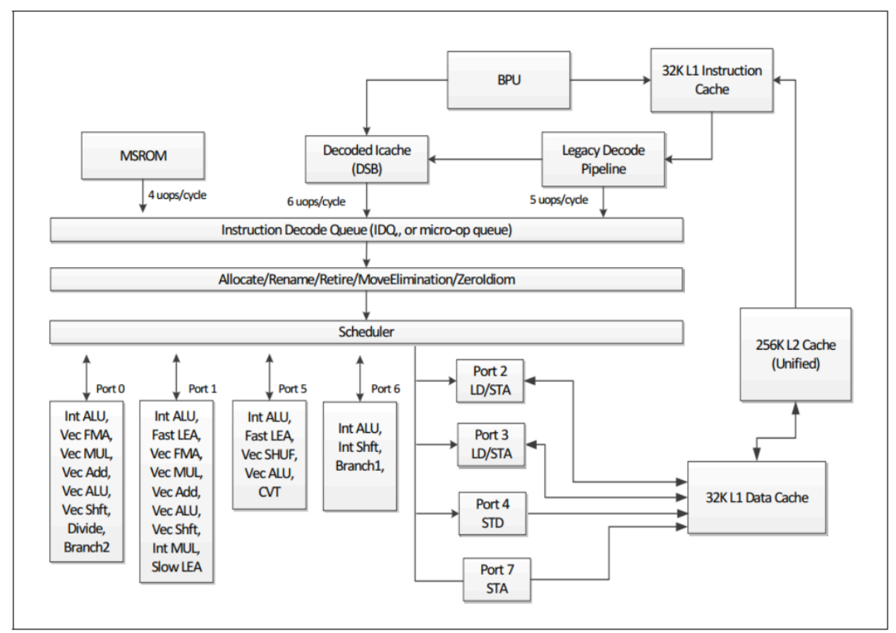

## cpu微架构

### cpu流水线
五级流水线（取指IF、译码ID、执行EXE、访存MEM、写回WB）是一个经典的用于理解cpu的理论模型，在一个理想的五级流水线中，当流水线“满载”时，它可以在同一时刻处理五条处于不同执行阶段的指令 。这本身就是一种并行（ILP，指令级并行）。
但事实上，现代 CPU 并不是每个时钟周期只取一条指令，而是可以同时取指、译码、执行多条指令。例如，Intel Skylake核心就是一个8-way(8路)超标量后端。这意味着它不仅仅是5级流水线，更像是多条并行的流水线。



#### 指令是什么
指令本质就是：算子 + 数据移动(通过load指令加载到寄存器)+ store(存回内存中)

不同cpu指令集都会有相应的汇编语言，众所周知指令集可以分成两周，即RISC-精简指令集和CISC即复杂指令集，我们上面的例子属于x86cpu，就是复杂指令集的代表。
* RISC (如 RISC-V)：在这种架构下，一条汇编代码（如 ADD r1, r2, r3）基本就对应 CPU 执行的一个操作。
* CISC (如 x86)：在x86中，一条汇编指令（例如 ADD EAX, [MEM1]）可能非常复杂。CPU 的“译码”阶段会把它分解成多个更简单的、类似 RISC 的内部操作，称为微操作 (UOPs 或 micro-ops)。例如，`ADD EAX, [MEM1]`会被分解为一个`load uop`（从内存MEM1读取）和一个`add uop`（执行加法）。

#### 例子：ADD r1 r2 r3
以这个例子中比较重要的部分来说明：
* **译码 (ID - Instruction Decode)：**
    1.  **识别指令：** CPU 的控制单元查看指令的 `opcode`（操作码），识别出这是一条 `ADD` 指令。
    2.  **识别寄存器：** 它解析出指令中的三个寄存器地址：两个源寄存器（`r2` 和 `r3`）和一个目标寄存器（`r1`）。
    3.  **读取寄存器：** 它向**寄存器堆 (Register File)** 发出信号，请求读取 `r2` 和 `r3` 中的数据。
    4.  **冒险检测：** （这是流水线中最关键的部分）译码逻辑会检查 `r2` 或 `r3` 是否是*前一条*尚未完成指令的*目标*寄存器。如果是，就会触发**数据冒险 (Data Hazard)**，流水线可能需要暂停 (stall) 或使用**数据前推 (data forwarding)** 技术来解决。
* **访存 (MEM - Memory Access)：**
    1.  **无操作 (No-Op)。** 这是最关键的一点。`ADD` 指令是一条纯粹的算术指令，它不与内存交互。因此，在这条指令经过 MEM 阶段时，这个阶段**什么也不做**。它的计算结果（来自上一阶段 EXE）只是“穿过”这个阶段，准备进入下一阶段。
* **写回 (WB - Write Back)：**
    1.  **写回结果：** 在 EXE 阶段计算出的结果（`r2` + `r3` 的和）在这个阶段被写回 (written back) 到**寄存器堆 (Register File)**。
    2.  **指定位置：** 写入的位置由指令中指定的目标寄存器 `r1` 决定。
    3.  **更新状态：** 一旦写回完成，这条指令就被认为是“退休 (retired)”了，它的结果对后续所有指令都可见（更新了“架构状态”）。


#### 超标量&乱序执行
超标量cpu有一个更宽的前端(Front-End)，可以每个周期取指和译码多条指令（例如 2 条、4 条或更多，这被称为 "issue-width" 或 "发射宽度"）。同时它们有一个包含多个执行单元 (multiple execution units) 的后端 (Back-End)

乱序执行：为了避免流水线因为一条指令的延迟（例如等待内存数据）而全部停顿 (stall)，现代 CPU 会采用乱序执行 。CPU 会查找后续指令中没有数据依赖的指令，让它们“插队”先执行，从而“隐藏”延迟。这部分内容下文会细说。

#### 寄存器堆&数据冒险
“寄存器堆”是 CPU 核心内部的一块物理硬件，它本质上是一个非常小、非常快的 SRAM 存储器。它用于存储寄存器，有如下特点：
* 读写操作必须快到能在一个周期内完成
* 译码阶段会读取其中的值而写回阶段会将内部数据写回寄存器堆，因此它需要有多端口能力，即同时应对不同的需求

当优先进入流水线层级的指令数据尚未被写回，而紧随其后的译码指令就需要执行了，就会发生数据冒险（data hazard），检测的算法是：查看当前指令的源寄存器是否在当前cycle下处于后续阶段（exe, mem, wb）的目标寄存器相同。如果存在hazard，一般来说cpu会将exe,mem阶段的输出喂给译码阶段的值，这个过程叫data forwarding。

#### stall
我们来看一条指令
```asm
LOAD r1, 0(r2)
```
该指令的后四个阶段行为：
1. ID: 读 r2 (基地址)
2. EXE: ALU 计算地址 r2 + 0
3. MEM: 从数据缓存/内存中读取该地址的数据
4. WB: 将从内存读到的数据写入 r1 (写入寄存器堆)

它的运行时间将极不稳定：
* 理想情况 (L1 缓存命中): 很快。L1缓存延迟约 4 个周期
* 最坏情况 (缓存未命中): 灾难性的。如果数据在主内存 (DRAM) 中，延迟可能高达 200+ 周期。这是导致流水线停顿的主要原因。

我们假设这条指令后跟随着另一条指令：
```asm
ADD r3, r1, r4
```
当指令二处于译码阶段，冒险检测单元发现 ADD 指令需要 r1，但此时 LOAD 指令的数据还没有从内存中取回（它还在 MEM 阶段挣扎）。数据前推 (Forwarding) 此时帮不上忙，因为数据根本就还不存在。结果： 控制单元必须让 ADD 指令“冻结”在 ID 阶段，不能进入 EXE。ADD 指令后面的所有指令也都会被卡住。流水线就像堵车一样停了下来。这个“冻结”的周期，就是 Stall。注意，stall只会冻结受到影响的这些指令，下游指令会继续执行（为什么？）。

#### 对抗stall&隐藏stall
前文提到的超标量技术和乱序执行诞生的根本目的就是减少stall带来的影响，我们假设有一条无关指令：AND r6, r7, r8，如果是简单的顺序流水线，由于上一个指令在执行阶段被阻塞了，AND指令无法进入到执行阶段，导致它以及之前的流水线都需要排队。超标量技术使得cpu的执行单元变成多个，这时候AND指令可以到另一个执行单元被执行，而乱序执行技术可以将前面的ADD指令送到一个缓冲区，另外把没有数据依赖的指令送到ALU去执行，两者配合隐藏了stall带来的延迟效应。

## 其他基础知识

### RV32I

**RV32I** 是RISC-V指令集的基础配置：
- **RV** = RISC-V架构
- **32** = 32位地址空间和寄存器宽度
- **I** = Integer基础整数指令集（约40条指令）

这是最小的可用RISC-V指令集，包括算术运算、逻辑运算、加载/存储、分支跳转等基本指令。其他扩展如M（乘除法）、A（原子操作）、C（压缩指令）等可以在I基础上添加。

### CPU的"Tick"及其模拟

**Tick**（时钟周期）是CPU执行的最小时间单位：
- 每个tick代表一个时钟周期
- 在这个周期内，CPU完成一部分工作（如取指、译码、执行等）

**简单的模拟**：
```rust
struct CPU {
    pc: u32,           // 程序计数器
    registers: [u32; 32],
    memory: Vec<u8>,
    // ... 其他状态
}

impl CPU {
    fn tick(&mut self) {
        // 1. 取指 (Fetch)
        let instruction = self.fetch();
        
        // 2. 译码 (Decode)
        let decoded = self.decode(instruction);
        
        // 3. 执行 (Execute)
        self.execute(decoded);
        
        // 4. 更新PC
        self.pc += 4;
    }
    
    fn run(&mut self) {
        loop {
            self.tick();  // 每次调用代表一个时钟周期
        }
    }
}
```

### 如何模拟CPU流水线

#### 五级流水线

**五级流水线模拟**：
```rust
struct Pipeline {
    // 五个流水线阶段
    if_stage: Option<IFStage>,    // Instruction Fetch
    id_stage: Option<IDStage>,    // Instruction Decode
    ex_stage: Option<EXStage>,    // Execute
    mem_stage: Option<MEMStage>,  // Memory Access
    wb_stage: Option<WBStage>,    // Write Back
}

impl Pipeline {
    fn tick(&mut self) {
        // 反向执行避免数据冲突
        self.write_back();
        self.memory_access();
        self.execute();
        self.decode();
        self.fetch();
    }
}
```

流水线需要处理冒险（hazards）：
- **数据冒险**：后续指令依赖前面指令结果 → 需要前递（forwarding）或停顿（stall）
- **控制冒险**：分支指令 → 需要分支预测或清空流水线
- **结构冒险**：资源冲突 → 教育模拟器通常忽略

### 外设设备详解

#### **DTB (Device Tree Blob)**
- **作用**：设备树二进制文件，描述硬件配置
- **功能**：告诉操作系统系统中有哪些设备、内存布局、中断配置等
- **模拟**：通常在启动时加载到内存特定位置，传递给内核

#### **CLINT (Core-Local Interruptor)**
- **作用**：核心本地中断器
- **功能**：
  - 提供机器态定时器中断（MTIP）
  - 提供软件中断（MSIP）用于核间通信
- **关键寄存器**：
  - `mtime`：当前时间计数器
  - `mtimecmp`：比较值，mtime≥mtimecmp时触发中断

#### **PLIC (Platform-Level Interrupt Controller)**
- **作用**：平台级中断控制器
- **功能**：管理外部中断（如UART、硬盘等设备）
- **特性**：支持中断优先级、多核中断路由

#### **UART (Universal Asynchronous Receiver/Transmitter)**
- **作用**：串口通信设备
- **功能**：用于字符输入/输出（通常是控制台）
- **模拟示例**：
```rust
struct UART {
    data: u8,  // 数据寄存器
}

impl UART {
    fn write(&mut self, value: u8) {
        print!("{}", value as char);  // 输出到终端
    }
}
```

#### **VirtIO**
- **作用**：虚拟化I/O设备标准接口
- **功能**：提供标准化的虚拟设备（块设备、网络、GPU等）
- **优势**：简化设备驱动开发，提高性能
- **常见设备**：
  - virtio-blk：块设备（虚拟硬盘）
  - virtio-net：网络设备
  - virtio-console：控制台
