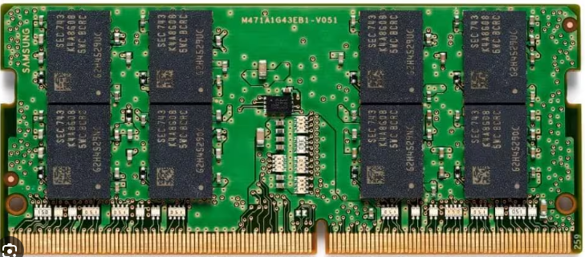
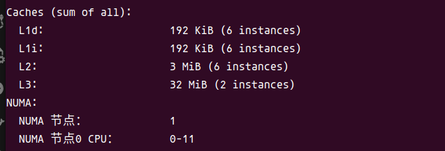

# Cache

本文档记录和cache有关的所有内容


## memory种类

### Dynamic RAM

内存基本是DRAM制作的

* 存储空间需要经常刷新




### Static RAM

一般称为SRAM

* 不一定需要被"refreshed"
* 比DRAM快得多
* 很贵

主要用作CPU cache


#### 内部结构


## 查看cache信息

使用lscpu查看各级缓存的大小

```shell
lscpu
```




## tlb相关

