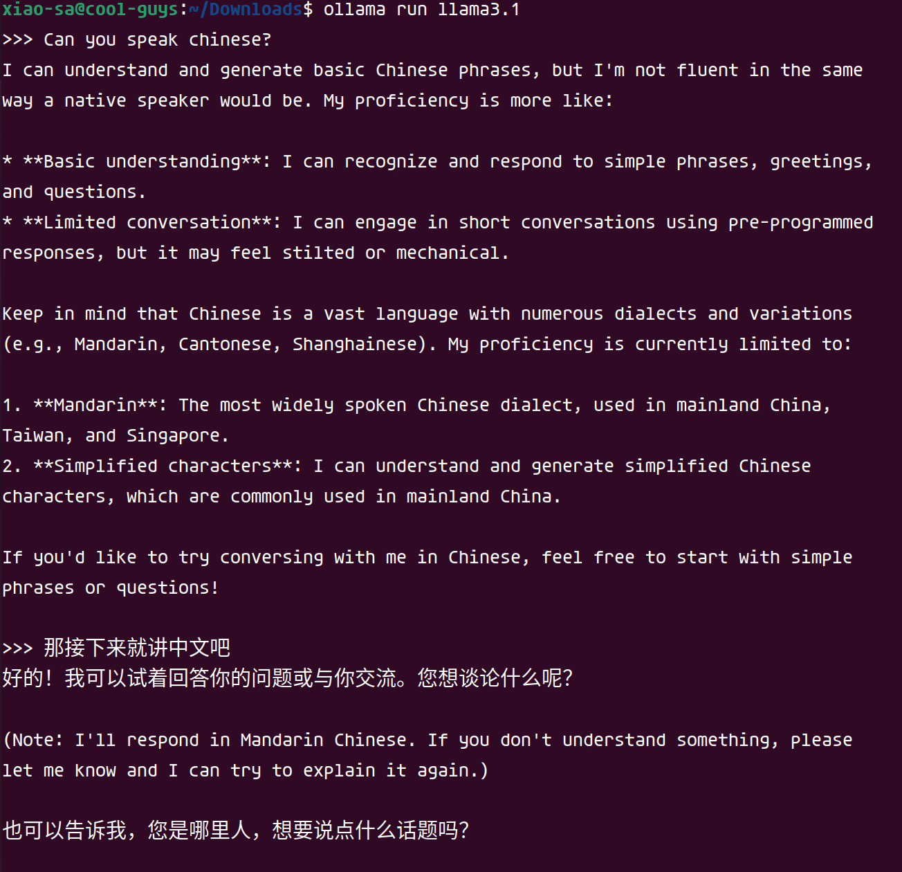

# 深度学习应用与理论


## 主要关注什么

* 定制化的智能算法设计
* 图形学的/图像处理的
* 游戏AI
* 边缘设备的，多快好省的算法


## 应用

### U-net线稿上色模型

https://zhuanlan.zhihu.com/p/24712438


### 妆容迁移

https://zhuanlan.zhihu.com/p/426474467

### 纯数据驱动模型的调优
目标：数据接入和训练，验证的管道已经搭建好了。在这个基础之上想要优化模型训练的超参数，使得整个模型的构建过程自动化的同时又有尽可能高的预测精度。


#### 思路
* 对比不同的搜索算法,这里列举下我找到的搜索算法:
    * hyoeroarameter tuning
        * 随机搜索
        * 网格搜索
        * 贝叶斯优化
        * TPE
    * Neural Architecture Search
        * ENAS
        * DARTS
    * Early Stopping
        * Median Stop
* 黑盒视角
* 构建pipeline的成本不能过高

很多项目中超参调优用的都是网格搜索的方法，网格的方法本质上就是用组合的方法构造参数空间来逐个比较，会受到模型参数的约束，但简单暴力，在探索事件允许的情况下是个基本的思路。

这个问题的约束包括以下：
* 

#### 开源工具
* optuna
* skopt

#### FLAML理论分析
首先，FLAML本身支持的功能包括：
* 模型选择
* 超参调优
* Ensemble
* 推理参数调优

FLAML工具本身背后的理论支撑主要来源于微软的的Research小组

[Research](https://microsoft.github.io/FLAML/docs/Research)

##### 自动化优化流程
FLAML工具是面向任务的自动化AI工具，使用模式可分为：
* 拥有`fit`, `predict`两个核心API的estimator库，用户只需要提供训练数据以及任务类型，即可获得较优的机器学习模型
* 任务类型
    * 表式数据的分类以及回归
    * 时序数据预测
    * panel datasets时序预测
    * 排序
    * 序列分类
    * 序列回归

##### 预置模型，优化目标
首先用户可以自己提供需要的优化指标，Estimator，搜索空间
内置的优化指标包括如下：
* 1-accuracy
* log_loss（分类任务的默认指标）
* r2（回归使用的默认指标）
* 用户自定义指标函数（函数的入参和返回为约定接口，即可保证自定义的自由度和）

```python
def custom_metric(
    X_val, y_val, estimator, labels,
    X_train, y_train, weight_val=None, weight_train=None,
    config=None, groups_val=None, groups_train=None,
):
    return metric_to_minimize, metrics_to_log
```
回归主要采用的Estimator：
* lgbm
* xgboost
* xgb_limitdepth
* rf
* extra_tree

时序预测主要采用的Estimator：
* 所有回归的estimator
* prophet
* arima
* sarimax
* holt-winters
* temporal_fusion_transformer（panel时序预测）

##### Tunning过程
flaml的超参优化过程所采用的算法有两种：
* CFO
* BlendSearch

CFO使用$FLOW^2$方法来适应每一次优化的步长，搜索从对于计算而言低成本的点开始，逐步地转移到高成本的区域。

[CFO论文](arxiv.org/abs/2005.01571)


#### 实践
测试下列工具，以测试集的ACC和RMSE指标来衡量模型的好坏：
* Mindware(基于open-box)(似乎有些BUG)
* FLAML（似乎是维护的最好的）


## LLM-based应用

### 技术背景

看到了李沐的帖子https://zhuanlan.zhihu.com/p/714533901，想到虽然自己平时工作中已经算是通用AI的使用者，但对于该技术还没什么了解，于是想花时间好好看看。


### 希望得到什么

* 使用其中使用到的技术来辅助自己搭建辅助agent，本质是生产力工具
* 通过了解最新技术增强对“AI”方向的洞察
* 理解“开源模型”能够该普通人带来什么有用的东西
* 了解如何定制模型
* 如何部署联网模型


### 一些基本问题

带着问题去了解一项技术，动力会更猛一些：

* LLM的评测/benchmark有哪些，原理是啥
* 评测LLM能力的指标是什么
* 


### Llama3-背景&理论

#### 参考材料

* llama团队官网：https://llama.meta.com/
* 获取地址：HuggingFace, Kaggle, Meta官网
* 


这部分内容是我看了李沐Llama3论文解读的缩略版。

首先是模型架构并没有什么变化：依旧是基于标准的稠密版本的Transformer architecture (Vaswani et al., 2017)，模型提升主要依赖于数据质量的提升以及训练数据size的提升


#### GQA（grouped query attention）


### Llama3-实践


#### Ollama一键安装

由于当前我个人的开发PC只搭载了一张8G的NVIDIA 2060，vram内存不足以支撑我使用405B等十分占用内存的模型，所以我使用的是8B的llama3:https://ollama.com/library/llama3.1:8b


这类模型后面跟着的tag`8b`的意思是：


使用`ollama`进行安装非常简单，我安装后简单地试了一下：




#### 使用candle部署


#### 网络连接

我一直认为，让agent连接上互联网才能真正释放其生产力。为此，我参考了下面的这些链接：

* WebLlama
* 


### 了解LangChain

文档中提到的核心动机：
* 连接LLM和数据源
* 允许语言模型和环境互动

安装langchain
```shell
pip install langchain[all]
# 依赖项非常多
```
langchain允许的组件包括这些:
* model I/O
* Data connection

使用代码


### AlphaProof

AlphaProof 是由谷歌 DeepMind 开发的一种新的基于强化学习的系统，专门用于形式化数学推理。它结合了预训练的语言模型和 AlphaZero 强化学习算法，后者之前成功自学掌握了国际象棋、将棋和围棋。AlphaProof 通过在形式化数学语言 Lean 中自我训练，来证明数学陈述。它能够生成解决方案候选，并通过搜索可能的证明步骤来证明或反驳这些解决方案。每个找到并验证的证明都被用来强化 AlphaProof 的语言模型，从而提高其解决后续更复杂问题的能力。

在 2024 年的国际数学奥林匹克竞赛（IMO）中，AlphaProof 与另一个系统 AlphaGeometry 2 结合，共同解决了比赛中的四个问题，达到了银牌水平。AlphaProof 解决了两个代数问题和一个数论问题，包括比赛中最难的问题，而 AlphaGeometry 2 证明了几何问题。这两个系统的结合使得它们在 42 分满分中获得了 28 分，每个解决的问题都得到了满分，相当于银牌类别的最高端。这标志着 AI 在数学竞赛中首次达到这样的成就。


#### 其中涉及到的技术点

阅读原文：

> We established a bridge between these two complementary spheres by fine-tuning a Gemini model to automatically translate natural language problem statements into formal statements, creating a large library of formal problems of varying difficulty.
>
> 
>
> 专门制作了在Gemini之上的形式化翻译模型，从而获得了100W+数据
>
> 
>
> Each proof that was found and verified is used to reinforce AlphaProof’s language model, enhancing its ability to solve subsequent, more challenging problems.
>
> 
>
> theorem prover作为验证器


* LLM把自然语言翻译成形式化语言
* MCTS+RL作为搜索搜索引擎
* theorem prover为后端验证工具
* 使用XX优化XX


在我看来，其实这些信息背后真正重要的结果是**基于Lean的搜索可以很强**，目前来看，他至少能娶到IMO银牌的水平。


## 理论

