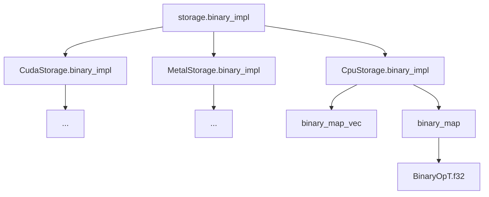

# candle tensor

candle的基础数据类型`tensor`的设计可以在candle_core中找到：


## dtype

`DType`枚举用于表示不同的数值类型，这些类型可用于表示机器学习或科学计算中的数据类型。

`DType`枚举定义了以下变体：

- `U8`：无符号8位整数。
- `U32`：无符号32位整数。
- `I64`：有符号64位整数。
- `BF16`：使用半精度（16位）的脑浮点数（Brain Floating Point）。
- `F16`：使用半精度（16位）的浮点数。
- `F32`：使用单精度（32位）的浮点数。
- `F64`：使用双精度（64位）的浮点数。

```rust
#[derive(Debug, Copy, Clone, PartialEq, Eq, Hash)]
pub enum DType {
    // Unsigned 8 bits integer.
    U8,
    // Unsigned 32 bits integer.
    U32,
    // Signed 64 bits integer.
    I64,
    // Brain floating-point using half precision (16 bits).
    BF16,
    // Floating-point using half precision (16 bits).
    F16,
    // Floating-point using single precision (32 bits).
    F32,
    // Floating-point using double precision (64 bits).
    F64,
}
```

注意几个关键的attribute:

* 允许为枚举实现`Debug` trait，这意味着你可以使用`println!("{:?}")`来打印枚举变体的值。
* 允许为枚举实现`Copy` trait，这意味着枚举的值可以被复制到另一个变量而不需要移动原值。


## 关键的trait

* WithDType
* NdArray
* VecOps


### WithDtype

WithDType实际上是dtype的伴生trait，用于表示所有符合Dtype枚举定义的类型都能实现的方法，其中有一些trait bound是值得注意的

* `'static`：表示实现此trait的类型必须具有'static生命周期，即它们不借用任何临时的数据。
* `Send`：表示实现此trait的类型可以安全地在多线程之间传送。
* `Sync`：表示实现此trait的类型可以安全地在多线程之间同步状态。
* `std::any::Any`：表示实现此trait的类型可以被用作动态类型。
* `crate::cpu::kernels::VecOps`：表示实现此trait的类型必须实现了`VecOps`，这是一个自定义的用于提供向量操作的trait，感兴趣可以跳转到相应的子标题查看


```rust
// 下面内容可以在dtype.rs中找到

pub trait WithDType:
    Sized
    + Copy
    + num_traits::NumAssign
    + std::cmp::PartialOrd
    + std::fmt::Display
    + 'static
    + Send
    + Sync
    + std::any::Any
    + crate::cpu::kernels::VecOps
{
    const DTYPE: DType;

    fn from_f64(v: f64) -> Self;
    fn to_f64(self) -> f64;
    fn cpu_storage_ref(data: &[Self]) -> CpuStorageRef<'_>;
    fn to_cpu_storage_owned(data: Vec<Self>) -> CpuStorage;

    fn to_cpu_storage(data: &[Self]) -> CpuStorage {
        Self::to_cpu_storage_owned(data.to_vec())
    }

    fn cpu_storage_as_slice(s: &CpuStorage) -> Result<&[Self]>;
    fn cpu_storage_data(s: CpuStorage) -> Result<Vec<Self>>;
}
```

除了转换函数之外的函数已经加上注释，有许多内容和CPU backend相关


伴生Trait的方法通过宏传递给所有dtype类型：

1. `$ty`：要实现`WithDType`的类型。
2. `$dtype`：与`$ty`对应的`DType`枚举变体。
3. `$from_f64`：一个表达式，用于将`f64`类型的值转换为`$ty`类型。
4. `$to_f64`：一个表达式，用于将`$ty`类型的值转换为`f64`类型。

```rust
macro_rules! with_dtype {
    ($ty:ty, $dtype:ident, $from_f64:expr, $to_f64:expr) => {
        impl WithDType for $ty {
            const DTYPE: DType = DType::$dtype;

            fn from_f64(v: f64) -> Self {
                $from_f64(v)
            }

            fn to_f64(self) -> f64 {
                $to_f64(self)
            }

            fn cpu_storage_ref(data: &[Self]) -> CpuStorageRef<'_> {
                CpuStorageRef::$dtype(data)
            }

            fn to_cpu_storage_owned(data: Vec<Self>) -> CpuStorage {
                CpuStorage::$dtype(data)
            }

            fn cpu_storage_data(s: CpuStorage) -> Result<Vec<Self>> {
                match s {
                    CpuStorage::$dtype(data) => Ok(data),
                    _ => Err(Error::UnexpectedDType {
                        expected: DType::$dtype,
                        got: s.dtype(),
                        msg: "unexpected dtype",
                    }
                    .bt()),
                }
            }

            fn cpu_storage_as_slice(s: &CpuStorage) -> Result<&[Self]> {
                match s {
                    CpuStorage::$dtype(data) => Ok(data),
                    _ => Err(Error::UnexpectedDType {
                        expected: DType::$dtype,
                        got: s.dtype(),
                        msg: "unexpected dtype",
                    }
                    .bt()),
                }
            }
        }
    };
}

// 看一个注册的例子
with_dtype!(u8, U8, |v: f64| v as u8, |v: u8| v as f64);
```

这里，macro的最后两项参数分别是目标dtype和f64的转换函数。


`to_cpu_storage_owned`方法获取`Vec<WithDtype>`的所有权，该方法在tensor初始化过程中用来获得CpuStorage


### VecOps

VecOps trait包括这些函数签名：

* fn min(self, rhs: Self) -> Self;
* fn max(self, rhs: Self) -> Self;
* fn vec_dot(lhs: *const Self, rhs: *const Self, res: *mut Self, len: usize)
* fn vec_reduce_sum(xs: *const Self, res: *mut Self, len: usize)
* fn vec_reduce_max(xs: *const Self, res: *mut Self, len: usize)
* fn vec_reduce_min(xs: *const Self, res: *mut Self, len: usize)

值得注意的是除了前两项之外的方法都有了统一实现，它们的实现都是**unsafe,inline**的,这主要是为了性能，代码会使用到裸指针，我们以其中一个作为例子查看：

下面的实现是返回非空向量的最大元素

```rust
#[inline(always)]
unsafe fn vec_reduce_max(xs: *const Self, res: *mut Self, len: usize) {
    *res = *xs;
    for i in 1..len {
        *res = (*res).max(*xs.add(i))
    }
}
```


### Ndarray

Ndarray是初始化一个tensor类型的数据输入数据类型，即new方法的入参，

当一个类型满足WithDType，则必定属于NdArray，不仅如此，通过

```rust
pub trait NdArray {
    fn shape(&self) -> Result<Shape>;

    fn to_cpu_storage(&self) -> CpuStorage;
}

impl<S: WithDType> NdArray for S {
    fn shape(&self) -> Result<Shape> {
        Ok(Shape::from(()))
    }

    fn to_cpu_storage(&self) -> CpuStorage {
        S::to_cpu_storage(&[*self])
    }
}
```


## backend

我们以cpu_backend为例,文件名：cpu_backend/mod.rs

```rust
#[derive(Debug, Clone)]
pub enum CpuStorage {
    U8(Vec<u8>),
    U32(Vec<u32>),
    I64(Vec<i64>),
    BF16(Vec<bf16>),
    F16(Vec<f16>),
    F32(Vec<f32>),
    F64(Vec<f64>),
}

#[derive(Debug, Clone)]
pub enum CpuStorageRef<'a> {
    U8(&'a [u8]),
    U32(&'a [u32]),
    I64(&'a [i64]),
    BF16(&'a [bf16]),
    F16(&'a [f16]),
    F32(&'a [f32]),
    F64(&'a [f64]),
}
```


## 其他结构体设计

### CpuStorage

```rust
#[derive(Debug, Clone)]
pub enum CpuStorage {
    U8(Vec<u8>),
    U32(Vec<u32>),
    I64(Vec<i64>),
    BF16(Vec<bf16>),
    F16(Vec<f16>),
    F32(Vec<f32>),
    F64(Vec<f64>),
}
```

CpuStorage是数据的统一存储类型


## Tensor

```rust
// Tensors are refcounted so that cloning is cheap when building the op graph.
// Storages are also refcounted independently so that its possible to avoid
// copying the storage for operations that only modify the shape or stride.
#[derive(Clone)]
/// Tensors are reference counted with [`Arc`] so cloning them is cheap.
pub struct Tensor(Arc<Tensor_>);


pub struct Tensor_ {
    id: TensorId,
    // As we provide inner mutability on the tensor content, the alternatives are:
    // - Using a mutex, this would have the highest cost when retrieving the storage but would
    //   prevent errors when concurrent access takes place. Mutex would also be subject to
    //   deadlocks for example using the current code if the same tensor is used twice by a single
    //   binary op.
    // - Using a refcell unsafe cell would have some intermediary cost, borrow checking would be
    //   verified dynamically, but the resulting tensors would not be send or sync.
    // - Using an unsafe cell would have the lowest cost but undefined behavior on concurrent
    //   accesses.
    // Ideally, we would use Arc<Storage> for tensors on which we don't plan on modifying the data
    // and Arc<Mutex<Storage>> for tensors where the data could be modified, e.g. variables but
    // that's tricky to encode in the current setup.
    storage: Arc<RwLock<Storage>>,
    layout: Layout,
    op: BackpropOp,
    is_variable: bool,
    dtype: DType,
    device: Device,
}
```


要点：

* Tensor使用Arc来引用计数，从而拷贝Tensor的成本变得比较低
* op字段用于记录作用于tensor的
* 实现了内部可变性：
  * `Arc<RwLock<Storage>>`形的storage字段针对会修改数据内容的变量
  * 字段`is_variable`


### 低成本拷贝

Arc对象的拷贝实际上很像引用，在多线程环境中实际拷贝的是对象指针，从而在构建大型计算图中，会指向一个内存块。


### 内部可变性

关于internal mutability的含义，可以参考：

> By default shared things in Rust are read-only. You use internal mutability, when you need to modify a shared thing.
>
> So anywhere you need to have a shared thing (`&`, `Rc`, `Arc`, `static`, captures of `Fn`), but you want to mutate it, you use internal mutability (cells, mutexes, atomics).

而关于Cell，我们可以有：

```rust
use std::cell::{Cell, RefCell};

let c = Cell::new(5);
let mut r = RefCell::new(5);

// 使用 Cell
let _value = c.get(); // 获取值
c.set(6); // 修改值

// 使用 RefCell
let _value = r.borrow(); // 获取不可变引用
*r.borrow_mut() = 6; // 获取可变引用并修改值

//那么为何Tensor的设计不是：
pub struct Tensor_ {
    storage: Cell<Storage>,
	...
}
```


storage的定义其实经过了这样的变化（可以查看历史PR）

* `Arc<Storage>`:
* `Arc<RefCell<Storage>>`:pr154
* `Arc<RwLock<Storage>>`:pr155


这里有几个问题：

* 为何不使用Cell（理论上最低的开销），源码注释给出了答案：

> Using an unsafe cell would have the lowest cost but undefined behavior on concurrent accesses

简言之就是担心出现竞态条件

* 不用RefCell

> 因为检查借用的开销，顺带一提storage()方法经过这样的变动：

```rust
fn storage(&self) -> Result<std::cell::Ref<'_, Storage>> {
    Ok(self.storage.try_borrow()?)
fn storage(&self) -> std::sync::RwLockReadGuard<'_, Storage> {
    self.storage.read().unwrap()
```

* 使用Mutex和RwLock哪个好

在计算图场景下，一个表达式当中可能多次引用了同一个storage，甚至可能是不同的线程在同一时间完成该操作，如果使用Mutex，该开销将非常高，而RwLock仅在改数据时进行上锁，因此RwLock更加合适。


### layout

`storage`是一个一维数组，因此“shape”相关的信息存储在了`layout`中

从而，当我们要获取三维数组的slice如`tensor[1][2]`，时我们可以知道如何截取或者转换storage中的内容

```rust
#[derive(Clone, PartialEq, Eq)]
pub struct Shape(Vec<usize>);

pub struct Layout {
    shape: Shape,
    // The strides are given in number of elements and not in bytes.
    stride: Vec<usize>,
    start_offset: usize,
}

// layout的初始化方法
impl Layout {
        pub fn contiguous_with_offset<S: Into<Shape>>(shape: S, start_offset: usize) -> Self {
            let shape = shape.into();
            let stride = shape.stride_contiguous();
            Self {
                shape,
                stride,
                start_offset,
            }
    }
}
```


layout存储了：

* shape
* strides
* start offset


这里我们先了解下，什么是strides:

我的理解就是连续元素的步长，如：

```
[[[1, 2, 3, 4], [5, 6, 7, 8], [9, 10, 11, 12]], [...]]
这个数组的shape是(2, 3, 4)
按照candle中的定义，stride应该是一个连续元素数量的数组，即：
(3 * 4, 4, 1)

上述的例子，还会用来演示narrow
```

这里注意一点：candle是行主序存储


关于如何使用layout，我们从tensor的API：narrow出发：

```rust
pub fn narrow<D: Dim>(&self, dim: D, start: usize, len: usize) -> Result<Self> {
    let dims = self.dims();
    let dim = dim.to_index(self.shape(), "narrow")?;
    let err = |msg| {
        Err::<(), _>(
            Error::NarrowInvalidArgs {
                shape: self.shape().clone(),
                dim,
                start,
                len,
                msg,
            }
            .bt(),
        )
    };
    if start > dims[dim] {
        err("start > dim_len")?
    }
    if start.saturating_add(len) > dims[dim] {
        err("start + len > dim_len")?
    }
    if start == 0 && dims[dim] == len {
        Ok(self.clone())
    } else {
        let op = BackpropOp::new1(self, |t| Op::Narrow(t, dim, start, len));
        let layout = self.layout().narrow(dim, start, len)?;
        let tensor_ = Tensor_ {
            id: TensorId::new(),
            storage: self.storage.clone(),
            layout,
            op,
            is_variable: false,
            dtype: self.dtype,
            device: self.device.clone(),
        };
        Ok(Tensor(Arc::new(tensor_)))
    }
}
```

可以看到storage实际上只是经过了拷贝，真正变化的内容是`layout`，Layout.narrow()如下：

```rust
...
    let mut dims = dims.to_vec();
    dims[dim] = len;
    Ok(Self {
        shape: Shape::from(dims),
        stride: self.stride.clone(),
        start_offset: self.start_offset + self.stride[dim] * start,
    })
```

从这里我们能够得知：

`tensor.narrow`返回的新tensor，其内部的storage实际上指向的内存块是原tensor的，除非对tensor调用`to_vec`，`to_vec2`等方法，该操作并不会出现storage类型的内存分配/拷贝操作


### index

这部分实现的代码在indexer.rs

相应的测试文件indexing_tests.rs

首先我们来看索引器结构体


#### TensorIndexer

```rust
#[derive(Debug)]
/// Generic structure used to index a slice of the tensor
pub enum TensorIndexer {
    /// This selects the elements for which an index has some specific value.
    Select(usize),
    /// This is a regular slice, purely indexing a chunk of the tensor
    Narrow(Bound<usize>, Bound<usize>),
    /// Indexing via a 1d tensor
    IndexSelect(Tensor),
    Err(Error),
}
```


使用TensorIndexer来索引Tensor

```rust
impl Tensor {
    fn index(&self, indexers: &[TensorIndexer]) -> Result<Self, Error> {
        let mut x = self.clone();
        let dims = self.shape().dims();
        let mut current_dim = 0;
        for (i, indexer) in indexers.iter().enumerate() {
            x = match indexer {
                TensorIndexer::Select(n) => x.narrow(current_dim, *n, 1)?.squeeze(current_dim)?,
                TensorIndexer::Narrow(left_bound, right_bound) => {
                    let start = match left_bound {
                        Bound::Included(n) => *n,
                        Bound::Excluded(n) => *n + 1,
                        Bound::Unbounded => 0,
                    };
                    let stop = match right_bound {
                        Bound::Included(n) => *n + 1,
                        Bound::Excluded(n) => *n,
                        Bound::Unbounded => dims[i],
                    };
                    let out = x.narrow(current_dim, start, stop.saturating_sub(start))?;
                    current_dim += 1;
                    out
                }
                TensorIndexer::IndexSelect(indexes) => {
                    if indexes.rank() != 1 {
                        crate::bail!("multi-dimensional tensor indexing is not supported")
                    }
                    let out = x.index_select(&indexes.to_device(x.device())?, current_dim)?;
                    current_dim += 1;
                    out
                }
                TensorIndexer::Err(e) => crate::bail!("indexing error {e:?}"),
            };
        }
        Ok(x)
    }
}
```

* Select(usize) -> tensor.narrow


#### 测试用例

再来看下test中常用的indexing方法：

```rust
// integer_index
let result = tensor.i(1)?;
let result = tensor.i((.., 2))?;
// range_index
let result = tensor.i(..)?;
let result = tensor.i(1..3)?;
// index_3d
assert_eq!(tensor.i((0, 1, 3))?.to_scalar::<u32>()?, 7);
assert_eq!(tensor.i((0..2, 0, 0))?.to_vec1::<u32>()?, &[0, 12]);
// slice_assign

```

indexing的API只有tensor.i(`index`:...)

其实现：

```rust
pub trait IndexOp<T> {
    /// Returns a slicing iterator which are the chunks of data necessary to
    /// reconstruct the desired tensor.
    fn i(&self, index: T) -> Result<Tensor, Error>;
}
...
impl<T> IndexOp<T> for Tensor
where
    T: Into<TensorIndexer>
{}

impl<A> IndexOp<(A,)> for Tensor
where
    A: Into<TensorIndexer>,
{}

#[allow(non_snake_case)]
impl<A, B> IndexOp<(A, B)> for Tensor
where
    A: Into<TensorIndexer>,
    B: Into<TensorIndexer>,
{}
```

* `i`接受特定的`T`，然后返回一个Tensor对象
* `Into<TensorIndexer>`即可以转换为TensorIndexer的类型
* 接受的对象基本是基于`TensorIndexer`构成的元组类型
* 


## Op

### 实现要点

实现一个深度学习框架的Op系统，其关键是**反向传播**的过程该如何实现，从tensor的实现考虑，需要思考：

* 基本：实现一个OP的全流程
  * 给op注册<op_type>OpT trait
  * 实现各个op的过程宏：
    * layout对齐(broadcast)
    * storage.<op_type>_impl（op_type包括：unary, binary）
    * BackpropOp增加关系
  * 将特定op（如 Add, Sub等）注册为tensor的方法
* op_impl
* 如何记录梯度信息


#### 注册实例

有两部分注册工作，我们都以binary op作为示例：

* 给op注册<op_type>OpT trait

```rust
// BinaryOpt
pub trait BinaryOpT {
    const NAME: &'static str;
    const KERNEL: &'static str;
    const V: Self;
    fn bf16(v1: bf16, v2: bf16) -> bf16;
    fn f16(v1: f16, v2: f16) -> f16;
    fn f32(v1: f32, v2: f32) -> f32;
    fn f64(v1: f64, v2: f64) -> f64;
    fn u8(v1: u8, v2: u8) -> u8;
    fn u32(v1: u32, v2: u32) -> u32;
    fn i64(v1: i64, v2: i64) -> i64;

    const BF16_VEC: bool = false;
    fn bf16_vec(_xs1: &[bf16], _xs2: &[bf16], _ys: &mut [bf16]) {}
    const F16_VEC: bool = false;
    fn f16_vec(_xs1: &[f16], _xs2: &[f16], _ys: &mut [f16]) {}
    const F32_VEC: bool = false;
    fn f32_vec(_xs1: &[f32], _xs2: &[f32], _ys: &mut [f32]) {}
    const F64_VEC: bool = false;
    fn f64_vec(_xs1: &[f64], _xs2: &[f64], _ys: &mut [f64]) {}
    const U8_VEC: bool = false;
    fn u8_vec(_xs1: &[u8], _xs2: &[u8], _ys: &mut [u8]) {}
    const U32_VEC: bool = false;
    fn u32_vec(_xs1: &[u32], _xs2: &[u32], _ys: &mut [u32]) {}
    const I64_VEC: bool = false;
    fn i64_vec(_xs1: &[i64], _xs2: &[i64], _ys: &mut [i64]) {}
}

// 注册过程
bin_op!(Add, "add", |v1, v2| v1 + v2, vs_add, vd_add);
bin_op!(Sub, "sub", |v1, v2| v1 - v2, vs_sub, vd_sub);
bin_op!(Mul, "mul", |v1, v2| v1 * v2, vs_mul, vd_mul);
bin_op!(Div, "div", |v1, v2| v1 / v2, vs_div, vd_div);
bin_op!(
    Minimum,
    "minimum",
    |v1, v2| if v1 > v2 { v2 } else { v1 },
    vs_min,
    vd_min
);
bin_op!(
    Maximum,
    "maximum",
    |v1, v2| if v1 < v2 { v2 } else { v1 },
    vs_max,
    vd_max
);
```


* 将特定op（如 Add, Sub等）注册为tensor的方法

```rust
impl Tensor {
    ...
    // 二元算子注册
    binary_op!(add, Add);
    binary_op!(mul, Mul);
    binary_op!(sub, Sub);
    binary_op!(div, Div);
    // broadcast注册
	broadcast_binary_op!(broadcast_add, add);
    broadcast_binary_op!(broadcast_mul, mul);
    broadcast_binary_op!(broadcast_sub, sub);
    broadcast_binary_op!(broadcast_div, div);
    broadcast_binary_op!(broadcast_maximum, maximum);
    broadcast_binary_op!(broadcast_minimum, minimum);
    broadcast_binary_op!(broadcast_eq, eq);
    broadcast_binary_op!(broadcast_ne, ne);
    broadcast_binary_op!(broadcast_lt, lt);
    broadcast_binary_op!(broadcast_le, le);
    broadcast_binary_op!(broadcast_gt, gt);
    broadcast_binary_op!(broadcast_ge, ge);
}

// binary_op
macro_rules! binary_op {
    ($fn_name:ident, $op_name:ident) => {
        pub fn $fn_name(&self, rhs: &Self) -> Result<Self> {
            let shape = self.same_shape_binary_op(rhs, stringify!($fn_name))?;
            if shape.elem_count() == 0 {
                return Ok(self.clone());
            }
            let storage = self.storage().binary_impl::<crate::op::$op_name>(
                &*rhs.storage(),
                self.layout(),
                rhs.layout(),
            )?;
            let op = BackpropOp::new2(self, rhs, |t1, t2| Op::Binary(t1, t2, BinaryOp::$op_name));
            Ok(from_storage(storage, shape.clone(), op, false))
        }
    };
}
```


下面是一个调用的例子

```rust
    #[inline(always)]
    fn f32(v1: f32, v2: f32) -> f32 {
        $e(v1, v2)
    }
```


### op_impl

该实现的链路可以概括为（以binary op为例）：



```rust
pub fn binary_map<T: Copy, U: Copy, F: FnMut(T, T) -> U>(
    lhs_l: &Layout,
    rhs_l: &Layout,
    lhs: &[T],
    rhs: &[T],
    mut f: F,
) -> Vec<U> {
    match (lhs_l.contiguous_offsets(), rhs_l.contiguous_offsets()) {
        (Some((o_l1, o_l2)), Some((o_r1, o_r2))) => lhs[o_l1..o_l2]
            .iter()
            .zip(rhs[o_r1..o_r2].iter())
            .map(|(&l, &r)| f(l, r))
            .collect(),
        (Some((o_l1, o_l2)), None) => {
            // TODO: Maybe we want to avoid going through the layout twice.
            match rhs_l.offsets_b() {
                Some(ob) => {
                    let mut i_in_block = 0;
                    let mut i_right_broadcast = 0;
                    lhs[o_l1..o_l2]
                        .iter()
                        .map(|&l| {
                            let r = unsafe { rhs.get_unchecked(i_in_block + ob.start) };
                            i_right_broadcast += 1;
                            if i_right_broadcast >= ob.right_broadcast {
                                i_in_block += 1;
                                i_right_broadcast = 0;
                            }
                            if i_in_block >= ob.len {
                                i_in_block = 0
                            }
                            f(l, *r)
                        })
                        .collect()
                }
                None => lhs_l
                    .strided_index()
                    .zip(rhs_l.strided_index())
                    .map(|(lhs_i, rhs_i)| f(lhs[lhs_i], rhs[rhs_i]))
                    .collect(),
            }
        }
        (None, Some((o_r1, o_r2))) => {
            // TODO: Maybe we want to avoid going through the layout twice.
            match lhs_l.offsets_b() {
                Some(ob) => {
                    let mut i_in_block = 0;
                    let mut i_right_broadcast = 0;
                    rhs[o_r1..o_r2]
                        .iter()
                        .map(|&r| {
                            let l = unsafe { lhs.get_unchecked(i_in_block + ob.start) };
                            i_right_broadcast += 1;
                            if i_right_broadcast >= ob.right_broadcast {
                                i_in_block += 1;
                                i_right_broadcast = 0;
                            }
                            if i_in_block >= ob.len {
                                i_in_block = 0
                            }
                            f(*l, r)
                        })
                        .collect()
                }
                None => lhs_l
                    .strided_index()
                    .zip(rhs_l.strided_index())
                    .map(|(lhs_i, rhs_i)| f(lhs[lhs_i], rhs[rhs_i]))
                    .collect(),
            }
        }
        _ => lhs_l
            .strided_index()
            .zip(rhs_l.strided_index())
            .map(|(lhs_i, rhs_i)| f(lhs[lhs_i], rhs[rhs_i]))
            .collect(),
    }
}
```


### 计算图构建实例

看一段简单的单元测试代码：

```rust
fn simple_grad(device: &Device) -> Result<()> {
    let x = Var::new(&[3f32, 1., 4.], device)?;
    let x = x.as_tensor();
    let y = (((x * x)? + x * 5f64)? + 4f64)?;
    let grads = y.backward()?;
    let grad_x = grads.get(x).context("no grad for x")?;
    assert_eq!(x.to_vec1::<f32>()?, [3., 1., 4.]);
    // y = x^2 + 5.x + 4
    assert_eq!(y.to_vec1::<f32>()?, [28., 10., 40.]);
    // dy/dx = 2.x + 5
    assert_eq!(grad_x.to_vec1::<f32>()?, [11., 7., 13.]);
    Ok(())
}
```


### broadcast OP

张量的广播操作（Broadcasting）是一种在不同形状的张量之间进行算术运算的技术。它允许你在某些维度上扩展较小的张量，使其在那些维度上“看起来”像较大的张量，从而可以在不复制数据的情况下进行元素级运算。

广播遵循以下规则：

1. **维度对齐**：从两个张量的尾部（即从右到左）开始比较它们的维度大小。
2. **维度扩展**：如果一个张量的维度较小，那么在比较时会在其前面添加更多的维度，每个新维度的大小为1，直到两个张量的维度大小相同。
3. **维度广播**：如果一个张量的某个维度大小为1，而另一个张量的相应维度大小大于1，那么较小的张量会在该维度上被广播扩展到较大的维度大小。
4. **元素广播**：如果两个张量的维度大小在某个维度上不匹配，并且其中一个张量的维度大小也不是1，那么它们不能进行广播。


```rust
// shape.rs
    pub fn broadcast_shape_binary_op(&self, rhs: &Self, op: &'static str) -> Result<Shape> {
        let lhs = self;
        let lhs_dims = lhs.dims();
        let rhs_dims = rhs.dims();
        let lhs_ndims = lhs_dims.len();
        let rhs_ndims = rhs_dims.len();
        let bcast_ndims = usize::max(lhs_ndims, rhs_ndims);
        let mut bcast_dims = vec![0; bcast_ndims];
        // 遍历最大维度次数
        for (idx, bcast_value) in bcast_dims.iter_mut().enumerate() {
            let rev_idx = bcast_ndims - idx;
            let l_value = if lhs_ndims < rev_idx {
                1
            } else {
                lhs_dims[lhs_ndims - rev_idx]
            };
            let r_value = if rhs_ndims < rev_idx {
                1
            } else {
                rhs_dims[rhs_ndims - rev_idx]
            };
            *bcast_value = if l_value == r_value {
                l_value
            } else if l_value == 1 {
                r_value
            } else if r_value == 1 {
                l_value
            } else {
                Err(Error::ShapeMismatchBinaryOp {
                    lhs: lhs.clone(),
                    rhs: rhs.clone(),
                    op,
                }
                .bt())?
            }
        }
        Ok(Shape::from(bcast_dims))
    }
```


接下来的循环遍历 `bcast_dims`，对于每个维度：

- `rev_idx` 是当前维度的反向索引，用于从尾部开始比较维度大小。
- `l_value` 是 `lhs` 在 `rev_idx` 位置的维度大小，如果 `lhs` 的维度数不足以到达该位置，则默认为1。
- `r_value` 是 `rhs` 在 `rev_idx` 位置的维度大小，如果 `rhs` 的维度数不足以到达该位置，则默认为1。
- `bcast_value` 是广播后的维度大小，它将取 `l_value` 和 `r_value` 中的非1值，如果两者都大于1且不相等，则返回一个形状不匹配的错误。


#### Layout.strided_index

```rust
    ...    
	None => lhs_l
            .strided_index()
            .zip(rhs_l.strided_index())
            .map(|(lhs_i, rhs_i)| f(lhs[lhs_i], rhs[rhs_i]))
            .collect(),
	}
```

`binary_map`的实现高度依赖`Layout.strided_index`方法来提供Iterator

这个方法实际是返回一个基于Layout的StridedIndex结构体

```rust
#[derive(Debug)]
pub struct StridedIndex<'a> {
    next_storage_index: Option<usize>,
    multi_index: Vec<usize>,
    dims: &'a [usize],
    stride: &'a [usize],
}

// 为其实现Iterator方法
impl<'a> Iterator for StridedIndex<'a> {
    type Item = usize;

    fn next(&mut self) -> Option<Self::Item> {
        let storage_index = match self.next_storage_index {
            None => return None,
            Some(storage_index) => storage_index,
        };
        let mut updated = false;
        let mut next_storage_index = storage_index;
        for ((multi_i, max_i), stride_i) in self
            .multi_index
            .iter_mut()
            .zip(self.dims.iter())
            .zip(self.stride.iter())
            .rev()
        {
            let next_i = *multi_i + 1;
            if next_i < *max_i {
                *multi_i = next_i;
                updated = true;
                next_storage_index += stride_i;
                break;
            } else {
                next_storage_index -= *multi_i * stride_i;
                *multi_i = 0
            }
        }
        self.next_storage_index = if updated {
            Some(next_storage_index)
        } else {
            None
        };
        Some(storage_index)
    }
}
```


#### 实现细节

Tensor.broadcast -> Layout.broadcast

```
// Layout.broadcast

```


问题：**broadcast是否属于op**


### 一元算子


### affine算子

注册一个二元算子，使用的是宏`bin_trait`

* trait对应到std::ops中的trait
* 

```rust
macro_rules! bin_trait {
	($trait:ident, $fn1:ident, $mul:expr, $add:expr) => {
            impl<B: std::borrow::Borrow<Tensor>> std::ops::$trait<B> for Tensor {
            type Output = Result<Tensor>;

            fn $fn1(self, rhs: B) -> Self::Output {
                Tensor::$fn1(&self, rhs.borrow())
            	}
        	}
        ...
    }
}

// 将加法注册为binary op
// 通过这种方法实现的op包括：Add, Sub, Mul, Div
bin_trait!(Add, add, |_| 1., |v| v);
```


## 非算子API

### new

通过Ndarry获取**shape**以及**to_cpu_storage**来获取统一的**CpuStorage**格式，再通过from_storage装箱。初始化一个tensor变量时，is_variable一定是false，即不可变


下面来看内存存储对象的代码实现：

```rust
let storage = device.storage(array)?;
// 这里array是device::NdArray
// 存储格式转换的依赖关系：
// Device.storage -> NdArray.to_cpu_storage() -> WithDType.to_cpu_storage(data: &[WithDType]) -> to_cpu_storage_owned(data: Vec<WithDType>)

// tensor初始化的灵活性体现在其输入NdArray（WithDType的各种组合）可以非常灵活
// 第一个依赖关系通过Ndarray对不同shape张量的转换实现（转换为&[WithDType]）,如：
impl<S: WithDType, const N: usize, const M: usize> NdArray for &[[S; N]; M] {
    // 省略了shape方法的实现
    fn to_cpu_storage(&self) -> CpuStorage {
        S::to_cpu_storage_owned(self.concat())
    }
}

// 再比如对三维数组的实现：
// 实际上在内存层面重构了laytou(storage的)
impl<S: WithDType, const N1: usize, const N2: usize, const N3: usize> NdArray
    for &[[[S; N3]; N2]; N1]
{
    fn to_cpu_storage(&self) -> CpuStorage {
        let mut vec = Vec::with_capacity(N1 * N2 * N3);
        for i1 in 0..N1 {
            for i2 in 0..N2 {
                vec.extend(self[i1][i2])
            }
        }
        S::to_cpu_storage_owned(vec)
    }
}


// 组合包括：S，&[S; N]，&[S]，&[[S; N]; M]，&[[[S; N3]; N2]; N1]，&[[[[S; N4]; N3]; N2]; N1]，需要注意的是除了标量之外，其他的输入必须为引用（因为内存被分配在堆上，需要避免拷贝的开销）
// 即最多可以支持四维数组（如果要支持更多维度可以考虑使用rust的宏）

// 从&[WithDType]到Vec<WithDType>的类型转换一定会伴随堆上内存的分配（重构或者拷贝）
```


### to_vec


### reshape


### backward

```rust
```


## 问题定位

### issue2499

详情可以查看帖子：https://github.com/huggingface/candle/issues/2499


@okpatil4u 

Your backend is CPU. I modified the loop count of broadcast_add in the code to 10 times and tested the performance of both optimized and unoptimized binary products, comparing the results with the performance of the Python code. I think maybe the main reason for this discrepancy is likely that you haven't enabled compilation optimizations, resulting in low loop efficiency in the compiled product (not utilizing compilation optimization capabilities such as SIMD instructions). 


I modified the loop count of broadcast_add in the code to 10 times and tested the performance of both optimized and unoptimized binary products, comparing the results with the performance of the Python code.

**Experimental Conditions**：
my PC CPU:

```
OS: ubuntu 20.04
Architecture:                    x86_64
CPU Operating Modes:          32-bit, 64-bit
Address sizes:                 43 bits physical, 48 bits virtual
Byte Order:                    Little Endian
CPU:                            12
  Online CPU(s) list:          0-11
Vendor ID:                     AuthenticAMD
  Model Name:                  AMD Ryzen 5 3600 6-Core Processor
    CPU Family:               23
    Model:                     113
    Thread(s) per core:       2
    Core(s) per socket:       6
    Socket(s):                 1
    Stepping:                  0
    Frequency boost:          enabled
```


compiler setting

```
[profile.release]
opt-level = 2
lto = false
debug = true
panic = 'abort'
```


and this is my result:
optimized:broadcast add（10x loop） : 447.87228ms
optimized:broadcast add（100x） : 3.983712414s
python code: broadcast add（10x） : 0.04471111297607422（44.71111297607422ms）
python code: broadcast add（100x） : 0.4770965576171875（477.0965576171875ms）

Obviously, Python code is 10x faster than candle

I used strace to trace the system calls of both implementations and found that the Python version of broadcast seems to use multi-threading to distribute tensor operations (in this case, 48 threads). I am not sure if this implementation mechanism improves computational efficiency. In contrast, the Rust code in this case used only one thread/logical core. I tested whether multi-threading could enhance the efficiency of the code in this scenario using Rayon.

```
strace --follow-forks --summary-only python3 broadcast_add.py

strace: Process 66105 attached
strace: Process 66106 attached
strace: Process 66107 attached
strace: Process 66108 attached
strace: Process 66109 attached
strace: Process 66110 attached
strace: Process 66111 attached
strace: Process 66112 attached
strace: Process 66113 attached
strace: Process 66114 attached
...
```


```rust
// modified code
use rayon::prelude::*;
use std::time::Instant;

fn main() -> Result<()> {
    let a = Arc::new(Tensor::rand(0f32, 1.0, (32, 630, 12, 32), &candle_core::Device::Cpu)?);
    let b = Arc::new(Tensor::rand(0f32, 1.0, (32, 1, 1, 32), &candle_core::Device::Cpu)?);

    let start = Instant::now();
    (0..10).into_par_iter().for_each(|_| {
        let a_clone = a.clone();
        let b_clone = b.clone();
        let _ = a_clone.broadcast_add(&b_clone);
    });
    println!("broadcast add with Rayon: {:?}", Instant::now() - start);

    Ok(())
}
```


rayon version:broadcast add with Rayon（100x）: 781.284023ms

However, such a coarse level of parallelism doesn't make practical sense. Could you tell me if there is an API or another method that could make Candle Tensor achieve the same efficiency as Torch in this scenario, and how does Torch internally implement tensor.broadcast_add? Thank you very much. [@LaurentMazare](https://github.com/LaurentMazare)


You can try adding [profile.release] to your cargo.toml with the following settings:
```toml
[profile.release]
debug = true
opt-level = 3
```


## 设计总结

### 从模式上看

