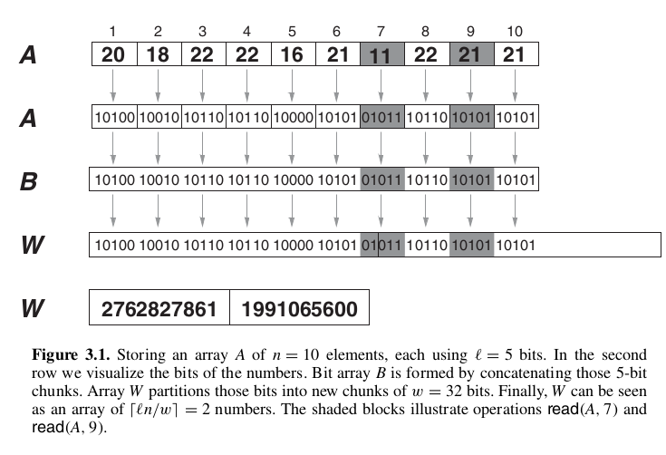
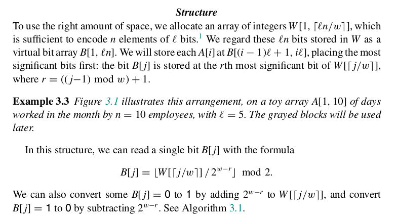
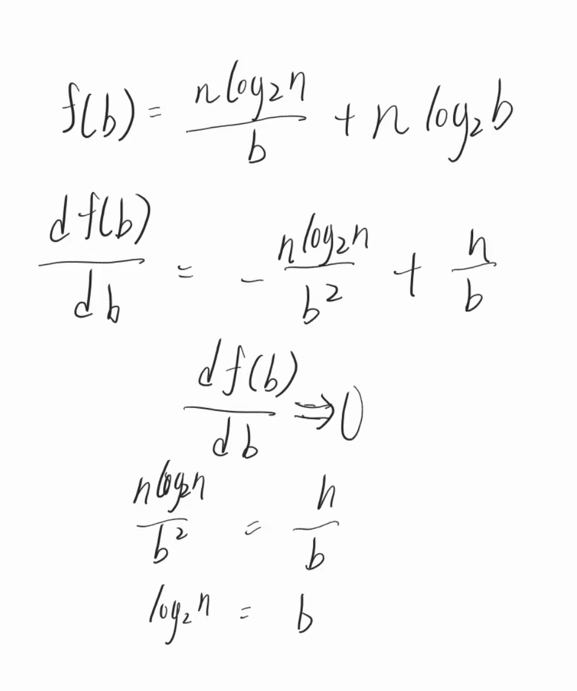
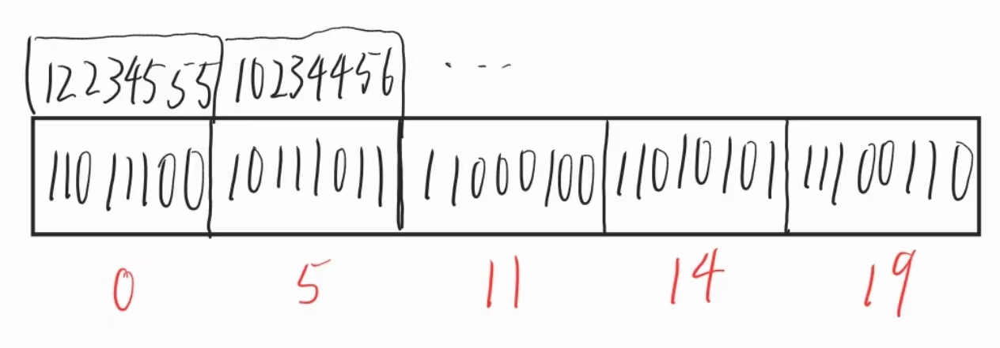
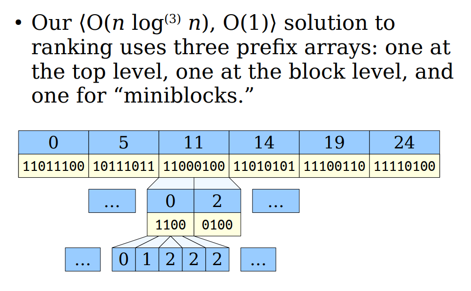
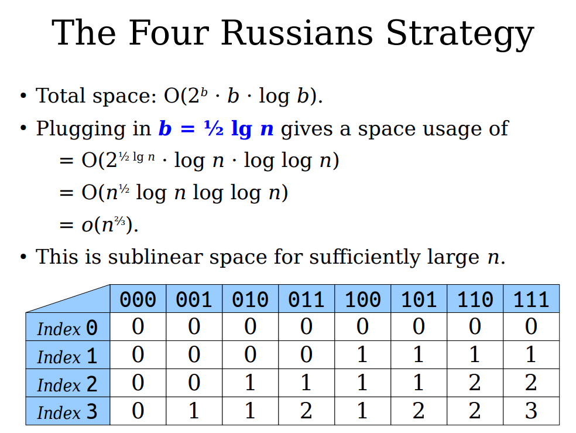

# Succinct Data Structures

## 引导

我们如何编码一个具体的的组合对象(例如树)，使得即使用一个静态的占用很小内存的数据结构，仍可在恒定的时间内执行查询？

这里有一个问题，“占用很小”该如何定义？

按照维基百科的定义：使用的空间**接近于信息论的下限值**。

这种数据结构，不是“压缩表示”，允许高效的查询操作。

假设$Z$是存储某种数据类型的信息论最优数值，其表示可以有三种数据结构类型：

- *[implicit](https://en.wikipedia.org/wiki/Implicit_data_structure)* if it takes $Z + O(1)$ bits of space,
- *succinct* if it takes bits of space, and
- *compact* if it takes bits of space.


一些简洁数据结构的例子：

* bitvector
* tree;treap
* text collection
* Permutations


一个简单的例子：boolean array


### 该系列会包含的内容

* 理论基础, 推导（简单的）
* 可以参考的代码实现
  * Rust（数据结构实现）
  * Python（一些计算的估计，manim动画脚本）


### 《简洁数据结构》，数据结构的信息论下界

* 引导部分
* “惊喜程度”与“熵”的直观理解
* Worst-Case Entropy
* Shannon Entropy


### 《简洁数据结构》，bit vector的构成与表示（Rust实现）

* bit vector的API介绍
* bit vector的Query动画
* 位向量表示&Rust代码介绍


### 《简洁数据结构》，array抽象以及部分和的应用


### 《简洁数据结构》，bit vector的Rank效率优化


### 《简洁数据结构》，bit  vector的Query优化以及应用场景


### 《简洁数据结构》，


什么是Compact data structure


## 参考资料

* 书本*Compact Data Structure*
* https://web.stanford.edu/class/archive/cs/cs166/cs166.1226/
* https://stackoverflow.com/questions/72580828/what-is-a-succinct-rank-data-structure-how-does-it-work


## 概览

### 一个例子：static bounded subset


我们要研究几个问题：

* 什么是Succinct Data Structures
* 什么是Succinct Index
* rank和select的时间复杂度如何优化
* 简洁数据结构如何应用在实践中，需要一个具体的例子


简洁数据结构简而言之就是：

`简洁的数据表示 + 简洁的索引`


`Succinct Index`，为数据结构赋能，使其完成高效查询的辅助的简洁表示，其空间复杂度必须满足：$o(LogL)$

以及我们最终的目的是，使其满足和理论值一致的查询时间复杂度


至于后面的问题，我们在具体的实现章节回答


### 理论&估计

我们假设数据结构的输入来源于L个不同源头。那么使用输入表示的数据一定会使用：

$ceil(LogL)+o(logL)$bits

至于信息论的下界为何是这个值，可以参考[数据结构的信息论下界推导]()


### Query

对于紧凑的数据结构来说，`Rank`和`Select`都是最重要的两种`query`操作，为何如此？

一开始我对这个问题的答案非常好奇，找到很多的相关博客以及一些高阶课程课件以及论文，但这些都没有回答我的问题，直到我阅读了一本和数据压缩以及字符串处理领域的大牛`Gonzalo Navarro`所写的`Compact Data Structure`，情况才有所好转。

这个问题背后最根本的问题实际是“对于紧凑的数据表示，索引在实际场景中的表现主要是什么？”

我们现将目光放到两个关键的场景：

* 文本压缩
* 


## Arrays

一个数组 $A[1, n]$ 是一个元素序列，可以在任意位置进行读取和写入。也就是说，数组是一种抽象数据类型，支持以下操作： 

* read(A, i)：返回 A[i]，对于任意 1 ≤ i ≤ n
* write(A, i, x)：设置 A[i] ← x，对于任意 1 ≤ i ≤ n 和任意 x。 


与经典的数组编程结构不同，我们对空间高效的数组表示感兴趣，这些表示希望能够只存储每个数字 A[i] 的有用位。在某些情况下，数组的值是统一的，使用相同数量的位来存储所有元素是合理的。在其他情况下，数字之间的差异很大，我们更倾向于为每个元素分配可变数量的位。


### 元素为固定大小的数组



### 元素为可变大小的数组


## bit vectors

### API

位向量及其操作是简洁数据结构的基础 

设 $S \subseteq \{0, 1, \ldots, u - 1\} $ 是一个位向量中设置位的位置集合，其中位向量长度为 $u$。我们的位向量支持以下查询：

* **Access(i)** 返回 `true` 如果i在S中，否则返回 `false` 
* **Rank(i)**返回 $ alpha \in S | \alpha < i \ $ 的基数
* **Select(k)** 返回S中第k个i
* **Update(i)** 向S中插入或删除z


这里存在一个问题就是，`Bool`数据类型理论上只需要用1bit存储，为何诸如C，Rust等语言中的bool类型的数据所占内存空间都是1byte呢？非常简单：

> 因为大多数CPU芯片都依照byte进行寻址

因此实现一个bit_vector，一定是需要用一些技巧的（位运算）

简单地去证明这件事，来看：


```rust
pub struct BitVector {
    words: Vec<usize>,
    len: usize,
}
```

`usize`的大小取决了系统位数，相信大部分人用的开发机都是64位的，那么usize的内存占用空间便是8字节，即64比特

`len`就是bit vector的长度：注意，不是words的长度


### 如何表达

那么这个结构该如何表达一个具体的bit vector呢？

首先是用该结构体表示的对象一定能够和理想化的bit vector对象形成双射，简单地证明一下：

首先需要清楚`usize`类型可以表达任意一个64位的位向量，这很容易理解：二进制和十进制系统中的符合构成双射，当需要表达的位数超过64，只需要再往`vec<usize>`中增加一个新的元素就好了，这样看，`len`是不是显得没有必要？不是的，试想如果没有len，表达[1, 1]该咋表达，如果单用words = [2]，实际表达的是$[0,0...1,1]$，其中0有62个这和需要的并不一致。


现在，再来看看空间的问题，我们假设需要表达的位向量长度位$n$，则该数据结构占用的内存也是近似于$n _{bit}$


### Access/Read

> 访问bit_vector的第i个元素

由“如何表达”章节，我们对于bit_vector是如何实现的，已经有了较清晰的认识，那么现在我希望得到第i位元素，实现也很容易就能得到：

```rust
// 显然64位系统上，WORD_LEN的
pub const WORD_LEN: usize = std::mem::size_of::<usize>() * 8;

fn access(&self, pos: usize) -> Option<bool> {
    if pos < self.len {
        let (block, shift) = (pos / WORD_LEN, pos % WORD_LEN);
        Some((self.words[block] >> shift) & 1 == 1)
    } else {
        // 越界的时候，返回空值
        None
    }
}
```

值得注意的代码应该是：

```rust
(self.words[block] >> shift) & 1 == 1
```

self.words[block]得到的是pos所"被包含"的usize变量，shift代表在指定usize变量所代表的二进制变量的偏移量。

一个例子，假设`self.words[block]`是$2^{62} + 2^{63}$即$13835058055282163712$，而pos为$n * 64 + 62, n \in \mathbb{N}$

则经过右移操作后，得到的数值为3（十进制），最关键的是通过$and$操作符，我们能得到其第一位（即我们的i所指向的位）是否为1


这里有一个问题是，如何得到一个切片的值（如"01001101"中的最后三位"101"）


#### 形式化表达

*Compact Data Structure*书中给到了相应的形式化表述：

> In general, we will assume that the elements use a small number of bits, which fit
> in a computer word of w bits and thus can be manipulated in constant time. We call
> “integer” the numeric data type offered by the language using w bits
>
> 上述是对Words的描述


首先书中提到的获取$B[j]$的方法如下：



对于bit array，我们有：

这里$B[j] = {\lfloor W[j]/2^{w-j} \rfloor} mod 2$

实际上这是因为：
$$
n >> k  = \lfloor n/2^k \rfloor
$$


验证代码可以使用：

```python
tem = 2173192
bin_tem = bin(tem)
# 用于验证公式是否可用：print(bin_tem)

# 获取一个数字的二进制表示的总位数
def words(j):
    return len(bin(t)) - 2

# 返回数字的二进制表示第j位的值
def get_bit_dec(dec, j):
    return int(k/2 ** (words(k) - j)) % 2
```


### update(动态结构)

待填坑


### Rank

该API可以理解为前n项和

首先，先不考虑words中最后一个元素的的值是多少，对于前几个word，我们要有一个函数，可以计算出usize的二进制表示中非零之和，这类函数一般称`popcount`，rust标准库中的usize具备count_ones方法可以为我们完成相应计算

```rust
#[inline(always)]
pub const fn popcount(x: usize) -> usize {
    x.count_ones() as usize
}
```


至于最后一个usize对象，我们联想到Access中右移的方法可以得到该块中的指定索引位之后的比特位，反过来，我们左移`64-偏移量`即可获得一个包含同样Rank的usize变量，对其使用popcount再将前面块的数加在一起，就是结果了：

```rust
fn rank(&self, pos: usize) -> Option<usize> {
    if self.len() < pos {
        return None;
    }
    let mut r = 0;
    let (wpos, left) = (pos / WORD_LEN, pos % WORD_LEN);
    for &w in &self.words[..wpos] {
        r += popcount(w);
    }
    if left != 0 {
        r += popcount(self.words[wpos] << (WORD_LEN - left));
    }
    Some(r)
}
```


该算法非常直观，其算法复杂度也容易评估，显然和bit_vector的长度呈线性关系（words的长度和bit_vector呈比例关系），因此算法复杂度是$O(u)$


那么一个问题是，有没有办法优化呢？


#### 优化思路探索


##### 多级前缀和（Multilevel Prefix Sums）

能想到的最简单的方法一定是用一张表来保存前N项的rank值，即`prefix sum`

假设bit_vector的长度为$n$，则rank值最大为$ceil(lg(n))$

比如1023位，则$2^{10}=1024$，因此10bit的存储类型能够覆盖该bv的需要，那么我们可以得到存储开销为：$O(nlogn)$，此时rank的时间复杂度达到了$O(1)$

沿着这个思路，想要进一步缩小存储开销，可以将查询的结构分块，我们后面将查询的数据结构称为`ps`(prefix sum)，我们假设块的大小为$b$，那么这时$rank(i)$的计算方法就转换为了：

* 读取第$\lfloor{i/b}\rfloor$位ps的值
* 扫描并求第$\lfloor{i/b}\rfloor*b$到$\lfloor{i/b}\rfloor*b + i\mod b - 1$的和

从而空间复杂度转为$O({\frac{nlogn}{b}})$，但代价是查询效率变成了$O(b)$

查询效率到了$O(b)$可就不简洁了，因此我们再结合prefix，但这时候上限变小了，因为我们有了块的概念，从而我们可以将上述算法的第二部求和的的数值变小，即：

$O({\frac{nlogn}{b}} + nlogb)$，这时候rank的时间复杂度就再次变成$O(1)$


到这一步，自我感觉非常良好了（Flag, -_-||），其实还存在着一个问题：有$b$数吗？ -> 如何设置$b$



从而空间占用可以被优化为$O(nloglogn)$,对于一个块，我们会有和bit vector等长的结构用于存储其块级别的rank，我们称每一个块的rank为`block-level rank`



我们注意到，上述优化过程可以不断地进行下去，因为每个block都可以再被划分为嵌套的sub-block，我们用$log^{k}n$代表对n使用k次对数函数，通过不断分解block，我们可以：

$O({\frac{nlogn}{b}} + nloglogb) \overset{b=logn}{\rightarrow} n + log^{3}n = O(nlog^3n)$

如图：



注意到，从上图的由上至下的结构中，我们需要用到$k-1$层存储nbit的结构，以及最后一层会使用到$nlog^kn$ bit，而我们的查询时间复杂度变成了$O(k)$

凭直觉，$k$是存在上界的，但是对于非常大的bit_vector来说，这个值的上界应该非常大，而$log^k$函数本身缩放能力极强，对于任意自然数$n$，总能找到一个$k$值使得$log^k n \leq 2$，其中最小的k值所构成的**迭代对数函数**便是$log^*n$，从而我们发现：当n固定下来，我们一定能得到一个$`<O(nlog^*n), O(log^*n)>`$的方法来进行**rank**，前者为空间复杂度，后者为时间复杂度，这个方案叫`Multilevel Prefix Sums`


##### Four Russians



这里需要弄清楚的是两件事：

* 如何对b-block进行拆分
* 什么是Four Russians

这里第一个和第二个问题实际上是强关联的，进行拆分的大小要满足使用Four Russians的约束。进行拆分后，b的值确定，那么可能的数量实际是$2^b$个（图中的列），而行则是$b+1$，同前面一样，表中的每个格子的大小实际为$logb$，因此对于一个子块，开销为$O(2^b * b * logb)$，如何使得该值最小呢？

这里我们得对b进行一个估计，我们假设b为$\frac{logn}{2}$，


##### 混合方法


#### Darray结构

Darray是dense array的简称，这个结构体需要组合两个内嵌结构，分别是`DArrayIndex`和`Rank9SelIndex`

```rust
pub struct DArrayIndex {
    block_inventory: Vec<isize>,
    subblock_inventory: Vec<u16>,
    overflow_positions: Vec<usize>,
    num_positions: usize,
    over_one: bool,
}

pub struct Rank9SelIndex {
    len: usize,
    block_rank_pairs: Vec<usize>,
    select1_hints: Option<Vec<usize>>,
    select0_hints: Option<Vec<usize>>,
}

pub struct DArray {
    bv: BitVector,
    s1: DArrayIndex,
    s0: Option<DArrayIndex>,
    r9: Option<Rank9SelIndex>,
}
```


`Rank9SelIndex`这个结构体（后文简称r9），就是用于辅助bit_vector提供更高速的rank算法的。因此r9的构造依赖于bit vector实例。

关于Rank9算法的实现原理，可以参考https://vigna.di.unimi.it/ftp/papers/Broadword.pdf


```rust
const BLOCK_LEN: usize = 8;

fn build_rank(bv: &BitVector) -> Self {
    let mut next_rank = 0;
    let mut cur_subrank = 0;
    let mut subranks = 0;

    let mut block_rank_pairs = vec![next_rank];

    for i in 0..bv.num_words() {
        let word_pop = popcount(bv.words()[i]);

        let shift = i % BLOCK_LEN;
        if shift != 0 {
            subranks <<= 9;
            subranks |= cur_subrank;
        }

        next_rank += word_pop;
        cur_subrank += word_pop;

        if shift == BLOCK_LEN - 1 {
            block_rank_pairs.push(subranks);
            block_rank_pairs.push(next_rank);
            subranks = 0;
            cur_subrank = 0;
        }
    }

    let left = BLOCK_LEN - (bv.num_words() % BLOCK_LEN);
    for _ in 0..left {
        subranks <<= 9;
        subranks |= cur_subrank;
    }
    block_rank_pairs.push(subranks);

    if bv.num_words() % BLOCK_LEN != 0 {
        block_rank_pairs.push(next_rank);
        block_rank_pairs.push(0);
    }
    block_rank_pairs.shrink_to_fit();

    Self {
        len: bv.num_bits(),
        block_rank_pairs,
        select1_hints: None,
        select0_hints: None,
    }
}
```


### 应用场景

一个直接点的问题：实现了bit vector这个数据结构，它在什么情况下能够派上用场呢？

