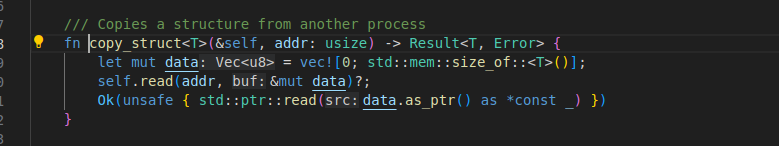
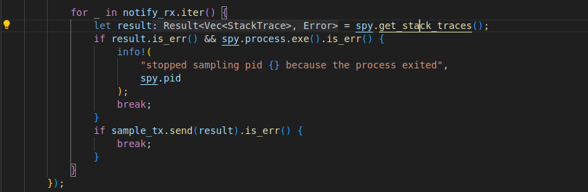
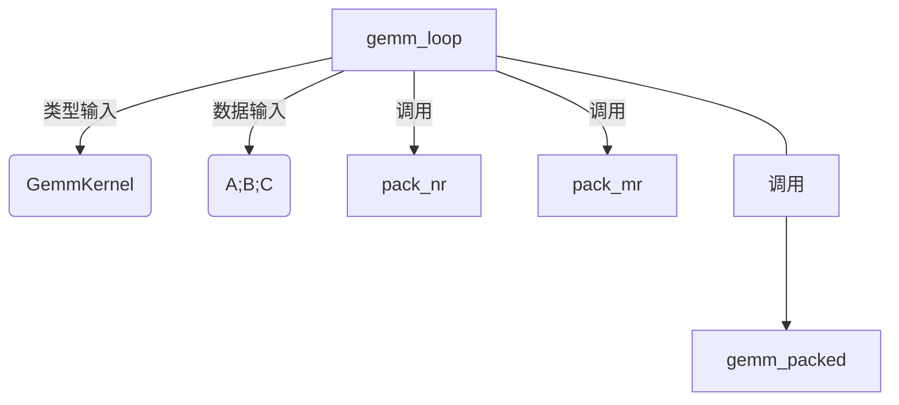
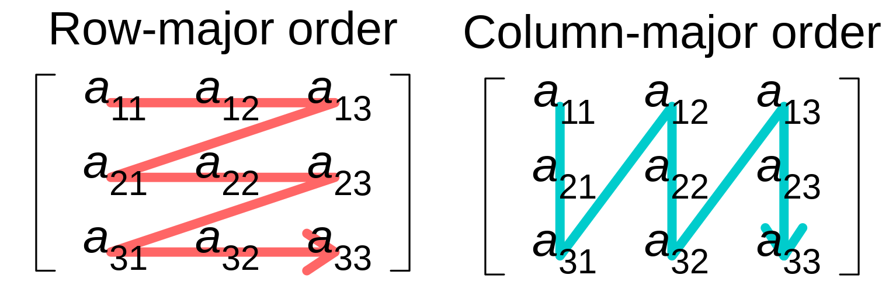
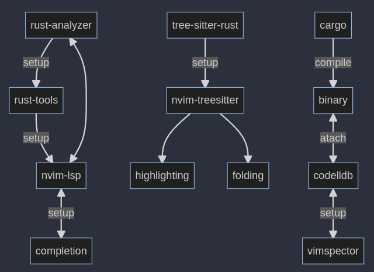

# rust学习

## rust应用场景

* 高性能数据结构
* C++的替代场景

<br>

## 学习材料

好的，我将根据之前对这四本书内容的理解，为你提炼出每个类别下的知识点：

**1. 《嵌入式Rust之书》**

* **最具技巧性 (Most Technically Skillful/Clever):**
  
  * **类型状态编程 (Typestate Programming) 用于外设配置:** 利用Rust的类型系统在编译时强制执行硬件外设（如GPIO引脚）的正确配置顺序和状态转换，防止运行时错误。这是一种将高级类型系统特性应用于底层硬件控制的巧妙方法。
  * **HAL/PAC/BSP分层抽象:** 理解并运用外设访问层（PAC）、硬件抽象层（HAL）和板级支持包（BSP）这三层抽象来构建可移植、可复用的嵌入式代码。

* **最容易被忽视 (Most Easily Overlooked):**
  
  * **`alloc` vs `heapless` 的细微差别:** 两者提供集合类型，但`alloc`需要全局分配器和OOM处理，而`heapless`是固定容量且返回`Result`。它们在内存使用模式、错误处理和实时性（WCET）上的权衡很容易被初学者忽略。
  * **`volatile` 访问的正确方式:** Rust中使用特定的方法（如`core::ptr::read_volatile` / `write_volatile`）进行volatile内存访问，而不是像C语言那样给变量加`volatile`关键字。
  * **裸机环境的必要设置:** 对于`alloc`的使用，需要配置全局分配器和`#[alloc_error_handler]`；对于任何`no_std`程序，需要配置`#[panic_handler]`。

* **实用性最强 (Most Practical/Useful):**
  
  * **开发环境搭建:** 如何安装和配置交叉编译器、GDB、OpenOCD、QEMU等基础工具链，这是进行任何嵌入式开发的前提。
  * **与外设交互:** 理解内存映射I/O，知道如何通过读写特定内存地址的寄存器来控制硬件外设。
  * **使用`embedded-hal`:** 利用`embedded-hal` crate提供的通用trait来编写可跨不同硬件平台使用的设备驱动程序。
  * **调试技术:** 使用GDB和OpenOCD（或Probe-rs）进行硬件调试，以及使用QEMU进行仿真调试。

* **最硬核 (Most Hardcore/Deep):**
  
  * **并发与中断处理:** 在中断服务程序（ISR）和主循环之间安全地共享外设和数据，理解临界区 (`cortex_m::interrupt::free`)、Mutex（尤其是`Mutex<RefCell<Option<T>>>`模式）以及`Send`/`Sync`在其中的作用。
  * **外设的单例模式:** 理解`Peripherals::take()`的工作原理，以及为什么需要它来将硬件外设的所有权模型引入Rust，从而利用借用检查器保证硬件访问的安全性。
  * **理解`no_std`环境的限制:** 彻底明白没有标准库、没有默认运行时、需要手动处理内存分配和恐慌（panic）意味着什么。

**2. 《Rust设计模式》**

* **最具技巧性 (Most Technically Skillful/Clever):**
  
  * **函数式Optics概念 (Functional Optics):** 理解Iso、Poly Iso、Prism等Optics概念，以及它们如何体现在像Serde这样的库API设计中，用于实现类型转换和数据访问的组合。
  * **泛型作为类型类 (Generics as Type Classes):** 使用泛型参数和特定的`impl`块来为同一结构体在编译时提供不同的API或行为，实现静态状态区分。

* **最容易被忽视 (Most Easily Overlooked):**
  
  * **参数类型的Deref Coercion:** 在函数签名中优先使用借用类型（如`&str`, `&[T]`）而非拥有类型的借用（如`&String`, `&Vec<T>`），利用Deref Coercion提高API的灵活性。
  * **FFI中的细微之处:** FFI错误处理的不同策略（返回码、哨兵值、C结构体）、FFI字符串传递的生命周期和所有权管理。
  * **RAII守卫模式的精髓:** 不仅仅是析构函数清理资源，更是利用其生命周期和借用检查器来保证资源访问的安全性（如`MutexGuard`）。
  * **`mem::take` / `replace` 用于状态转换:** 在`match`或`if let`中安全地修改包含拥有数据的enum变体，而无需克隆内部数据。

* **实用性最强 (Most Practical/Useful):**
  
  * **构造器模式 (`new`/`Default`) 和构建器模式 (Builder):** 创建结构体实例的标准和灵活方式。
  * **Newtype模式:** 通过简单的元组结构体包装，提供类型安全、抽象和实现特定trait（如`Display`）。
  * **`format!`宏用于字符串拼接:** 最常用且通常最易读的字符串组合方式。
  * **结构体分解 (Struct decomposition):** 将大结构体拆分成小结构体以解决借用检查器冲突，提高代码模块化程度。

* **最硬核 (Most Hardcore/Deep):**
  
  * **函数式Optics原理:** 深入理解其背后的函数式编程思想和范畴论概念（虽然书中可能不会深入到范畴论）。
  * **深入理解变性 (Variance):** 掌握协变、逆变、不变的概念及其对泛型类型和生命周期子类型关系的影响。
  * **反模式的深层原因:** 理解为什么像Deref多态这样的模式是反模式，需要对Rust的Trait系统、方法解析和隐式转换有深刻理解。

**3. 《Rustonomicon》**

* **最具技巧性 (Most Technically Skillful/Clever):**
  
  * **从零实现`Arc`和`Mutex` (或`Vec`):** 这需要结合`unsafe`指针操作、原子操作、内存布局、`NonNull`、`PhantomData`以及对`Send`/`Sync`的深刻理解。
  * **`PhantomData`的精妙运用:** 利用`PhantomData`精确控制类型的变性（Variance）、Drop检查行为和`Send`/`Sync`自动推导。
  * **借用拆分 (Borrow Splitting):** 使用`unsafe`代码（如在slice的`split_at_mut`中）安全地将一个可变借用拆分为多个独立的、不重叠的可变借用，以满足特定数据结构（如迭代器）的需求。

* **最容易被忽视 (Most Easily Overlooked):**
  
  * **未定义行为（UB）的精确列表:** Rust中构成UB的具体情况（悬垂/未对齐指针解引用、违反别名规则、无效值产生等）比C/C++要少但非常严格。
  * **`repr(Rust)`的布局优化:** 默认布局下编译器可能重排字段、进行空指针优化等，这与`repr(C)`的保证不同。
  * **Drop检查 (`dropck`) 和 `#[may_dangle]`:** `Drop` trait与生命周期的交互非常微妙，`#[may_dangle]`是处理悬垂数据风险的高级`unsafe`工具。
  * **`Send`/`Sync`是`unsafe` trait:** 虽然通常自动派生，但手动实现它们需要保证线程安全，这是`unsafe`承诺。
  * **`unsafe`的非局部性:** 安全代码的修改可能破坏`unsafe`代码块所依赖的不变性。

* **实用性最强 (Most Practical/Useful):**
  
  * **理解`unsafe`的作用域和能力:** 知道`unsafe`关键字到底解锁了哪些操作（解引用裸指针、调用`unsafe`函数/FFI、实现`unsafe` trait等）。
  * **裸指针（Raw Pointers）的基本使用:** 理解`*const T`和`*mut T`的含义，以及何时需要使用它们（主要是FFI和底层数据结构）。
  * **FFI基础:** 了解如何声明`extern "C"`块、处理C类型（`libc`）、处理回调、链接外部库。
  * **处理未初始化内存:** 掌握`MaybeUninit<T>`的使用方法，避免直接操作未初始化内存导致的UB。

* **最硬核 (Most Hardcore/Deep):**
  
  * **原子操作与内存顺序 (Atomics & Memory Ordering):** 深入理解C++内存模型和`Ordering::{SeqCst, Acquire, Release, Relaxed}`的精确语义及其对编译器和硬件重排序的影响。
  * **变性与子类型化 (Variance & Subtyping):** 完全掌握协变、逆变、不变性规则，及其对生命周期和泛型参数的影响。
  * **指针别名规则 (Aliasing Rules):** Rust中`&`和`&mut`的严格别名规则（虽然官方模型仍在演化，如Stacked Borrows），以及它们对优化的影响。
  * **`mem::transmute`的危险性:** 理解其限制（大小相同）和极易导致UB的多种方式（无效值、生命周期问题、布局不匹配等）。

**4. 《Rust宏小册》**

* **最具技巧性 (Most Technically Skillful/Clever):**
  
  * **增量TT Muncher + 下推累积:** 结合这两种模式来解析复杂或递归的语法结构，如解析嵌套循环或整个枚举定义。`Ook!`宏的实现是这种技巧的极致展示。
  * **算盘计数器 (Abacus Counters):** 使用特定的token序列（如`@`）在宏递归中跟踪嵌套深度或其他计数状态，绕过宏系统不能直接进行算术运算的限制。

* **最容易被忽视 (Most Easily Overlooked):**
  
  * **捕获与展开的区别 (Token Tree vs AST Node):** 捕获为`expr`、`ty`等非`tt`类型后，它变成了一个AST节点，不能再按词法树进行匹配。这导致`stringify!($e:expr)`和`stringify!(tokens)`表现不同。
  * **特定捕获类型后的跟随限制:** 某些捕获类型（如`:expr`）后面能跟的token是有限制的（通常是`=>`, `,`, `;`），这会影响宏规则的设计。
  * **宏的作用域和顺序依赖:** 宏在模块内向下可见，但在模块外需要`#[macro_use]`导出，且定义必须在使用之前。`extern crate`的`#[macro_use]`行为又不同（提升）。
  * **`self`和`_`的特殊性:** `self`在宏里有时像标识符有时像关键字，`_`则不被视为`ident`，处理它们需要特殊技巧（如用`tt`捕获）。
  * **卫生性（Hygiene）的细节:** 宏展开时标识符的语法上下文如何影响名称解析。

* **实用性最强 (Most Practical/Useful):**
  
  * **基本`macro_rules!`语法:** 理解匹配臂`($pattern) => {$expansion}`和基本捕获类型（`ident`, `expr`, `ty`, `tt`, `pat`, `stmt`, `item`, `path`, `meta`）。
  * **重复匹配与展开:** 掌握`$(...)*`和`$(...)+`以及分隔符`sep`的使用，用于处理列表等。
  * **`$crate`元变量:** 在导出的宏中引用当前crate的路径，保证路径正确性。
  * **调试宏:** 学会使用`trace_macros!`和`log_syntax!`来诊断宏展开过程，以及`rustc --pretty expanded`查看最终代码。
  * **内部规则模式 (Internal Rules):** 使用`@`前缀等方式组织宏内部的辅助规则，避免污染命名空间。
  * **回调模式 (Callbacks):** 将一个宏作为参数传递给另一个宏，实现类似高阶函数的模式。

* **最硬核 (Most Hardcore/Deep):**
  
  * **在`macro_rules!`中实现图灵完备系统:** 如`Ook!`宏所示，展示了系统的表达能力极限，但非常复杂且易出错。
  * **处理极深递归或大量重复:** 需要仔细设计宏规则以避免超出编译器的递归限制。
  * **模拟复杂语法解析:** 不使用过程宏（procedural macros）而仅用`macro_rules!`来解析类似DSL的复杂输入。

<br>

## 语言的核心特性

### 语言设计

迷惑的点：

* 总结&和*符号
* 可变变量的引用和可变引用有啥区别
* 字符串的复杂性如何体现
* rust中智能指针的使用场景
* crate的详细解释，模块树的层级结构
* 如何为一个项目实现多个模块文件
* 什么是semver trick
* 为什么迭代器比普通循环更快
* rust的trait和go的interface的区别
* rust的core::mem::ManuallyDrop如何使用
* 如何实现栈上的数组
* 如何实现allocator
* rust的union和struct的区别
* usize的使用场景一般是什么
* 枚举类

解惑：

* ＆和＊：&在rust中是借用（&expr或&mut expr，不考虑expr & expr）以及被借用的指针类型（&type, &mut type, &'a type, &'a mut type），而*就是解引用(*expr)以及裸指针（Raw pointer）（*const type, *mut type）。值得注意的是，使用println!去打印对象，会自动的完成解引用；想要加强对所有权的理解，可以看一些reddit以及stackoverflow中的例子，确认理解了问题的正解之后；再在一些项目中使用debugger去观察对象在断点处的状态，最后再读下Rust程序语言设计中的引用与借用，便能够理解
* 首先回顾很重要的一点就是同一时间，可变引用只能有一个。回到问题，不管是可变变量还是可变引用，它们都有在对应的作用域内改变指向对象的能力，因此可变引用只能为可变对象创建
* 首先要明确只存在一种字符串类型：`str`，而它通常以被借用的形式出现，而最常用的str的容器则是标准库中的String，String是类似于`Vec`的动态堆字符串类型，而`str`是不可变的utf8字节序列，由于其大小不可知，我们通常使用`&str`。两者的关系可归为`Vec<T>`和`&[T]`。str实际存储的位置可能是：
  * 二进制文件中的某处：通常存的是字符串的字面量，比如"foo"
  * String变量中
  * 栈中
* 标准库中智能指针有这些类型，我们分开讨论：
  * Box`<T>`：本质是实现了`Deref`和`Drop`两个关键trait的结构体，可以用来创建递归数据结构以及管理数据结构（容器类型）；
    * Deref：解引用的实现，注意实现deref方法时，输出的是其想要输出目标**的引用**，另外一方面可以使用Type关键字指定输出引用的类型，从而实现强制类型转换。注意，`Deref`可以用于重载不可变引用，但是也存在着用于重载不可变引用的`DerefMut`
    * Drop: 对象离开作用域时必须执行的函数。drop函数不能显式调用，因此如果需要提前清理值，可以使用`std::mem::drop`
  * Rc`<T>`：
* 在进入代码级别的作用域管理前，必须得先明确`crate`和`crate根`的概念，`crate根`是package的**接口文件**，package的作用可以是library，也可以是executable-file，而它们向外暴露的实体是二进制产物，另一方面它们在rust文件中也有**明确的**表征，即`lib.rs`和`main.rs`。在这些共识之下，crates根代表的实际就是这些个关键文件。优先讲crate根是因为我们关注一个语言的模块系统经常以`文件组织`作为切入点，这符合直觉。而`crate`是:
  * 编译产物，在第一点中提到二进制产物也能够称为`crate`，这里要提到rust编译器的工作模式：rust总是使用单个源文件作为输入来开启编译过程。你肯定能猜到，这些源文件就是第一点中的`crate根`，但另一方面，这些关键的二进制产物同样是`crate`，这也是为什么容易搞不清楚，从使用的角度说，就更能明确为何一个package**必须有一个crate（0 lib crate +  N bin crate 或者 1 lib crate + n bin crate。$N \in [1,\infty], n \in [0, \infty]$**。
  * 一种特殊的模块，就叫"crate模块"。这也符合直觉，任何系统的模块存在都是为了crate服务的，编译也从crate对应的文件出发，因此它们是根，即crate根
  * rust中有几个关键字可以用来管理作用域：
    * mod: 其语法为`mod <Module Name> {...}`，`mod`代表module，即我们在各类编程语言中最熟悉的模块，需要注意，模块与rust文件的关系是mod块嵌入在不同文件中，所以一个rust文件可以有多个模块，mod的详细使用方法可以在下一点中找到
    * pub: 将符号导出为可由外部模块导入的，即公有。可以导出的内容有函数，模块，结构体，枚举类以及字段
    * use: 用于将其他crate的内容导入
* 很多语言的模块设计强调了文件系统的参与（比如Python），但是Rust将文件布局和模块层次进行了解耦，因此rust可以实现更加细粒度的隐私控制。使用`mod`去导入其他文件中的模块时，首先调用方一定需要显式地`mod <module>;`，其次可以有两种方法：即`<module>.rs`或者是`<module>/mod.rs`文件，
* semver trick是
* 迭代器是Rust的零成本抽象之一，
* rust的trait和go的interface
* rust的ManuallyDrop
* 参考stackoverflow的27859822问题：
* 如何实现allocator
* struct和union的区别
* usize实际是和计算机系统相关的无符号整数类型，所以表示非负场景的数值都可以用usize，比如数组长度

### 语言内部

#### 标准库

rust的标准库很小巧，这是一个Reddit上的月经话题。

参考文章https://nindalf.com/posts/rust-stdlib/

这里总结了这么设计的一些原因：

* 标准库很难新增代码，因为rust语言的项目原则中[stability as deliverable](https://blog.rust-lang.org/2014/10/30/Stability.html)提到，rust禁止breaking changes。

#### 链接过程&linker

链接器的性能通常是一个比较重要的考虑因素，编译总会有讲obj文件链接在一起的过程，这个过程就是linker在发光发热。

rust使用的链接器是`lld`

rust编译器支持静态/动态地将crate链接起来的方法。

一些要点：

* 智能指针RefCell`<T>`与内部可变性：内部可变性（Interior mutability）是Rust中的一个设计模式，允许即使有不可变引用时也可以改变数据，这是通常情况下借用规则不允许的，因此需要在数据结构中使用unsafe来模糊可变性和借用规则。
* Rc为引用计数智能指针，它与Python中的PyObject有什么不一样呢？首先Rc`<T>`用于希望在堆上分配一些供多个部分读取的内存场景，并且不确定谁会最后使用它。

## 练习

一些外部的有趣练习：

* rustlings
* rust-quiz
* lifetimekata
* Rust latam: procedural macros workshop

交互性质的练习：

* oort

### rust练习册-rustlings

```shell
git clone -b 5.6.1 --depth 1 https://github.com/rust-lang/rustlings
cd rustlings
cargo install --locked --force --path .

# 开始
rustlings watch
```

这个练习的好处：

* 有一种读条进步的感觉，比较爽(对于新手)
* 学会使用“rustc --explain EXXXX”
* 熟悉编译器的报错和内容
* 很多题没有标准答案，可以多试试，就当是熟练和建立rust心智模型的过程
* 建议完成时间：4天内
* 其中我认为完成部分的习题有比较大的意义（如果你是一个新手，你直接去做这些内容可能也不太容易一次通过）：
  * vecs/vecs2.rs
  * move_semantics/*
  * enums/enums3.rs
  * strings/*(尤其string4)
  * hashmaps3
  * quiz2.rs
  * error_handling/errors6.rs(知识点：enum;错误传播;map_err)
  * quiz3.rs
  * iterators/iterators2/3.rs
  * smart_pointers/cow1.rs
  * threads/threads3.rs
  * macros/macros3.rs
  * conversions/try_from_into.rs
  * conversions/as_ref_mut.rs

当然我认为rustlings也有些不足（不过这些本来就不是rustlings设计之初考虑的事）:
缺少一些复合型的训练

### 项目学习1-smallvec

#### 项目概况

#### code snippets

```rust
// 用枚举类来构建两种堆分配的错误类型
#[derive(Debug)]
pub enum CollectionAllocErr {
    CapacityOverflow,
    AllocErr {
        layout: Layout,
    },
}
impl core::fmt::Display for CollectionAllocErr {
    fn fmt (&self, f: &mut core::fmt::Formatter<'_>) -> core::fmt::Result {
        write!(f, "Allocation error: {:?}", self)
    }
}
```

### 项目学习2：py-spy

py-spy是一个python profiling项目，配备较多的测试用例，配合rust-toolchains，是个不错的学习项目。建议事不考虑bindings的代码，直接从rust-api下手开始看。另一方面，对profiling/debug领域感兴趣的人也应该学习下这个项目。

#### 关键的数据结构/结构体

* PythonSpy: Python进程监视器，存储全部状态的抽象
* PythonProcessInfo: Python进程的消息存储结构，包含信息有：memory map layout, 解析好的二进制信息（libpython）：这里值得注意的是二进制信息的存储结构是`BinaryInfo`，其中有一个关键字段symbols是内存名称到地址的Map
* InterpreterState：Python解释器的状态机trait，有各个关键版本的impl

#### 实现中的技巧

* 使用read_process_memory获取进程运行时的内部结构（依赖各个OS的syscall，比如linux的[process_vm_readv](https://man7.org/linux/man-pages/man2/process_vm_readv.2.html)），
* 用rust的类型推断结合技巧一copy_struct



* 使用binary parser——goblin解析并获取二进制文件的关键符号的内存地址，再使用技巧二尝试从内存中提取出需要的`python结构`，这里一定会存在的问题是ASLR（Address space layout randomization），处理地址空间随机化的方法需要解释下,如果说python解释器是附带符号的，则可以通过Python版本来获取interp_head和_PyRuntime两个变量的地址来获取解释器的地址

首先可以通过`cat /proc/sys/kernel/randomize_va_space`获取机器的策略：

`0` 表示禁用 ASLR。

`1` 表示启用基本随机化。

`2` 表示启用完全随机化。

* 这里存在一个问题，前文提到的`InterpreterState`从何而来？答案是使用`rust-bindgen`来获得Python关键对象的rust结构体，具体分析如下：
  * 生成binding的脚本为位于项目根目录下的`generate_bindings.py`，对应的函数为`extract_bindings`，内部行为可以分解如下：
    * 获取CPython源码
    * checkout到指定的Python版本
    * 运行configure生成`pyconfig.h`
    * 将`Python.h`,`frameobject.h`,`pycore_pystate.h`,`pycore_interp.h`,`pycore_frame.h`作为输入写入到文件`bindgen_input.h`
    * 将`bindgen_input.h`作为输入生成`bindgen_output.rs`，注意这里需要指定一些`whitelist-type`，最后将文件写入到vxx.rs中即可
  * 上述生成的内容实质上为
* 获取call stack的方法是：
  * 从PyInterpreterState中取出所有Python线程
  * 遍历每个线程的PyFrameObject对象，获取call stack
* `top`命令本质是生成一个监控的Iterator，每次iter就是从Python进程中采样（获取调用信息），这个iterator每次进行迭代，实际上就是Sampler中的receiver从一个采样线程中去获取采集到的性能样本。采集的代码如下：



#### 依赖py-spy做的有趣的事

### 开发中的实践

这是我学习rust过程中记录下的认为有意义的code snippet

* 实现一个类可以不断输入值来更新时间的早晚
* 使用unsafe实现插桩，完成这些功能
  * 重复运行某一个函数
  * 度量某个函数的运行时间
* 侦测器：筛选出目标进程中满足筛选条件的函数符号

### 实践-使用PyO3创建一个ssh连接池

这个实践有以下的目的：

* 在大量的例子和帮助中学习，熟悉rust
* 了解pyo3的开发模式，为后续写binding, warapper打下基础
* 了解russh的使用方法，机制
* 简单学会使用tokio来完成异步逻辑
* 实现一个并发的，惰性的ssh连接
* 实现文件的传送（file-likt-obj/file）

安装maturin: `pip install maturin`

创建目录（也可以用pyenv创建虚拟环境完成下列步骤）

```
mkdir py_rpc
cd py_rpc
maturin init
```

#### 定义pyo3中的函数

`#[pyfunction]`用于定义一个Python中的函数（调用Rust），

#### 定义pyo3中的class

定义一个wrapper十分简单：

```rust
#[pyclass]
struct MyClass {
    inner: i32
}
```

但wrapper存在一些问题：

* 无法使用lifetime参数：由于pyclass是动态的数据，rust编译器没办法去追踪pyclass本身的生命周期，保证内存安全性的唯一办法是：pyclass不要借用任何短于static生命期的数据。 -> pyclass对象中的每个引用的生命周期>=static
* 一个问题是如果存在这样一个对象，它在rust函数中有自己的owner，同时也能被python解释器访问，需要用到引用计数的智能指针比如`Arc`, `Py`
* 无法使用泛型参数，因为rust编译器会为每个泛型T生成相应的代码，这个生成过程是在编译阶段完成的，最好的解决方法是为pyclass实现一个宏

```rust
use pyo3::prelude::*;

struct GenericClass<T> {
    data: T,
}

macro_rules! create_interface {
    ($name: ident, $type: ident) => {
        #[pyclass]
        pub struct $name {
            inner: GenericClass<$type>,
        }
        #[pymethods]
        impl $name {
            #[new]
            pub fn new(data: $type) -> Self {
                Self {
                    inner: GenericClass {data: data},
                }
            }
        }
    };
}

create_interface!(IntClass, i64);
create_interface!(FloatClass, String);
```

python runtime和rust runtime有很大的差异，所以当我们研究一个抽象的`对象`在两个runtime中如何进行转换时，一定会回顾两个语言本身的设计原则：

* 

#### 关于RPC

定义RPC框架，我们首先想到的就是通信的数据结构以及调用方法，IDL全称为interface design language，很多RPC框架需要使用IDL生成对应的代码（同时IDL很重要的一个特征是不依赖实现语言），因为其中封装了消息收发，结构体编码解码，生成结构体等操作。

```rust
struct Msg{
    tag: String,
    detai: String,
}
```

实现RPC框架，需要定义的内容包括：

* 消息，编码解码的传输层
* message code generator(idl parser + message derive)
* 

我们要做的是thrift RPC框架，使用thrift的好处是：

* 已经有较多知名大企业使用，有保障 

thrift中的数据类型可以分为`基础类型`，`容器类型`，`常量类型`:
值得注意的是容器类型包含map, set, list

### 配套工具

这两个工具真好用：

* cargo：
    * 
* rust-analyzer：
  * 最好的rust老师之一
  * 和VSCODE/NVIM集成度高，新用户可以快速上手调试

## 开发计划

使用rust来开发：

* 串联主要工作流程（三位一体）的小工具
* 网络请求分析工具（格式化目标进程的网络请求参数）
* linux系统调用的追踪与回放工具
* 简化版本的blktrace工具(blk-explorer)
* 多机的硬件性能追踪统计工具
* 联合go开发的hpcrun改版工具
* python第三方库没有覆盖到的性能敏感部分

## 高性能Rust

Rust编译器通过LLVM后端支持现代的各种编译器优化

### 矩阵乘

$A, B \in R^{n \times n}, n \in N$

$C_{ij} := \sum_{k=1}^{n} A_{ik} B_{kj}$

#### 编译优化选项

Rust常见的几个编译优化选项：

* Release Build:最常见的选项，其中包含多项可能得优化，最常见的优化便是自动向量化（生成SIMD指令）；
* LTO-LLVM Link Time Optimization:链接阶段的优化，但通常会增加编译时间；
* 本地架构编译：使用`RUSTFLAGS=-C target=cpu=native`，可以使用架构细化的指令，当本地CPU支持新的SIMD扩展，这么做可以再次提高性能，坏处是老芯片跑不了
* PGO-Profile Guided Optimization:更高效的分支预测能力

#### 循环展开

表面上，循环展开是一个简单的概念：如果循环迭代次数在编译时已知，就复制内部代码那么多次数。这有多重好处。首先，它减少了每次迭代中进行的比较和跳转的数量。其次，它允许更容易的流水线处理，因为不再需要路径预测！主要的缺点是代码复制增加了二进制文件的大小。

查看汇编代码，循环展开已经在我们的情况下应用了。但是，如果编译器没有展开函数，有两种主要方法可以手动强制执行：

• `Unroll!` [33] 是一个 Rust 宏，它通过在预处理中替换展开的 Rust 代码，在编译时展开应用程序。目前，它只能检测具有整数字面量界限的循环。

• 对于更复杂的循环，可以配置 LLVM 更积极地应用循环展开。这由 `-unroll-threshold` 参数控制。

作为一个重要的注释，不要在没有基准测试的情况下手动应用循环展开，因为它可能会通过消耗过多的 CPU 指令缓存来恶化性能。

#### Data重用：tiled

一段演示的rust代码：

```rust
/// index ptr with index i
unsafe fn at(ptr: *const f32, i: usize) -> f32 {
    *ptr.offset(i as isize)
}

/// 4x4 matrix multiplication kernel for f32
///
/// This does the matrix multiplication:
///
/// C ← α A B + β C
///
/// + k: length of data in a, b
/// + a, b are packed
/// + c has general strides
/// + rsc: row stride of c
/// + csc: col stride of c
/// + if `beta` is 0, then c does not need to be initialized
#[inline(always)]
pub unsafe fn kernel_4x4(k: usize, alpha: f32, a: *const f32, b: *const f32,
                         beta: f32, c: *mut f32, rsc: isize, csc: isize)
{
    let mut ab = [[0.; 4]; 4];
    let mut a = a;
    let mut b = b;

    // Compute matrix multiplication into ab[i][j]
    unroll_by_8!(k, {
        let v0 = [at(a, 0), at(a, 1), at(a, 2), at(a, 3)];
        let v1 = [at(b, 0), at(b, 1), at(b, 2), at(b, 3)];
        loop4x4!(i, j, ab[i][j] += v0[i] * v1[j]);

        a = a.offset(4);
        b = b.offset(4);
    });


    macro_rules! c {
        ($i:expr, $j:expr) => (c.offset(rsc * $i as isize + csc * $j as isize));
    }

    // Compute C = alpha A B + beta C,
    // except we can not read C if beta is zero.
    if beta == 0. {
        loop4x4!(i, j, *c![i, j] = alpha * ab[i][j]);
    } else {
        loop4x4!(i, j, *c![i, j] = *c![i, j] * beta + alpha * ab[i][j]);
    }
}
```

#### simd

检测simd指令的方法：

```rust
#[inline]
pub(crate) fn detect<G>(selector: G) where G: GemmSelect<T> {
    // dispatch to specific compiled versions
    #[cfg(any(target_arch="x86", target_arch="x86_64"))]
    {
        if is_x86_feature_detected_!("fma") {
            if is_x86_feature_detected_!("avx2") {
                return selector.select(KernelFmaAvx2);
            }
            return selector.select(KernelFma);
        } else if is_x86_feature_detected_!("avx") {
            return selector.select(KernelAvx);
        } else if is_x86_feature_detected_!("sse2") {
            return selector.select(KernelSse2);
        }
    }

    #[cfg(target_arch="aarch64")]
    #[cfg(has_aarch64_simd)]
    {
        if is_aarch64_feature_detected_!("neon") {
            return selector.select(KernelNeon);
        }
    }

    return selector.select(KernelFallback);
}
```

以`is_x86_feature_detected_!`为例：

```rust

```

#### 深度优化的核心思想

下面内容引入自：https://github.com/flame/how-to-optimize-gemm/wiki

This work is based on two publications. You will want to read these when you are done with this exercise. If you use information on this page in other research, please reference these papers.

- Anatomy of high-performance matrix multiplication. Kazushige Goto, Robert A. van de Geijn. ACM Transactions on Mathematical Software (TOMS), 2008.
  
  (Available without charge at the following site: http://www.cs.utexas.edu/users/flame/FLAMEPublications.html)

- BLIS: A Framework for Rapidly Instantiating BLAS Functionality. Field G. Van Zee, Robert A. van de Geijn. ACM Transactions on Mathematical Software (TOMS), 2015.
  
  (Available without charge at the following site: http://www.cs.utexas.edu/users/flame/FLAMEPublications.html)

For more advanced exercises with recent architectures (Intel Sandy/Ivy Bridges, Haswell, etc.), you may want to try BLISlab.

- BLISlab: A Sandbox for Optimizing GEMM
  
  (Available at: https://github.com/flame/blislab)

#### 实例代码




算法代码中的含义可以参考https://github.com/flame/blis/blob/master/docs/KernelsHowTo.md#implementation-notes-for-gemm

```rust
/// Implement matrix multiply using packed buffers and a microkernel
/// strategy, the type parameter `K` is the gemm microkernel.
// no inline is best for the default case, where we support many K per
// gemm entry point. FIXME: make this conditional on feature detection
#[inline(never)]
unsafe fn gemm_loop<K>(
    m: usize, k: usize, n: usize,
    alpha: K::Elem,
    a: *const K::Elem, rsa: isize, csa: isize,
    b: *const K::Elem, rsb: isize, csb: isize,
    beta: K::Elem,
    c: *mut K::Elem, rsc: isize, csc: isize)
    where K: GemmKernel
{
    debug_assert!(m <= 1 || n == 0 || rsc != 0);
    debug_assert!(m == 0 || n <= 1 || csc != 0);

    // if A or B have no elements, compute C ← βC and return
    if m == 0 || k == 0 || n == 0 {
        return c_to_beta_c(m, n, beta, c, rsc, csc);
    }

    let knc = K::nc();
    let kkc = K::kc();
    let kmc = K::mc();
    ensure_kernel_params::<K>();

    let a = Ptr(a);
    let b = Ptr(b);
    let c = Ptr(c);

    let (nthreads, tp) = get_thread_pool();
    let thread_config = LoopThreadConfig::new::<K>(m, k, n, nthreads);
    let nap = thread_config.num_pack_a();

    let (mut packing_buffer, ap_size, bp_size) = make_packing_buffer::<K>(m, k, n, nap);
    let app = Ptr(packing_buffer.ptr_mut());
    let bpp = app.add(ap_size * nap);

    // LOOP 5: split n into nc parts (B, C)
    for (l5, nc) in range_chunk(n, knc) {
        dprint!("LOOP 5, {}, nc={}", l5, nc);
        let b = b.stride_offset(csb, knc * l5);
        let c = c.stride_offset(csc, knc * l5);

        // LOOP 4: split k in kc parts (A, B)
        // This particular loop can't be parallelized because the
        // C chunk (writable) is shared between iterations.
        for (l4, kc) in range_chunk(k, kkc) {
            dprint!("LOOP 4, {}, kc={}", l4, kc);
            let b = b.stride_offset(rsb, kkc * l4);
            let a = a.stride_offset(csa, kkc * l4);

            // Pack B -> B~
            K::pack_nr(kc, nc, slice::from_raw_parts_mut(bpp.ptr(), bp_size),
                       b.ptr(), csb, rsb);

            // First time writing to C, use user's `beta`, else accumulate
            let betap = if l4 == 0 { beta } else { <_>::one() };

            // LOOP 3: split m into mc parts (A, C)
            range_chunk(m, kmc)
                .parallel(thread_config.loop3, tp)
                .thread_local(move |i, _nt| {
                    // a packing buffer A~ per thread
                    debug_assert!(i < nap);
                    app.add(ap_size * i)
                })
                .for_each(move |tp, &mut app, l3, mc| {
                    dprint!("LOOP 3, {}, mc={}", l3, mc);
                    let a = a.stride_offset(rsa, kmc * l3);
                    let c = c.stride_offset(rsc, kmc * l3);

                    // Pack A -> A~
                    K::pack_mr(kc, mc, slice::from_raw_parts_mut(app.ptr(), ap_size),
                               a.ptr(), rsa, csa);

                    // LOOP 2 and 1
                    gemm_packed::<K>(nc, kc, mc,
                                     alpha,
                                     app.to_const(), bpp.to_const(),
                                     betap,
                                     c, rsc, csc,
                                     tp, thread_config);
                });
        }
    }
}
```

#### Cache-oblivious算法

当$C=A\times B$时，

CPU以行主序访问A，以列主序访问B



由于内存以行主序对齐，B中每个元素的访问过程必然伴随着cache miss

一个解决方法是将问题转换为：

$A \cdot B^{T}$

## unsafe

https://cliffle.com/p/dangerust/

### why

* 能读懂更多数据结构相关的源码，了解背后的一些细节
  
  * static var
  * compiler opt
  * uninitialized data
  * ...

* 学会rust的裸指针操作

* rust中SIMD编程的原始方法

* 比对性能和elf文件大小

> 基础准备：
> 
> 能够简单阅读C和Rust代码
> 
> x86-64机器

### 实际案例:n_body

n_body是来自[the Benchmarks Game](https://benchmarksgame-team.pages.debian.net/benchmarksgame/)的一段程序，中文名大概可以是“N体问题”，这段程序简短但是原版是一段高度优化的C代码，很有参考性。

优化的具体点包括：

* SSE simd指令
* 内存布局优化

#### 直接翻译版

以下是直接将C语言代码进行翻译得到的关键片段的截取

```rust
#[repr(C)]  // Note 2
struct body {
    position: [f64; 3],
    velocity: [f64; 3],
    mass: f64,
}
```

* 使用#[repr(C)]可以使得结构体中的内存布局和C保持一致

```c
static void offset_Momentum(body bodies[]){
    for(intnative_t i=0; i<BODIES_COUNT; ++i)
        for(intnative_t m=0; m<3; ++m)
            bodies[0].velocity[m]-=
              bodies[i].velocity[m]*bodies[i].mass/SOLAR_MASS;
}
```

```rust
unsafe fn offset_Momentum(bodies: *mut body) {
    for i in 0..BODIES_COUNT {  // <---- Note 3
        for m in 0..3 {
            (*bodies.add(0)).velocity[m] -=  // <- Note 4
                (*bodies.add(i)).velocity[m] // <- Note 5
                * (*bodies.add(i)).mass / SOLAR_MASS;
        }
    }
}
```

* *bodies.add(i)实际是rust中对裸指针的加法，因为没有进行运算符重载

```rust
// Add the potential energy between this body and
// every other body.
for j in i+1..BODIES_COUNT {
    let mut position_Delta =   // <----------- Note 1
        [mem::MaybeUninit::<f64>::uninit(); 3];
    for m in 0..3 {
        position_Delta[m].as_mut_ptr().write(
            (*bodies.add(i)).position[m]
                - (*bodies.add(j)).position[m]
        );
    }
    let position_Delta: [f64; 3] = // <------- Note 2
        mem::transmute(position_Delta);

    energy -= (*bodies.add(i)).mass
        * (*bodies.add(j)).mass
        / f64::sqrt(               // <------- Note 3
              position_Delta[0]*position_Delta[0]+
              position_Delta[1]*position_Delta[1]+
              position_Delta[2]*position_Delta[2]
          );
}
```

* 上述代码中`Note1`的C源码是`double position_Delta[3];`，C语言中当你不主动提供initializer的情况下，变量中的元素是不可预测的随机值，为啥提这点，因为有些场景下，不初始化值意味着更好的性能，但`未初始化变量`又是很多BUG的诞生地，在rust中，你如果要达到同样的效果，就必须打更多字。注意这里还有一个细节，就是写入数据的时候使用了指针操作`write`，这就避免了去读指定内存段的操作，很多时候rust改写内存值需要优先读取它的值（到寄存器中），这是因为你读取的类型有析构函数

* `Note2`中，我们使用了transmute，这个函数就牛逼了，他可以对两个相同size的类型进行相互转换，本质就是将一种类型的比特位解释为另外一种，跟C中的cast类似，现在，我们将[mem::MaybeUninit::`<f64>`::uninit(); 3]转换为了[f64; 3]

* ```C
  float x = something();
  int y = *(int *) &x;
  ```

```c
static void advance(body bodies[]){

    #define INTERACTIONS_COUNT \
        (BODIES_COUNT*(BODIES_COUNT-1)/2)
    #define ROUNDED_INTERACTIONS_COUNT \
        (INTERACTIONS_COUNT+INTERACTIONS_COUNT%2)

    //  ,--------------------------------- Note 1
    // v       v-------------------------- Note 2
    static alignas(__m128d) double
      position_Deltas[3][ROUNDED_INTERACTIONS_COUNT],
      magnitudes[ROUNDED_INTERACTIONS_COUNT];
```

* C中局部的static变量的初始值会被设置为0，这是语言标准定义的。另一方面，清零的操作只会进行一次，换句话说，每次对`advance`函数的调用后，static变量的内部残留值将会被延续到下一次调用（带状态的函数），副作用是，非线程安全。
* alignas(__m128d)代表声明对象将会以`__m128d`的方式对齐，而这是SSE向量类型，简单介绍就是，该类型用于存储两个双精度浮点(double)类型，该类型要求变量按照16字节对齐

对应到相应的Rust代码：

```rust
unsafe fn advance(bodies: *mut body) {

    const INTERACTIONS_COUNT: usize =
        BODIES_COUNT * (BODIES_COUNT - 1) / 2;
    const ROUNDED_INTERACTIONS_COUNT: usize =
        INTERACTIONS_COUNT + INTERACTIONS_COUNT % 2;

    // Note 1
    #[repr(align(16))]
    #[derive(Copy, Clone)]
    struct Align16([f64; ROUNDED_INTERACTIONS_COUNT]);

    // Note 2
    static mut position_Deltas: [Align16; 3] =
        [Align16([0.; ROUNDED_INTERACTIONS_COUNT]); 3];
    static mut magnitudes: Align16 =
        Align16([0.; ROUNDED_INTERACTIONS_COUNT]);
```

* 由于只有自定义类型能在Rust中进行对齐内存，所以我们声明了`Align16`

温馨声明：之后的代码段都在函数advance中：

```c
for(intnative_t i=0; i<ROUNDED_INTERACTIONS_COUNT/2; ++i){
    __m128d position_Delta[3];

    for(intnative_t m=0; m<3; ++m)
        position_Delta[m]=
            ((__m128d *)position_Deltas[m])[i];
```

```rust
for i in 0..ROUNDED_INTERACTIONS_COUNT/2 {
    let mut position_Delta =
        [mem::MaybeUninit::`<__m128d>`::uninit(); 3];
    for m in 0..3 {
        position_Delta[m].as_mut_ptr().write(
            *(&position_Deltas[m].0
                as *const f64         // <----- Note 1
                as *const __m128d).add(i)
        );
    }
    let position_Delta: [__m128d; 3] =
        mem::transmute(position_Delta);
```

* 注意到上述代码中原生数据类型的转换，C中使用了`(__m128d *)position_Deltas[m]`将访问的double[]类型转换为__m128d指针类型，这个时候注意索引`i`，其总数为`ROUNDED_INTERACTIONS_COUNT/2`，刚好能将position_Deltas完整遍历。而Rust代码中对于`position_Delta`的处理则和上文一致。

* rust中对裸指针的处理：可变： as *mut f64 仅读： as *const f64

```c
const __m128d distance_Squared=
  position_Delta[0]*position_Delta[0]+
  position_Delta[1]*position_Delta[1]+
  position_Delta[2]*position_Delta[2];

__m128d distance_Reciprocal=
   _mm_cvtps_pd(_mm_rsqrt_ps(_mm_cvtpd_ps(distance_Squared)));
for(intnative_t j=0; j<2; ++j)
    distance_Reciprocal=distance_Reciprocal*1.5-
      0.5*distance_Squared*distance_Reciprocal*
      (distance_Reciprocal*distance_Reciprocal);

((__m128d *)magnitudes)[i] =
    0.01/distance_Squared*distance_Reciprocal;
```

```rust
let distance_Squared: __m128d = _mm_add_pd(
    _mm_add_pd(
        _mm_mul_pd(position_Delta[0], position_Delta[0]),
        _mm_mul_pd(position_Delta[1], position_Delta[1]),
    ),
    _mm_mul_pd(position_Delta[2], position_Delta[2]),
);

let mut distance_Reciprocal: __m128d =
  _mm_cvtps_pd(_mm_rsqrt_ps(_mm_cvtpd_ps(distance_Squared)));
for _ in 0..2 {
    distance_Reciprocal = _mm_sub_pd(
        _mm_mul_pd(distance_Reciprocal, _mm_set1_pd(1.5)),
        _mm_mul_pd(
            _mm_mul_pd(
                _mm_mul_pd(
                    _mm_set1_pd(0.5),
                    distance_Squared,
                ),
                distance_Reciprocal,
            ),
            _mm_mul_pd(
                distance_Reciprocal,
                distance_Reciprocal,
            ),
        ));
}

(magnitudes.0.as_mut_ptr() as *mut __m128d)
    .add(i)
    .write(_mm_mul_pd(
        _mm_div_pd(
            _mm_set1_pd(0.01),
            distance_Squared,
        ),
        distance_Reciprocal,
    ));
```

* 向量操作，基本都带前缀：`_mm_`
* 依旧地，C中的向量操作都使用了运算符重载

最后，我们来看main函数

```rust
fn main() {
    unsafe {
        offset_Momentum(solar_Bodies.as_mut_ptr());  // Note 1
        output_Energy(solar_Bodies.as_mut_ptr());
        let c = std::env::args().nth(1).unwrap()  // Note 2
            .parse().unwrap();
        for _ in 0..c {
            advance(solar_Bodies.as_mut_ptr())
        }
        output_Energy(solar_Bodies.as_mut_ptr());
    }
}
```

#### 原生版本性能测试

* 编译

```shell
time gcc -o3 -fomit-frame-pointer -march=native -funroll-loops -static ./c_src/n_body.c -o ./build/n_body_gcc -lm

real    0m0.101s
user    0m0.057s
sys     0m0.043s
```

```shell
time clang -O3 -fomit-frame-pointer -march=native -funroll-lo
ops -static c_src/n_body.c -o build/n_body_clang -lm
c_src/n_body.c:130:1: warning: non-void function does not return a value [-Wreturn-type]
}
^
1 warning generated.

real    0m0.169s
user    0m0.097s
sys     0m0.072s
```

```shell
time rustc -C opt-level=3 -C target-cpu=native -C codegen-units=1 ./src/n_body.rs -o ./build/n_body_rustc

real    0m0.274s
user    0m0.164s
sys     0m0.093s
```

* 执行

使用hyperfine来进行测试与统计

```shell
hyperfine --runs 5 time ./build/n_body_gcc 50000000
```

```shell
hyperfine --runs 5 './build/n_body_gcc 50000000'
Benchmark 1: ./build/n_body_gcc 50000000
  Time (mean ± σ):      3.147 s ±  0.005 s    [User: 3.146 s, System: 0.001 s]
  Range (min … max):    3.140 s …  3.151 s    5 runs
```

```shell
hyperfine --runs 5 './build/n_body_clang 50000000'
Benchmark 1: ./build/n_body_clang 50000000
  Time (mean ± σ):      3.165 s ±  0.016 s    [User: 3.164 s, System: 0.001 s]
  Range (min … max):    3.148 s …  3.191 s    5 runs
```

```shell
hyperfine --runs 5 './build/n_body_rustc 50000000'
Benchmark 1: ./build/n_body_rustc 50000000
  Time (mean ± σ):      2.662 s ±  0.005 s    [User: 2.661 s, System: 0.001 s]
  Range (min … max):    2.657 s …  2.669 s    5 runs
```

可以看到，在我的PC上，rust程序的执行时间比c版本的（clang和gcc编译）要短0.5秒

#### 裸指针修改为可变引用

```rust
fn offset_Momentum(bodies: &mut [body; BODIES_COUNT]) {
    for i in 0..BODIES_COUNT {
        for m in 0..3 {
            //     v----------------------------------- Note 3
            bodies[0].velocity[m] -=
                bodies[i].velocity[m] * bodies[i].mass / SOLAR_MASS;
        }
    }
}
```

实际性能没什么变化

```shell
hyperfine --runs 5 './build/n_body_rustc_safe 50000000'
Benchmark 1: ./build/n_body_rustc_safe 50000000
  Time (mean ± σ):      2.669 s ±  0.019 s    [User: 2.668 s, System: 0.001 s]
  Range (min … max):    2.656 s …  2.703 s    5 runs
```

#### 未初始化变量

在rust翻译版本代码中，我们显式地声明了未初始化变量：

```rust
let mut position_Delta = [mem::MaybeUninit::`<__m128d>`::uninit(); 3];
for m in 0..3 {
    position_Delta[m].as_mut_ptr().write(
        initial_value_here
    );
}
let position_Delta: [__m128d; 3] = mem::transmute(position_Delta);
```

如果说我们将上述代码修改为一般代码常见的形式：

```rust
let mut position_Delta = [0.; 3];
for m in 0..3 {
    position_Delta[m] = initial_value_here;
}
```

这个时候再去检查二进制产物的体积，是不会会更大？

```shell
$ size nbody-2 nbody-3
   text       data        bss        dec        hex    filename
 226776      10744        888     238408      3a348    nbody-2
 226776      10744        888     238408      3a348    nbody-3
```

事实上，并没有

因为，编译器发现编码者在声明变量后立刻去对值进行了填充，应用一种编译技术"dead store elimination"，理所当然地，性能并不会降低：

```shell
hyperfine --runs 5 './build/n_body_rustc_safe 50000000'
Benchmark 1: ./build/n_body_rustc_safe 50000000
  Time (mean ± σ):      2.672 s ±  0.013 s    [User: 2.671 s, System: 0.001 s]
  Range (min … max):    2.660 s …  2.695 s    5 runs
```

#### advance函数优化

advance函数中有为了提升性能而使用的SSE扩展代码，在SSE代码片段中，我们不可避免地使用了unsafe——将同一段内存解释为不同的类型。

我们考虑使用`union`，同一段内存（size一样大），我们可以对这段数据有不同的解释方式（所有字段共享的内存空间必须能够容纳最大的那个字段。这意味着 `union` 的大小等于其最大字段的大小）：

```rust
#[repr(C)]
union Interactions {
    scalars: [f64; ROUNDED_INTERACTIONS_COUNT],
    vectors: [__m128d; ROUNDED_INTERACTIONS_COUNT / 2],
}
```

从而，循环中的源代码段从

```rust
position_Delta[m].as_mut_ptr().write(
    *(&position_Deltas[m].0
        as *const f64         // <----- Note 1
        as *const __m128d).add(i)
);
```

变成了

```rust
position_Delta[m] = position_Deltas[m].vectors[i];
```

虽然，我们的代码依旧是unsafe的（对union对象的字段进行访问都是unsafe），但是我们得到了编译器进行边界检查的好处。

另一方面，我们知道我们所运行的所有Rust代码其底层都难以避免会触碰到"unsafe code"，但是现在我们多了一种选项：

```rust
// Our union type, as seen above, reproduced here for your reference
#[repr(C)]
union Interactions {
    scalars: [f64; ROUNDED_INTERACTIONS_COUNT],
    vectors: [__m128d; ROUNDED_INTERACTIONS_COUNT / 2],
}

impl Interactions {
    /// Returns a reference to the storage as `f64`s.
    pub fn as_scalars(&mut self) -> &mut [f64; ROUNDED_INTERACTIONS_COUNT] {
        // Safety: the in-memory representation of `f64` and `__m128d` is
        // compatible, so accesses to the union members is safe in any
        // order.
        unsafe {
            &mut self.scalars
        }
    }

    /// Returns a reference to the storage as `__m128d`s.
    pub fn as_vectors(&mut self)
        -> &mut [__m128d; ROUNDED_INTERACTIONS_COUNT/2]
    {
        // Safety: the in-memory representation of `f64` and `__m128d` is
        // compatible, so accesses to the union members is safe in any
        // order.
        unsafe {
            &mut self.vectors
        }
    }
}
```

没错，通过封装，我们可以得到一些safe的API。

再一次的，我们来看看性能是否有衰减：

```shell
hyperfine --runs 5 './build/n_body_rustc_safe 50000000'
Benchmark 1: ./build/n_body_rustc_safe 50000000
  Time (mean ± σ):      2.680 s ±  0.007 s    [User: 2.679 s, System: 0.001 s]
  Range (min … max):    2.671 s …  2.687 s    5 runs
```

#### 最终版本

```shell
hyperfine --runs 5 './build/n_body_rustc 50000000'
Benchmark 1: ./build/n_body_rustc 50000000
  Time (mean ± σ):      2.662 s ±  0.005 s    [User: 2.661 s, System: 0.001 s]
  Range (min … max):    2.657 s …  2.669 s    5 runs

hyperfine --runs 5 './build/n_body_rustc_safe 50000000'
Benchmark 1: ./build/n_body_rustc_safe 50000000
  Time (mean ± σ):      2.233 s ±  0.009 s    [User: 2.232 s, System: 0.001 s]
  Range (min … max):    2.223 s …  2.243 s    5 runs

size build/n_body_rustc_safe build/n_body_rustc
   text    data     bss     dec     hex filename
 356003   13048     281  369332   5a2b4 build/n_body_rustc_safe
 356579   13336     617  370532   5a764 build/n_body_rustc
```

## 设计模式

### Generic as type class

好的，我们来深入探讨《Rust设计模式》中提到的 "Generics as Type Classes"（泛型作为类型类）原理，并结合书中的例子和一些补充来说明。

**核心概念：泛型作为类型类**

这个模式的核心思想是：**利用 Rust 的泛型和 trait bounds（或者说特定类型的 `impl` 块）来为同一个数据结构（通常是泛型结构体）在编译时提供不同的 API 或行为，这取决于泛型参数的具体类型。**

与传统的面向对象语言中的继承不同（一个子类继承父类的所有方法，并可能添加新方法或覆盖旧方法），Rust 的这种模式更像是：

* 定义一个通用的数据结构 `Struct<T>`。
* 为 `Struct<T>` 实现一些对所有 `T` 都通用的方法。
* 然后，为特定的 `T`（比如 `Struct<SpecialType>`）或满足特定 trait bound 的 `T`（比如 `Struct<T: MyTrait>`）实现额外的方法或不同的行为。

这使得 `Struct<TypeA>` 和 `Struct<TypeB>` 虽然共享基础结构和一些通用方法，但可能拥有完全不同的、在编译时就确定的专属 API。编译器会根据泛型参数的具体类型选择正确的 `impl` 块。

**《Rust设计模式》中的例子解读与扩展**

书中给出的例子是关于一个 `FileDownloadRequest<P: ProtoKind>`，其中 `P` 是一个代表协议类型的泛型参数。

1. **基础结构和通用 API:**
   
   ```rust
   // （简化自书中代码）
   // 代表协议类型的 trait
   pub(crate) trait ProtoKind {
       type AuthInfo; // 关联类型，不同协议可能有不同的认证信息结构
       fn auth_info(&self) -> Self::AuthInfo;
   }
   
   // 代表具体协议的类型 (空结构体作为标记)
   pub struct Nfs { /* ...NFS特定的元数据... */ pub mount_point: PathBuf }
   pub struct Bootp { /* ...BOOTP特定的元数据... */ }
   
   impl ProtoKind for Nfs {
       type AuthInfo = String; // 假设 NFS 认证信息是字符串
       fn auth_info(&self) -> Self::AuthInfo { /* ... */ "nfs_auth_token".to_string() }
   }
   impl Nfs { // NFS 专属方法
       pub fn mount_point(&self) -> &Path { &self.mount_point }
   }
   
   impl ProtoKind for Bootp {
       type AuthInfo = Vec`<u8>`; // 假设 BOOTP 认证信息是字节序列
       fn auth_info(&self) -> Self::AuthInfo { /* ... */ vec![1,2,3] }
   }
   // Bootp 可能没有额外的专属方法，或者有其他不同的方法
   
   // 通用的文件下载请求结构体
   struct FileDownloadRequest`<P: ProtoKind>` {
       file_name: PathBuf,
       protocol_details: P, // 存储协议特定的信息
   }
   
   // 为所有 FileDownloadRequest<P> 实现的通用方法
   impl`<P: ProtoKind>` FileDownloadRequest<P> {
       fn file_path(&self) -> &Path {
           &self.file_name
       }
   
       fn auth_info(&self) -> P::AuthInfo {
           self.protocol_details.auth_info()
       }
   
       // 通用构造函数
       pub fn new(file_name: PathBuf, protocol_details: P) -> Self {
           Self { file_name, protocol_details }
       }
   }
   ```
   
   在这里：
   
   * `ProtoKind` trait 定义了所有协议都应该有的行为（比如获取认证信息）。
   * `Nfs` 和 `Bootp` 是实现了 `ProtoKind` 的具体类型，它们可以携带各自协议独有的数据。
   * `FileDownloadRequest<P: ProtoKind>` 是泛型结构体，`protocol_details` 字段的类型由 `P` 决定。
   * `impl<P: ProtoKind> FileDownloadRequest<P>` 块中定义的方法（如 `file_path`, `auth_info`）对所有 `FileDownloadRequest`（无论 `P` 是什么）都可用。

2. **特定类型的专属 API:**
   
   ```rust
   // （简化自书中代码）
   use std::path::{Path, PathBuf}; // 假设这些已定义
   
   // ... (ProtoKind, Nfs, Bootp, FileDownloadRequest<P> 定义同上) ...
   
   // 专门为 FileDownloadRequest`<Nfs>` 实现的方法
   impl FileDownloadRequest`<Nfs>` {
       fn mount_point(&self) -> &Path {
           self.protocol_details.mount_point() // 直接调用 Nfs 结构体的方法
       }
   }
   
   // 可能为 FileDownloadRequest`<Bootp>` 实现的其他专属方法
   // impl FileDownloadRequest`<Bootp>` {
   //     fn get_boot_server_ip(&self) -> IpAddr { /* ... */ }
   // }
   
   fn main() {
       let nfs_details = Nfs { mount_point: PathBuf::from("/mnt/share") /* ...更多NFS细节... */ };
       let nfs_request = FileDownloadRequest::new(PathBuf::from("file.txt"), nfs_details);
   
       let bootp_details = Bootp { /* ...BOOTP细节... */ };
       let bootp_request = FileDownloadRequest::new(PathBuf::from("kernel.img"), bootp_details);
   
       // 通用方法
       println!("NFS file: {:?}", nfs_request.file_path());
       println!("BOOTP file: {:?}", bootp_request.file_path());
   
       // NFS 专属方法
       println!("NFS mount point: {:?}", nfs_request.mount_point());
   
       // 尝试在 BOOTP 请求上调用 NFS 专属方法会导致编译错误
       // println!("BOOTP mount point: {:?}", bootp_request.mount_point()); // 编译错误！
       //                                        ^^^^^^^^^^^ method not found in `FileDownloadRequest<Bootp>`
   
       // 如果为 Bootp 也定义了专属方法
       // println!("BOOTP server IP: {:?}", bootp_request.get_boot_server_ip());
   }
   ```
   
   在这里：
   
   * `impl FileDownloadRequest<Nfs>` 块专门为 `P` 是 `Nfs` 类型的 `FileDownloadRequest` 添加了 `mount_point` 方法。
   * 当编译器看到 `nfs_request.mount_point()` 时，它知道 `nfs_request` 的类型是 `FileDownloadRequest<Nfs>`，所以这个方法调用是合法的。
   * 当它看到 `bootp_request.mount_point()` 时，它知道 `bootp_request` 的类型是 `FileDownloadRequest<Bootp>`，并且在该类型的 `impl` 块中找不到 `mount_point` 方法，因此会报错。

**为什么这像是 "类型类" (Type Classes)？**

"类型类" 是 Haskell 等函数式语言中的概念，它允许你为类型定义一组行为（类似于 Rust 的 trait），然后可以为不同的类型实现这些行为。更重要的是，你可以基于类型参数或类型类约束来定义函数的行为或数据的结构。

Rust 的这种模式与之相似之处在于：

* **行为由类型参数决定：** `FileDownloadRequest<P>` 的完整 API 不是固定的，而是由泛型参数 `P` 的具体类型决定的。
* **编译时分派：** 哪些方法可用是在编译时就确定了的，而不是运行时多态。
* **特化：** 你可以为“某个泛型结构体的特定类型实例化版本”提供特化的实现或额外的方法。

**与传统面向对象继承的区别：**

* **无继承层次：** `FileDownloadRequest<Nfs>` 和 `FileDownloadRequest<Bootp>` 之间没有父子继承关系。它们是同一泛型结构体的不同实例化，可以共享通用代码，但其专属 API 是通过独立的 `impl` 块提供的。
* **非运行时多态：** 你不能将 `FileDownloadRequest<Nfs>` 和 `FileDownloadRequest<Bootp>` 放入同一个 `Vec` 并期望在运行时动态调用 `mount_point`（除非使用 trait object `Vec<Box<dyn SomeCommonTrait>>`，但那就不是这个模式的核心了）。这个模式的优势在于编译时的静态保证。

**另一个简单的例子：带状态的构建器 (Builder with States)**

这个模式也常用于实现类型状态机，或者像构建器模式那样，在构建过程中对象处于不同状态，拥有不同的可用方法。

```rust
#[derive(Debug)]
struct HttpRequest`<State>` {
    url: String,
    method: String,
    headers: Vec`<(String, String)>`,
    body: Option`<String>`,
    _state: std::marker::PhantomData`<State>`, // 状态标记，不占空间
}

// 状态标记类型 (空结构体)
struct Fresh; // 初始状态
struct WithMethod; // 已设置方法
struct WithUrl;    // 已设置URL
struct ReadyToSend; // 方法和URL都已设置

// 初始构造
impl HttpRequest`<Fresh>` {
    pub fn new() -> Self {
        HttpRequest {
            url: String::new(),
            method: String::new(),
            headers: Vec::new(),
            body: None,
            _state: std::marker::PhantomData,
        }
    }
}

// 通用方法，适用于多种状态 (这里用 trait 来约束，也可以不用)
trait HttpBuilder {
    fn add_header(self, key: &str, value: &str) -> Self;
}

impl`<S>` HttpBuilder for HttpRequest`<S>` {
    fn add_header(mut self, key: &str, value: &str) -> Self {
        self.headers.push((key.to_string(), value.to_string()));
        self
    }
}

// 从 Fresh 或 WithMethod 状态设置 URL
impl HttpRequest`<Fresh>` {
    pub fn url(self, url: &str) -> HttpRequest`<WithUrl>` { // 返回新状态的类型
        HttpRequest {
            url: url.to_string(),
            method: self.method,
            headers: self.headers,
            body: self.body,
            _state: std::marker::PhantomData,
        }
    }
}
impl HttpRequest`<WithMethod>` {
     pub fn url(self, url: &str) -> HttpRequest`<ReadyToSend>` { // 返回新状态的类型
        HttpRequest {
            url: url.to_string(),
            method: self.method,
            headers: self.headers,
            body: self.body,
            _state: std::marker::PhantomData,
        }
    }
}


// 从 Fresh 或 WithUrl 状态设置方法
impl HttpRequest`<Fresh>` {
    pub fn method(self, method: &str) -> HttpRequest`<WithMethod>` { // 返回新状态的类型
        HttpRequest {
            url: self.url,
            method: method.to_string(),
            headers: self.headers,
            body: self.body,
            _state: std::marker::PhantomData,
        }
    }
}
impl HttpRequest`<WithUrl>` {
    pub fn method(self, method: &str) -> HttpRequest`<ReadyToSend>` { // 返回新状态的类型
        HttpRequest {
            url: self.url,
            method: method.to_string(),
            headers: self.headers,
            body: self.body,
            _state: std::marker::PhantomData,
        }
    }
}


// 只有 ReadyToSend 状态才有 send 方法
impl HttpRequest`<ReadyToSend>` {
    pub fn send(self) {
        println!("Sending {} request to {}...", self.method, self.url);
        // ... 实际发送逻辑 ...
    }
}


fn main() {
    let request_builder = HttpRequest::`<Fresh>`::new();

    // request_builder.send(); // 编译错误! HttpRequest`<Fresh>` 没有 send 方法

    let request_with_url = request_builder.url("http://example.com");
    // request_with_url.send(); // 编译错误! HttpRequest`<WithUrl>` 没有 send 方法

    let request_ready = request_with_url.method("GET");
    request_ready.send(); // 正确!

    // 另一种顺序
    let request_builder2 = HttpRequest::`<Fresh>`::new();
    let request_with_method = request_builder2.method("POST");
    let request_ready2 = request_with_method.url("http://api.example.com");
    request_ready2.send();
}
```

在这个例子中：

* `HttpRequest<State>` 的 `State` 泛型参数代表了请求构建的不同阶段。
* 通过返回不同 `State` 的 `HttpRequest` 实例，我们改变了对象的“类型”。
* 只有当 `State` 是 `ReadyToSend` 时，`send` 方法才可用。
* 编译器在编译时就能保证你不会在未准备好的请求上调用 `send`。

**高明之处总结：**

1. **静态保证：** 核心优势在于**编译时**就能确保API的正确使用。你不能在 `FileDownloadRequest<Bootp>` 上调用 `mount_point()`，也不能在未完全配置的 `HttpRequest` 上调用 `send()`。这消除了特定类型的运行时错误。
2. **清晰的API边界：** 对于不同的泛型参数，API 的可用性是明确的。用户在编码时就能清楚地知道对于当前类型的对象，哪些操作是合法的。
3. **代码去重与特化共存：** 通用逻辑可以放在 `impl<P: ProtoKind> FileDownloadRequest<P>` 这样的块中，而特定逻辑则放在 `impl FileDownloadRequest<Nfs>` 中，实现了代码复用和行为特化的良好平衡。
4. **利用类型系统表达状态和能力：** 这是一种更高级的抽象方式，将对象的“能力”或“状态”编码到类型本身，而不是依赖于运行时的字段值检查。
5. **零成本抽象（通常）：** 由于这些都是在编译时解析和单态化的，通常不会带来额外的运行时开销。编译器会为 `FileDownloadRequest<Nfs>` 和 `FileDownloadRequest<Bootp>` 生成各自特化的代码。

这种模式体现了 Rust 鼓励利用其强大的类型系统来在编译阶段捕捉尽可能多的错误的哲学。它可能比简单的 getter/setter 模式初看起来更复杂，但它提供的静态保证和 API 清晰度在构建大型、健壮的系统时非常有价值。

<br>

### typestate模式

原贴：https://cliffle.com/blog/rust-typestate/

要点：

* 

## IDE

### neovim

为什么要使用neovim来进行rust编程，可以参考这个博客：[博客](https://rsdlt.github.io/posts/rust-nvim-ide-guide-walkthrough-development-debug/)



#### 我的安装流程

```shell
# 确保安装版本 > 0.9.0的neo-vim
pkg install nvim

# linux环境安装nvim：github上有预编译的二进制文件
# 需要自己编译安装，也没有问题，基本只需要gcc(github仓大概300M)
git clone https://github.com/neovim/neovim
git checkout stable
cd neovim && make CMAKE_BUILD_TYPE=RelWithDebInfo

# 安装nerd font和nvchad
注意nerd font需要安装在对应的terminal软件依赖中，比如使用windows terminals登录，则对应的windows系统需要安装相应字体
...
git clone https://github.com/NvChad/NvChad ~/.config/nvim --depth 1 && nvim

# 准备好rust-tools
git clone xx ~/.config/nvim/lua/custom/
```

### vscode