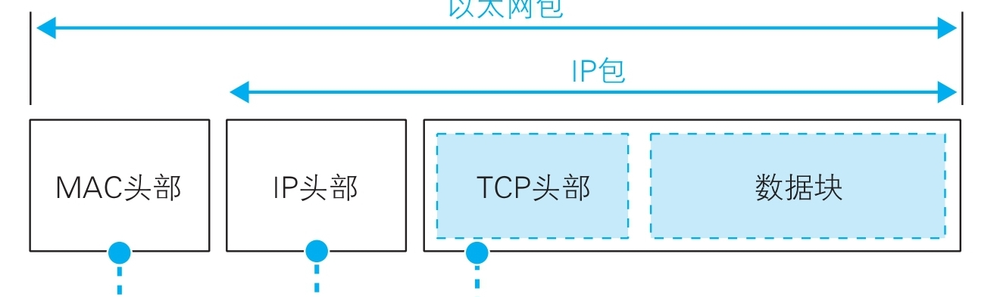

# 网络知识探索

## 软件工具
### wireshark
在我的学习过程中，利用wireshark能覆盖的知识点：
* 学习网络协议

### termux

## 理论回顾
### 协议栈和网卡
#### IP与以太包
网络包的头部包含了各项控制信息，其结构：


#### IPV4和IPV6
IPV4地址共32位，可以转换为4位十进制数值。
IPV6共128位，使用冒号十六进制表示法

在linux系统下，如何识别一个网络连接是基于V4还是V6呢？
```shell
netstat -an | grep -E 'Proto|LISTEN'
# 显示为tcp/udp为v4，udp6/tcp6为v6
```

### 网线和网络设备的基本认识
#### 集线器
首先得知道，每个网络包都是独立传输的，HTTP的请求方法，TCP的确认响应和序号，客户端和服务器之间的关系，这一切都与包的传输无关，所有的包在传输的过程中都是独立的，没有任何关联。

事实上，家用路由器已经集成了集线器和交换机的功能，我们最常接触的网络是局域网，下面展示下局域网链路的基本结构：


## 现实中的问题

### 在局域网中占用某个IP
首先通过虚拟机软件创建/克隆一个虚机

推荐使用克隆，这样省去了装系统的麻烦

随后修改`/etc/sysconfig/network-scripts`下的`ifcfg-<物理网卡号>`中的IPADDR
随后`service network restart`

### 网络转发到proxy
默认设备皆为linux,centos

现有一个可用网络（连接了互联网）的ip以及端口（后称A地址）为192.168.5.2:18080，另一个不可用的proxy地址（后称B地址）为192.168.5.3:18080，现在希望将对B地址的请求转发到A地址

那么需要在B地址上使用iptables进行转发：
```shell
sysctl -w net.ipv4.ip_forward=1
iptables -t nat -A PREROUTING -p tcp --dport 18080 -j DNAT --to-destination 192.168.5.2
iptables -t nat -A POSTROUTING -p tcp -d 192.168.5.2 --dport 18080 -j SNAT --to-source 192.168.5.3
```
