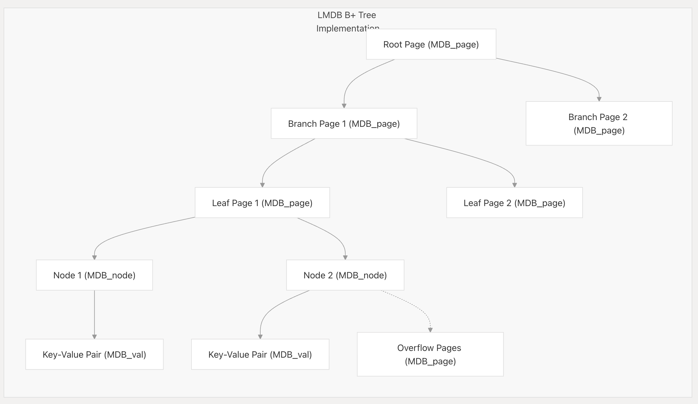
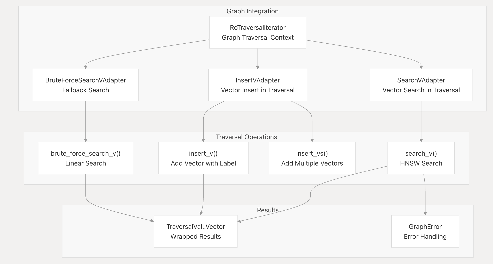
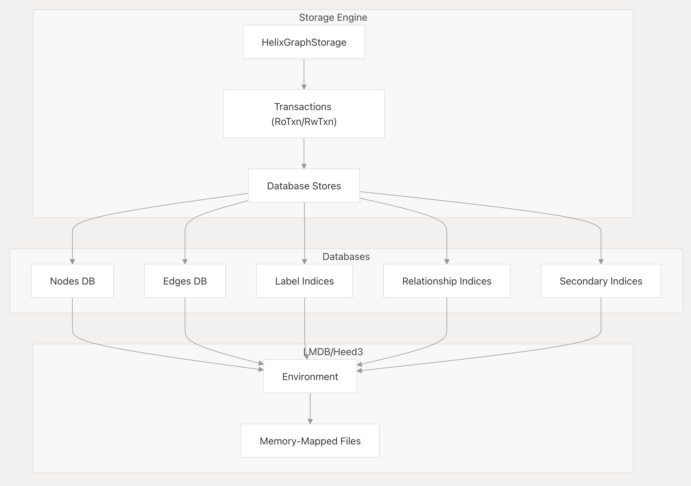

# graph-vector数据库

## 存储引擎-lmdb

lighting-memory-mapped-database是一个轻量级的基于b+树的：

* 嵌入式

* 有事务支持

* k-v型数据管理库

liblmdb是其软件实现，基于c语言开发，下面对其核心进行分析。

这是它的文档:[Embedded DataBase LMDB | Symas](https://www.symas.com/symas-embedded-database-lmdb)

<br>

### mmap-based

数据存储基于mmap系统调用（文件映射），使得IO流程不经过系统调用，物理上具备高读写性能。基于操作系统千锤百炼的页缓存机制，基于mmap构成的数据库系统能够最大化利用操作系统的缓存算法来提升应用性能。此外，当处理的数据远大于RAM的时候，源代码中`mdb_env_set_mapsize()`函数保证了RAM中留存的是**虚拟地址空间的预留大小**。

<br>

### B+树存储

lmdb数据存储是基于b+树数据结构进行存储的，其中的基础存储单元是**页（page）**，这里存在一个关键设计：LMDB的页是一种逻辑单元，但是它的实际分配大小为运行操作系统的**物理页大小的整数倍**。

这种设计能够最大化mmap的性能：假如页大小设置为3kb（操作系统页大小是4kb），必定存在很多的页是跨页的，相应的io便是跨页io，在读操作时，这可能会使开销翻倍（读取两个内存页）。而在写操作时，整个流程需要触发：读-修改-写的全套逻辑。

B+树数据结构存在两种类型的节点（在lmdb中代表页），分别是分支节点和叶子节点。lmdb通过位掩码的方式来标记一个页的类型，大致逻辑如下：

```c
#define P_BRANCH 0x01  // branch page
if (page->mp_flags & P_BRANCH) {
    // 这是一个分支页
}
```

b+树为对数时间查询，页中包含了存储的键值对数据，其具体结构如下：



由于b+树本身的特性，决定了：

* 所有Leaf page集中在树结构中的同一深度

* branch page仅用于构筑节点的导航节点

* 所有键值按其值大小进行排列来达到更优的查询效率

* leaf page之间通过指针构成双向链表

<br>

一些核心的API如下：

| Function               | Purpose                                      |
| ---------------------- | -------------------------------------------- |
| `mdb_page_search`      | Traverses the B+ tree to find a specific key |
| `mdb_node_search`      | Searches for a key within a page's nodes     |
| `mdb_page_split`       | Splits a full page when inserting new data   |
| `mdb_page_merge`       | Merges pages when removing data              |
| `mdb_cursor_next/prev` | Navigates sequentially through leaf nodes    |

<br>

### COW事务&AC

lmdb基于COW实现了AC特性：

* 当一个写事务发生时，lmdb不会修改原始页的数值而是基于mdb_page_touch()创建新页并将原始数据进行拷贝

* 对数据的修改会传播到新页的父系节点

* 事务提交时mdb_env_write_meta()来更新数据库文件的元数据（共有两个）之一

原子性保证：在修改元数据之前，指针指向的根数仍然为旧的未被修改的B+树根

一致性保证：在修改元数据之前，旧树的结构不会发生变化

### MVCC并行&ID

- **核心机制**：多版本并发控制 (MVCC)。

- **实现细节**：
  
  1. **写事务的隔离**：LMDB 通过一个写互斥锁来保证**任何时候最多只有一个写事务处于活动状态** 。这为写事务提供了最强的隔离级别。
  
  2. **读事务的隔离**：当一个读事务通过 `mdb_txn_renew0()` 开始时，它会在锁文件的一个槽位中记录下当前最新的已提交事务 ID 。这个 ID 就是该读事务的**数据快照**。
  
  3. 在此之后，该读事务访问的所有数据都将来自于这个快照版本。后续的写事务所做的任何修改（它们会产生新的页面和更高的事务ID）对这个读事务是**完全不可见**的。

- **如何保证 I**：由于读事务拥有一个不变的、历史版本的数据视图，而写事务是串行执行的，因此它们之间不会相互干扰，实现了高度的隔离。这就是为什么 LMDB 的**读操作完全不需要加锁** 。

<br>

- **核心机制**：文件系统同步调用 (`fsync`/`msync`)。

- **实现细节**：
  
  1. 在一个写事务提交的过程中，在 `mdb_env_write_meta()` 更新元数据页之后，LMDB 会确保将变更的数据页和元数据页都**强制刷写到物理磁盘**上。
  
  2. 这是通过
     
     `mdb_env_sync0()` 函数实现的，它会调用操作系统的 `msync()` 或 `fdatasync()`（在 Windows 上是 `FlushFileBuffers()`） 。这些系统调用会命令操作系统将文件缓冲区中的内容立即写入永久性存储介质。

- **如何保证 D**：只有当数据被确认已经安全地写入磁盘后，`mdb_txn_commit()` 才会成功返回。这确保了只要提交成功，数据就能在系统崩溃后得以幸存。

- **可调的持久性**：LMDB 也允许用户通过 `MDB_NOSYNC` 和 `MDB_NOMETASYNC` 等标志来放宽持久性要求，以换取更高的写入性能 。在这种模式下，系统崩溃可能会导致最近一次提交的事务丢失，但数据库的结构一致性（A 和 C）仍然能得到保证。

<br>

### Rust wrapper:heed3


## 向量存储

### hnsw

### 稀疏搜索（sparse search）

## 基于kv-db的graph引擎

### 可遍历性&一等公民

在思考具体的算法如何将向量和实体/节点关联起来之前，我们应该更抽象地看待问题：要实现混合搜索，系统中最基础的单元应该要具备一些作为**基本公民**的共性，在helixdb中，它们首先是**可遍历性**。这在代码中十分清晰：

```rust
// tr_val.rs
pub enum TraversalVal {
    /// A node in the graph
    Node(Node),
    /// An edge in the graph
    Edge(Edge),
    /// A vector in the graph
    Vector(HVector),
    /// A count of the number of items
    Count(Count),
    /// A path between two nodes in the graph
    Path((Vec<Node>, Vec<Edge>)),
    /// A value in the graph
    Value(Value),
    /// An empty traversal value
    Empty,
}

#[derive(Serialize, Deserialize, Debug, PartialEq, Eq, Clone)]
#[serde(rename_all = "snake_case")]
pub enum EdgeType {
    #[serde(rename = "vec")]
    Vec,
    #[serde(rename = "node")]
    Node,
}

pub trait Traversable {
    fn id(&self) -> u128;
    fn label(&self) -> String;
    fn check_property(&self, prop: &str) -> Result<Cow<'_,Value>, GraphError>;
    fn uuid(&self) -> String;
}
```

可遍历性保证了，图系统中的遍历可适用于任何实现了这个trait的对象，特别的，针对向量的流程如下：



此外，EdgeType类型也能够体现出向量和节点都属于图系统中的一等公民。

以推荐系统作为具体场景，一个简单的推荐算法可能只是一个查询就能cover的：

```rust
let results = G::new(storage, &txn)
    .search_v(&user_a_vector, K, "user_embedding", None) // 1. 向量搜索
    .out("follows", &EdgeType::Node)                     // 2. 图遍历
    .filter_ref(|val, _| {                               // 3. 过滤
        // ... 检查 val 是否是 user_a 或 user_a 已关注的人
        Ok(is_not_followed_by_user_a)
    })
    .dedup()                                             // 4. 去重
    .collect_to::<Vec<_>>();
```

<br>

### 存储结构

首先说下关联：属性图意味着每一个节点可以通过**属性**来关联自身的元数据，底层实现上，属性其实是哈希表：

```rust
    #[serde(default)]
    pub properties: Option<HashMap<String, Value>>,
```

所有类型的数据存储共享同一个lmdb环境：



核心代码：
```rust
pub struct HelixGraphStorage {
    pub graph_env: Env,

    pub nodes_db: Database<U128<BE>, Bytes>,
    pub edges_db: Database<U128<BE>, Bytes>,
    pub out_edges_db: Database<Bytes, Bytes>,
    pub in_edges_db: Database<Bytes, Bytes>,
    pub secondary_indices: HashMap<String, Database<Bytes, U128<BE>>>,
    pub vectors: VectorCore,
    pub bm25: Option<HBM25Config>,
    pub version_info: VersionInfo,

    pub storage_config: StorageConfig,
}
```

另外，值得注意的一点是helixdb存储了几个库用于保存索引：
* 快速完成out()和in_()遍历
    * out_edges_db
    * in_edges_db
* 快速根据属性查找节点
    * secondary_indices
* hnsw索引信息

下面是一些用例以及其在存储系统上发生的细节
```rust
// 插入节点
G::new_mut(...).add_n("person", Some(props!{"name" => "Alice"}), Some(&["name"]))
```
* 开启写事务RwTxn，保证原子性
* nodes_db.put
    * key: 生成的u128的node_id
    * value: node.encode_node()后生成的序列化字节数组
* secondary_indices.get("name").unwrap().put(...)
    * Key: 属性值 "Alice" 被序列化后的字节数组
    * Value: 刚刚生成的 node.id
* txn.commit()

```rust
G::new_mut(...).add_e("knows", None, node1_id, node2_id, false, EdgeType::Node)
```
* 开启写事务 (RwTxn)。
* 创建 Edge 对象：
    * key：分配新 id，并记录 label、from_node (node1_id) 和 to_node (node2_id)
    * 序列化数据：调用 edge.encode_edge() 将 Edge 对象序列化为字节数组 。
* edges_db.put(...)
    * Key: edge.id。
    * Value: 序列化后的边数据。
* out_edges_db (出边索引)-out_edges_db.put(...)
    * Key: 调用 HelixGraphStorage::out_edge_key(&node1_id, &hash_label("knows", ...)) 生成20字节的 Key 。
    * Value: 调用 HelixGraphStorage::pack_edge_data(&edge.id, &node2_id) 生成32字节的 Value 。
* 写入 in_edges_db (入边索引)：动作: in_edges_db.put(...) 。
    * Key: 调用 HelixGraphStorage::in_edge_key(&node2_id, &hash_label("knows", ...)) 生成20字节的 Key 。
    * Value: 调用 HelixGraphStorage::pack_edge_data(&edge.id, &node1_id) 生成32字节的 Value 。
* txn.commit()

### 简单的数学分析

这种设计的直观优势很明显，相较于neo4j+向量数据库，所有的操作都在一次http请求中完成，另一方面，这种设计保证了一致性：事务特性依托于lmdb的事务特性。

以推荐系统为例，进行分析：

* top_k向量搜索（hnsw）：$O(log_2(向量总数)$

* 返回了k个向量，假设每个用户关注d个人，结合邻接关系的索引，这一步的复杂度为$O(log2(k*d))$

其实从这里我们也能看出一点：实质上对比多个系统混合的方案来说，混合索引的算法复杂度并没有更低。
