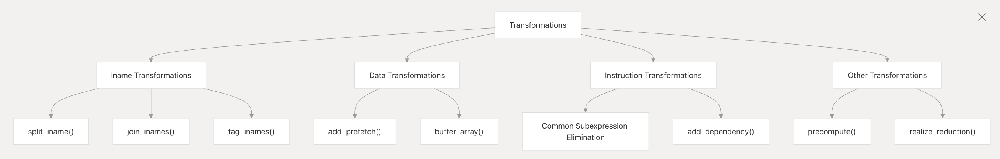

# 并行编程

## GPU硬件模型

我们以nvidia-gpu为例，因为nvidia是这一领域的先行者。

其实"CUDA"一词除了被引申为我们常说的并行编程模型外，还可用于指代硬件架构，这种说法参见https://modal.com/gpu-glossary/device-hardware/cuda-device-architecture。gpu硬件的通用硬件模型可以这样表达：

* 每一个设备都由多个流式多处理器（streaming multiprocessors）构成

* 每个处理器由多个Cuda cores/Tensor cores构成

想找具体的例子，可以看tesla p100发布白皮书中的内容：https://images.nvidia.com/content/pdf/tesla/whitepaper/pascal-architecture-whitepaper.pdf

### SMs

gpu上运行推理任务，其实可以被看作是这样一个过程：SMs在运行大量的**流处理器汇编代码**，我们以H800（下图）为例——蓝色为内存，绿色为core，橙色为调度单元

以H800为例，它峰值功率为700w，132个流处理器，每个具有4个warp调度器，而每个调度器又能以32个线程并行地发送指令，所以一个SM的并行度是4*32=128，同时，一个SM的并发容量是2048，GPU使用极其高效的warp切换技术能够实现最高25万个任务并发的效果

 

### Core

core是组成流处理器的基本组件，包括两种类型：cuda-core和tensor-core

相对于gpu的core，我们一般更了解cpu的cpu，并可能会把它们联系到一起，事实上他们很不一样。相较于tensor-core，cpu的core和SM更像，因为他们都拥有寄存器可以暂存数据。

 

### SFU

special function unit。用来计算特殊数学元算的单元：比如exp,cos,sin

### warp调度器

 

## loopy并行模型

### loopy软件架构

#### loopkernel

这个结构包含了生成代码所需要的全部信息

它包含了这些信息：

- Domains: 迭代空间的约束和迭代变量
- Instructions: 需要执行的计算操作
- Arguments: 输入和输出参数
- Temporaries: 计算过程中的临时变量
- Dependencies: 指令和迭代之间的关系
- Options: kernel的配置参数

 

#### preprocess过程

- 类型推断: 变量和表达式的类型推断
- Common subexpression elimination (CSE): 识别并消除重复的表达式
- 依赖分析: 识别表达式之间的关系
- Domain transformation: 修改迭代空间

相关的功能在`__init__.py`的85行和210行进行导入

 

#### transformation系统

优化实际上是通过各类变换来达到的，这可以说是loopy。为此，loopy的核心代码中存在一个transformation系统，kernel被传递进管道系统中，经过一层层的优化，变成了最终被完整优化的kernel代码。

 

#### expression系统...

其他模型细节参见https://deepwiki.com/inducer/loopy/1.1-architecture

 

### loopy并行模型

#### Inames&Domains

Inames代表Iteration name，Domains代表

#### 宏观优化技术

- **并行性映射 (Parallelism Mapping):** 通过 `lp.tag_inames`，你可以将 `loopy` 中的 `iname` (循环索引) 精确地映射到 CUDA 的 `blockIdx`, `threadIdx` (包括x,y,z维度) 以及 `warp` 相关的索引。这使得你可以精细控制计算如何在 GPU 的不同层级并行单元上执行。
  - 例如，`loopy/target/cuda.py` 中定义了如 `lp.CUDABlockIndexTag`, `lp.CUDAThreadIndexTag` 等。
- **内存层级优化 (Memory Hierarchy Optimization):**
  - **共享内存 (Shared Memory):** 你可以将数组标记为使用 `AddressSpace.LOCAL` (在 `loopy/kernel/data.py` 中定义)，`loopy` 的 CUDA 后端会将其转换为 `__shared__` 内存。通过 `lp.buffer_array` 等变换，你可以显式地控制哪些数据被加载到共享内存中，以及如何组织（例如，通过分块）。
  - **寄存器使用：** 通过循环展开、数据私有化 (`lp.privatize_array`) 等变换，可以增加数据在寄存器中的重用机会，减少对低速内存的访问。
  - **全局内存访问模式：** 变换如 `lp.split_iname` 后进行 `lp.tag_inames` 可以帮助实现合并的全局内存访问 (coalesced access)。`lp.add_prefetch` 可以用于显式的数据预取。
- **指令级优化 (Instruction-Level Parallelism - ILP):**
  - 循环展开 (`lp.unroll_iname`) 可以减少循环开销，并为编译器提供更大的指令调度窗口。
  - `loopy` 允许你指定数学运算的精度，或者使用特定的函数（如果后端支持）。
- **代码结构变换：**
  - 循环融合/分裂 (Fusion/Fission)
  - 循环交换 (Interchange)
  - 预计算 (`lp.precompute`)：将循环不变量或重复计算提前。

 

## cuda

 

## triton

### 运行链路
- @triton.jit 包装的 kernel 第一次被调用时，JITFunction.run 会根据参数实例化编译配置；若缓存未命中，则进入 _do_compile（python/triton/runtime/jit.py:651-702）。
- _do_compile 调用 python/triton/compiler/compile，后者通过 pybind11 暴露的 triton._C.libtriton（见 python/src/*.cc）驱动 MLIR/LLVM 管线，把 Triton AST 降级
  到 .ttir → .ttgir → .llir → ptx/llvm，并用对应 backend（CUDA→third_party/nvidia/backend/compiler.py，AMD→third_party/amd/backend/compiler.py）生成目标二进制；
  结果封装在 CompiledKernel（python/triton/compiler/compiler.py:400-498），并写入磁盘缓存 ~/.triton/cache。
- CompiledKernel.asm 同时保存多层 IR 文本和最终二进制：NVIDIA backend 的binary_ext="cubin"（PTX 通过 ptxas 装配后得到 CUBIN）；AMD backend 的binary_ext="hsaco"（ROCclr 生成 HSACO）。

加载与调用

- 运行时真正 launch 前，CompiledKernel._init_handles 会调用活跃 driver（triton.runtime.driver.active）来准备句柄：
    - driver.active.launcher_cls（NV: CudaLauncher at third_party/nvidia/backend/driver.py:673-714；AMD 有同构的 HipLauncher）会即时生成一段 C host stub，通过
      compile_module_from_src（python/triton/runtime/build.py:32-106）编译出一个 CPython 扩展模块；这个模块的 launch 函数负责把 Python 对象/张量转换成裸指针、填
      充参数数组以及调用底层 driver API。
    - driver.active.utils.load_binary 则是另一个随构建产出的扩展（NV: cuda_utils），内部调用 cuModuleLoadData/hipModuleLoadDataEx 把 cubin/hsaco 加载到 GPU 模
      块，并返回函数指针（third_party/nvidia/backend/driver.c:482-520 等）。
    - 若 kernel 需要临时 scratch buffer，CudaLauncher.__call__ 会按 grid 规模向设备分配，再把指针传给 launch。
- 完成上述准备后，CompiledKernel.run 会把 packed metadata、实际参数与可选 hook 交给 launcher，后者最终执行 cuLaunchKernelEx 或 HIP 对应 API，将 GPU 函数提交到当前 stream（third_party/nvidia/backend/driver.py:488-520 + 320-376）。

Python 侧如何“调用” PTX/HSACO

- Python 自身并不直接执行 PTX/HSACO，而是在第一次运行时驱动编译管线产出 cubin/hsaco，随后通过动态生成的 C 扩展调用 CUDA/HIP Driver API 把二进制装载并 launch。
- 这些扩展模块和 MLIR 编译器桥接体（libtriton.so）都在安装阶段用 pybind11/C API 构建；Python 运行时只需 import 并调用它们提供的函数。
- 之后相同 specialization 再次运行时会命中 kernel_cache 与磁盘缓存，跳过编译直接复用已加载的 GPU module；若上下文/设备切换，则重新加载但仍复用已有二进制。

小结
Triton 通过 MLIR/LLVM 在首次调用时产出目标二进制（PTX→CUBIN、HSACO），再由 runtime driver 把它载入 GPU 并使用即时编译的 C launcher（借助 pybind11/C API）发起
kernel launch。整个链路让 Python 代码拥有“先 Python 语言层构造 → 当场编译 → 直接驱动 GPU” 的体验，同时保持二进制缓存与跨层调试能力。

## luminal

egglog转换系统是为了得到更加高效的内核，所以我们得先简单了解egglog数据结构
