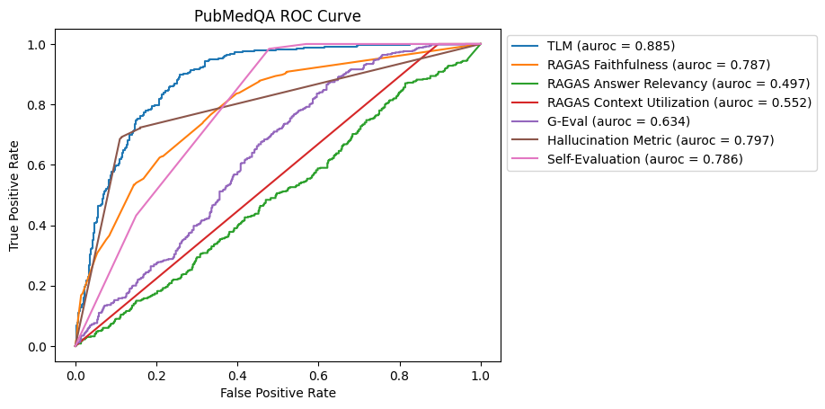

# rag落地方案

## 概览

### 目标

希望通过rag能做到：

* 一套基于隐式结构知识的

* 多源异构文档的管理，关键信息的自动提炼

* 大范围信息连接器

<br>

## graph-rag探索（调研阶段）

我们将调研的结果记录在此，当前的预研内容概括:

* 底层技术选型
  
  * query + 持久化：helixdb
  
  * 私有大模型部署：luminal/mistral.rs/vllm
- 实验构建目标&数据源
  
  - code assistant + github repository(text,code..)
  
  - 经济deep researcher：经济/货币新闻（具体来源待定）

- 图识别/建模（构建）策略&提取算法
  
  - 使用综合能力较强的llm进行**识别/建模**等复杂任务的agent，其提示词设计依托于schema设计/建模原则的确立
  
  - 使用Mcp来完成关系提取&验证：
    
    - 特化模型，如三元组特化模型：[SciPhi/Triplex · Hugging Face](https://huggingface.co/SciPhi/Triplex)
    
    - 代码静态分析工具：tree-sitter

- schema设计原则

### Helix-db实践

使用Helix-db在本地部署了数据库实例，记录一些关键内容。

1.使用helixql(helixdb自创的一种schema定义和query模型定义的查询语言，语法细节见https://docs.helix-db.com/documentation/hql/hql)构建数据库实例的定义：

```cypher
// schema.hx
N::Folder {
    name: String,
    extracted_at: Date DEFAULT NOW
}

N::File {
    name: String,
    extension: String,
    text: String,
    extracted_at: Date DEFAULT NOW
}

N::Entity {
    entity_type: String,
    start_byte: I64,
    end_byte: I64,
    order: I64,
    text: String,
    extracted_at: Date DEFAULT NOW
}
...
E::Entity_to_Entity {
    From: Entity,
    To: Entity,
    Properties: {
    }
}

E::Entity_to_EmbededCode {
    From: Entity,
    To: EmbededCode,
    Properties: {
    }
}

V::EmbededCode {
    vector: [F64]
}


// queries.hx
// Create Files
QUERY createSuperFile(root_id: ID, name: String, extension: String, text: String) => 
    root <- N<Root>(root_id)
    file <- AddN<File>({name:name, extension:extension, text:text})
    AddE<Root_to_File>()::From(root)::To(file)
    RETURN file

QUERY createFile(folder_id: ID, name: String, extension: String, text: String) => 
    folder <- N<Folder>(folder_id)
    file <- AddN<File>({name:name, extension:extension, text:text})
    AddE<Folder_to_File>()::From(folder)::To(file)
    RETURN file

// Get Files
QUERY getAllFiles() => 
    files <- N<File>
    RETURN files::!{text}

QUERY getFile(file_id: ID) => 
    file <- N<File>(file_id)
    RETURN file::!{text}
```

<br>

2.使用helix compile创建得到编译好的rust文件（helixql -> rust），文件名为queries.rs，结合helix-db内部的helix-container(bin crate)，能够得到一个可执行文件，该文件可理解为helix-db的数据库实例（暴露了数据库服务，默认端口6969），它会创建并管理持久化的数据库文件（默认路径在~/.helix/data下，也可以自己指定）**data.mdb**

* 查看数据库实例可以使用`helix status`（注意这是cli工具，并非container）

<br>

3.使用graph construction工具，我选择使用helixdb提供的codebase-index([GitHub - HelixDB/codebase-index](https://github.com/HelixDB/codebase-index/tree/main))工具，使用本地embedding（基于fastembed-rs）工具将示例项目的vector和基于tree-sitter创建的graph塞进了实例管理数据中（只要在src目录下cargo run即可，项目默认使用的是gemini提供的embedding api，我没有KEY所以替换成了本地实现的embedding function）

<br>

4.最后使用dashboard（[GitHub - HelixDB/helix-dashboard](https://github.com/HelixDB/helix-dashboard)）启动前后端，即可将数据渲染到浏览器上，下面为参考：


### 图的自动化构建

<br>

评估哪一个方法更好需要围绕着具体的**benchmark**和已经成熟的**商业化工具**进行评估，我会优先考虑调研在**软件开发**助理和**自动交易系统/deep researcher**两个领域的技术方案。我在此列举出我调研中了解到一些可借鉴的点:

* 逻辑密集型/复杂任务:**分解**目标为细粒度步骤，对于其中最复杂最容易出错的步骤看是否有专用工具/检测助手可以帮助**检验**阶段性成果（self-verification pipeline）
  
  * IMO论文指出多步骤结合验证专家的状态机session（参考https://github.com/yb235/Gemini-IMO-math-Agent）
  
  * 其他模式提示词：https://iamholumeedey007.medium.com/prompt-engineering-patterns-for-successful-rag-implementations-b2707103ab56
  
  * claude团队提出：在超长上下文任务中，可以将子任务的结论进行压缩/compact提供给**继任者**

* 图构建系统
  
  * HippoRAG2-图构建:
    
    * 使用llm对输入数据进行**ner**/**三元组提取**
    
    * 将向量嵌入图中：三元组中的实体会被向量化，三元组本身也会作为一个**事实**被向量化，同时原始文本也会向量化并被嵌入到文本块本身所代表的节点
    
    * **图构造**：事实边连接；文本块-包含实体连接（宏观 -> 微观）；同义词（基于向量的knn算法）边
    
    * 缓存设计
  
  * HippoRAG2-混合检索：
    
    * 用户问题向量化 -> 在事实嵌入库中进行相似度搜索 -> 得到相关事实列表
    
    * 基于dspy模版结合llm（例如llama3-70B）进行相关事实的筛选，如果没有筛选出相关的事实，则降级为标准向量检索
    
    * 基于personal page rank算法：以上一步筛选出的事实中的实体节点作为种子，赋予其较高初始权重，并将相关的文本块/篇章权重也进行增大，最终得到各个篇章得分
  
  * aider：应该使用tree-sitter这样的**专业领域工具**辅助构建特定输入格式的内容（提一下，从软件开发的角度来说应该在前期简化输入数据的自由度）
  
  * graphiti：
  
  * 

### schema设计原则

先调研：

* （kg+llm）领域综述：https://arxiv.org/pdf/2306.08302

* 最前沿的kg builder:[GitHub - getzep/graphiti: Build Real-Time Knowledge Graphs for AI Agents](https://github.com/getzep/graphiti)

* 通用设计：[GitHub - TuGraph-family/chat2graph: Chat2Graph: Graph Native Agentic System.](https://github.com/TuGraph-family/chat2graph)

* benchmark sota：[GitHub - OSU-NLP-Group/HippoRAG: [NeurIPS&#39;24] HippoRAG is a novel RAG framework inspired by human long-term memory that enables LLMs to continuously integrate knowledge across external documents. RAG + Knowledge Graphs + Personalized PageRank.](https://github.com/OSU-NLP-Group/HippoRAG)

<br>

## 效果评测

在我看来，一项技术/一个工具到底值不值得投入时间去研究或是开发很大程度取决于这个东西是否有非常明显的效益，举个例子，向量/深度学习编译器之所以会吸引很多开发者去研究，其中一个关键原因是它的关键**评判因素非常简单**并且诸如pytorch编译的**效果非常显著**，就是性能，常规的深度网络前向推理的时间远比经过编译优化后的运行时间要长，单就这一点就能迅速得到性能，能效上该工具的潜能巨大。

那么，回到rag/agent。这个工具和我提到的例子不一样的地方在于，后者有明确的评判边界，但是rag的评判因素可能没那么具体，但是广义的rag有一些现实中效益非常显著的例子（至少目前来看是这样），比如cursor，比如google的deep research。

这一节的目标是让这个过程尽可能清晰，简洁。

<br>

### 对比多种评估方法

市面上充斥着大量的rag评估工具和评估方法，我们经常能听到人们说ragas，deep eval之类的词，而我认为要做的第一步是简单地评估下已有的方法。

参考这一篇文章：https://towardsdatascience.com/benchmarking-hallucination-detection-methods-in-rag-6a03c555f063/

这篇文章探讨了在检索增强生成（RAG）系统中检测大型语言模型（LLM）生成的错误回答（即“幻觉”）的方法。

- **幻觉检测方法**：文章评估了多种幻觉检测方法，包括：
  - **自我评估**：LLM对生成答案的置信度进行评分。
  - **G-Eval**：使用思维链（CoT）提示，自动开发评估标准来评估答案质量。
  - **幻觉指标**：估计LLM回答与上下文矛盾的程度。
  - **RAGAS**：提供多种评分指标，用于检测幻觉。
  - **可信语言模型（TLM）**：使用自我反思、一致性检验和概率度量来识别错误、矛盾和幻觉。

- **评估方法**：文章在四个公开的RAG数据集上评估了这些方法，并使用AUROC和精确率/召回率来评估其性能。
- **结果分析**：TLM在所有数据集上都表现出色，其次是自我评估和RAGAS可靠性。RAGAS可靠性在需要与上下文相关的准确性的数据集（如PubMedQA和COVID-QA）中表现良好。



现在以这张图为例从细节分析一下评估是如何进行的：PubMedQA数据集中包含问题，上下文和答案的实例，使用分割将数据集划分为训练集和测试集。以ragas为例，ragas是一种评分方法，包含多个评分指标，比如忠诚度，上下文利用率，回答关联性等，将他们转换为0～1之间的数值，表示幻觉产生的可能性。

注意：**数据集中包含一个布尔标签（标注值）用于评判该回答是否正确**

然后，将数据集中的标注值用来和转换后的值进行比较。我们先介绍下ROC曲线

- ROC（Receiver Operating Characteristic）曲线是二分类评估工具，用于刻画一个“连续评分”或“概率输出”模型在不同判定阈值下的分类性能。它以：
  
  - 横轴：FPR（False Positive Rate）= FP / (FP + TN)
  - 纵轴：TPR（True Positive Rate，或 Recall）= TP / (TP + FN)  
    来描绘随着阈值变化，查全率与误报率的权衡。

- 为什么需要“连续评分 + 阈值”  
  ROC 的核心是：模型不是直接输出“正/负”，而是输出“分数/概率”。你通过改变阈值把分数转成“正/负”，每个阈值都对应一个 (FPR, TPR) 点。将所有阈值的点连起来就是 ROC 曲线。AUC（Area Under the Curve）衡量整体区分能力，等价于“随机抽一对正负样本，正样本得分高于负样本的概率”。

roc曲线评估意味着：

- 阈值无关：综合考察所有可能阈值下的表现。
- 类别不平衡时仍较稳定（相比精确率-召回率曲线的关注点不同）。
- 便于比较不同模型/评分方法的整体区分能力。

说了这么多，看下示例代码：

```python
import numpy as np
from datasets import load_dataset
from sklearn.metrics import roc_curve, roc_auc_score
import matplotlib.pyplot as plt

# 伪代码：加载 COVID-QA（名称仅示例，实际请查 HF 对应数据集）
ds = load_dataset("covid_qa_cleaned")["test"]  # 或 train/validation

# 假设你已实现如下函数：
# - build_retriever(): 返回一个检索器
# - generate_answer(question, contexts): 用 LLM 生成答案
# - compute_ragas_scores(batch): 用 ragas 计算各指标（返回 dict: {'faithfulness': ..., 'answer_rel': ..., ...}）
# - binary_label_answer_correct(gold_answer, generated_answer): 返回 0/1，定义你的“真值任务”

retriever = build_retriever()

records = []
for ex in ds:
    q = ex["question"]
    gold_ans = ex["answer"]             # 具体字段名随数据集而定
    # 1) 检索
    contexts = retriever.search(q, top_k=5)
    # 2) 生成答案
    gen_ans = generate_answer(q, contexts)
    # 3) 计算 RAGAS 指标
    ragas_dict = compute_ragas_scores([
        {"question": q,
         "contexts": contexts,
         "answer": gen_ans,
         "ground_truth": gold_ans}
    ])[0]

    # 4) 构造真值标签（例：答案是否正确）
    y = binary_label_answer_correct(gold_ans, gen_ans)

    records.append({
        "question": q,
        "gold_answer": gold_ans,
        "generated_answer": gen_ans,
        "ragas_faithfulness": ragas_dict["faithfulness"],
        "ragas_answer_rel": ragas_dict["answer_relevance"],
        "ragas_context_rel": ragas_dict["context_relevance"],
        "label_correct": y
    })

# 选择一个评分做 ROC（比如 answer relevance）
y_true = np.array([r["label_correct"] for r in records])
y_score = np.array([r["ragas_answer_rel"] for r in records])

# 计算 ROC & AUC
fpr, tpr, thresholds = roc_curve(y_true, y_score)
auc = roc_auc_score(y_true, y_score)
print("AUC:", auc)

# 画图
plt.figure(figsize=(5,5))
plt.plot(fpr, tpr, label=f"AnswerRel (AUC={auc:.3f})")
plt.plot([0,1], [0,1], "k--", alpha=0.4)
plt.xlabel("False Positive Rate")
plt.ylabel("True Positive Rate")
plt.title("ROC on COVID-QA (Answer Correctness)")
plt.legend()
plt.tight_layout()
plt.show()
```

### TLM is what you need

通过刚刚那份报告对比我们能知道，TLM（# Trustworthy Language Model）指标是一个很好的选择，只因它在各个数据集上的auroc值都很高。

### ARES方法

ARES 评估 RAG 模型的三个关键指标：上下文相关性、答案真实性和答案相关性。

**自动化评估**： ARES 利用合成查询生成和预测增强推理 (PPI) 来提供准确评估，并具有统计置信度。


## ADK探索

### 简介

ADK是google提出的一套开发agent系统的框架，设计动机是让agent的开发流程和软件开发流程对齐。我之所以研究adk是因为我认为google实际上是人工智能领域走在最前沿的公司，希望通过follow这家公司的动作来研究最优秀的助理设计方法。

<br>

### A2A协议

简单来说，A2A协议是google提出的让agent之间互相交流的一套协议。

### adk-agent

从adk-samples项目中以具体的agent设计作为案例研究adk构建agent的方式。

## 记录问题
